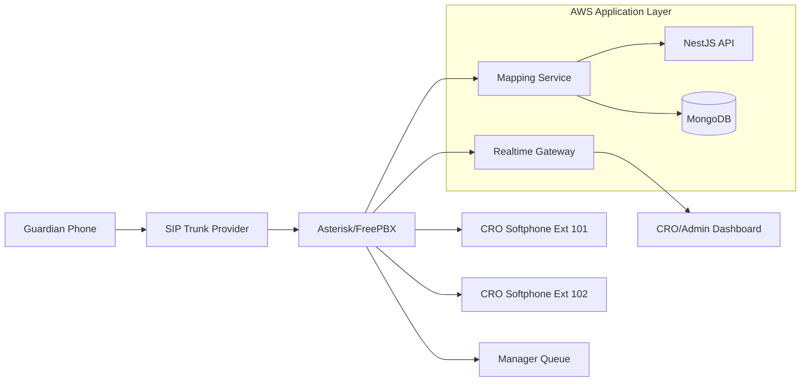
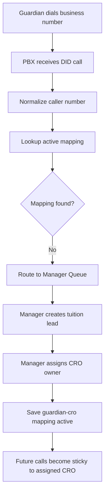
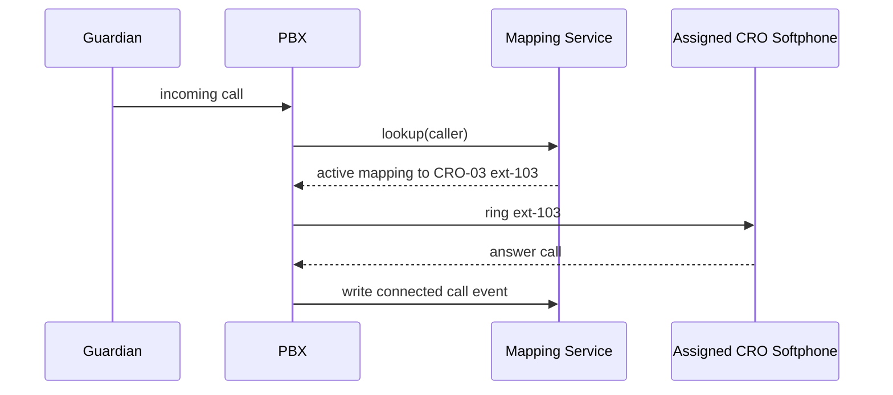
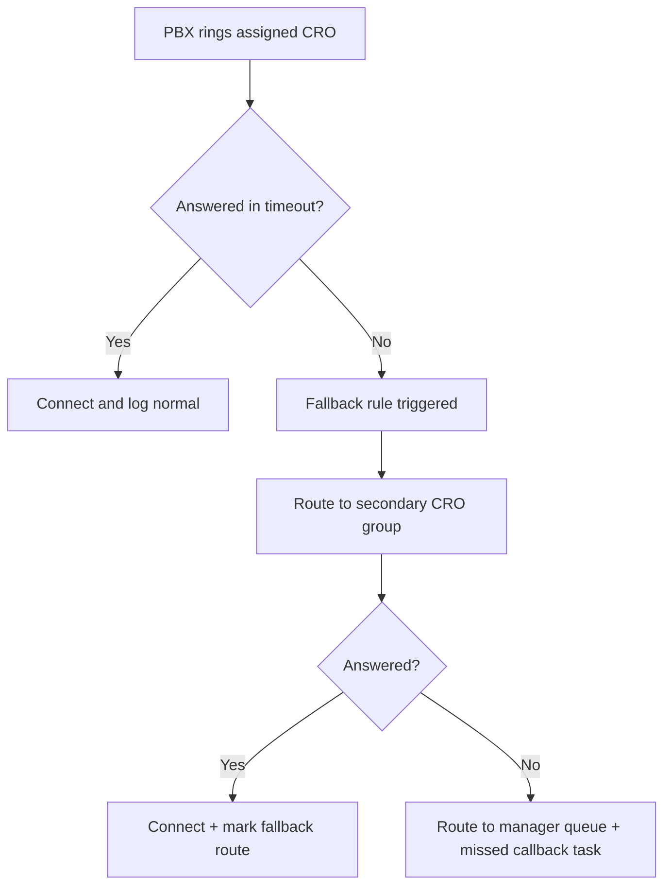
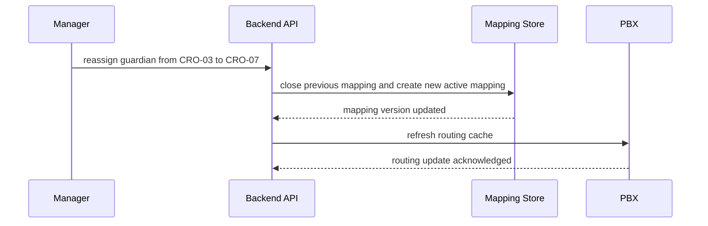
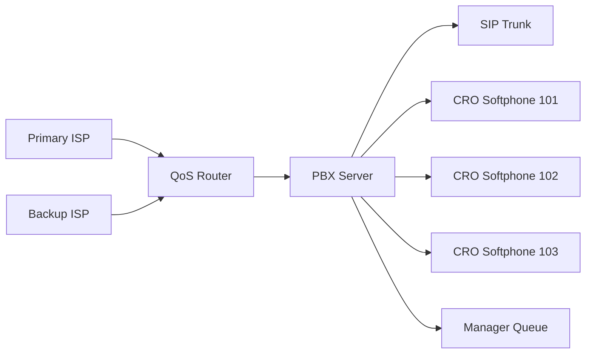

# Call Routing Module - End-to-End Technical Proposal

## Document Control

| Field | Value |
|---|---|
| Client | Bright Tutor |
| Module | IP Calling and CRO Sticky Routing |
| Version | 1.0 |
| Date | March 2026 |
| Purpose | Automate guardian inbound call handling with persistent guardian-to-CRO mapping and full call visibility |

## 1. Business Goal (Simple Language)

Bright Tutor needs every guardian call to be handled in a structured way:

1. First call from unknown guardian should go to manager queue for assignment.
2. After assignment, all next calls from that guardian should route to same CRO.
3. Routing should continue until tuition lifecycle closes or manager reassigns.
4. All calls should be logged with timestamps and dispositions.

This module eliminates manual call transfer dependency and makes call handling predictable, measurable, and auditable.

## 2. What Success Looks Like

1. Incoming guardian number is recognized instantly.
2. Call is auto-routed to assigned CRO extension.
3. Unknown numbers are routed to manager queue.
4. Assignment updates routing in real-time.
5. Call records appear in tuition profile and CRO dashboard.

## 3. Module Boundaries

### In Scope

1. Inbound call routing via PBX.
2. Guardian number normalization and mapping lookup.
3. Sticky mapping lifecycle (assign, active, reassign, close).
4. Queue fallback when CRO unavailable.
5. Call logging and disposition capture.

### Out of Scope (Phase-1)

1. AI voice bot/IVR intelligence.
2. Speech analytics and transcription.
3. Outbound predictive dialer campaigns.

## 4. Functional Modules Inside Call System

1. SIP Trunk Integration Layer
2. PBX Routing Engine
3. Guardian-CRO Mapping Service
4. Availability and Fallback Engine
5. Call Event Logger
6. Tuition Timeline Sync Service

## 5. End-to-End Architecture View



## 6. Deep Workflow Breakdown

### 6.1 Workflow A: Unknown Guardian First Call



### 6.2 Workflow B: Known Guardian Repeat Call



### 6.3 Workflow C: CRO Unavailable Fallback



### 6.4 Workflow D: Reassignment



## 7. Hardware Breakdown (User-Friendly)

### 7.1 Required Hardware

| Component | Recommended | Why Needed |
|---|---|---|
| PBX Host Machine | 4 cores, 8 GB RAM, SSD | Runs Asterisk/FreePBX reliably |
| Network Router | Business-grade with QoS | Better voice quality and jitter control |
| Headset for CRO | Noise-cancelling USB headset | Clear call quality |
| CRO Laptop | Browser + softphone capable | Handles portal and call activity |
| Backup Power (UPS) | 30-60 min backup | Prevent call drop during outage |

### 7.2 Network and Voice Topology



## 8. Software Breakdown (Layer by Layer)

### 8.1 Telephony Layer

1. SIP trunk for incoming DID.
2. Asterisk/FreePBX dialplan for routing.
3. Extension registry for CRO softphones.

### 8.2 Application Layer

1. Mapping micro-domain inside NestJS backend.
2. Number normalization utility.
3. Assignment and reassignment APIs.

### 8.3 Persistence Layer

1. `guardian_cro_mappings` for active routing state.
2. `call_logs` for call-level event history.
3. `call_dispositions` for business outcomes.

### 8.4 Dashboard Layer

1. Live incoming call popup.
2. Missed call follow-up queue.
3. CRO performance metrics and SLA counters.

## 9. Data Design (Practical View)

### 9.1 Core Collections

| Collection | Key Fields |
|---|---|
| guardian_cro_mappings | guardian_phone, cro_id, extension, status, active_from, active_to |
| call_logs | call_id, caller, callee_ext, route_type, start_time, end_time, duration |
| call_dispositions | call_id, outcome, notes, followup_due_at |
| reassignment_history | guardian_phone, old_cro_id, new_cro_id, changed_by |

### 9.2 Call Disposition Standard

1. New Lead
2. Follow-up Required
3. Tuition Confirmed
4. Wrong Number
5. No Answer Callback
6. Escalated to Manager

## 10. Routing Policy (Business Rules)

1. If mapping exists and status is active, route to assigned CRO extension.
2. If no active mapping, route to manager queue.
3. If assigned CRO unavailable, apply fallback path.
4. If tuition closed/cancelled, mapping status must become inactive.
5. Reassignment creates a new mapping version and closes previous one.

## 11. API Contract Examples

### 11.1 Call Route Lookup

Endpoint: `POST /api/v1/calls/route`

```json
{
  "caller": "88017XXXXXXXX",
  "did": "8809600XXXXXX"
}
```

Response:

```json
{
  "routeType": "ASSIGNED_CRO",
  "croId": "CRO-03",
  "targetExtension": "103",
  "fallback": ["manager_queue"]
}
```

### 11.2 Create Mapping

Endpoint: `POST /api/v1/call-mappings`

```json
{
  "guardianPhone": "88017XXXXXXXX",
  "tuitionId": "T-901234567",
  "croId": "CRO-03",
  "extension": "103",
  "assignedBy": "MGR-01"
}
```

### 11.3 Reassign Mapping

Endpoint: `PATCH /api/v1/call-mappings/reassign`

```json
{
  "guardianPhone": "88017XXXXXXXX",
  "newCroId": "CRO-07",
  "newExtension": "107",
  "reason": "Workload balancing"
}
```

## 12. Security and Governance

1. Restrict PBX admin panel to allowlisted VPN/internal IP.
2. Protect route APIs with service-to-service authentication.
3. Mask caller numbers for unauthorized roles.
4. Keep tamper-resistant logs of all mapping changes.
5. Define call recording retention policy and legal notice.

## 13. Capacity and Performance Planning

### Voice Quality Targets

1. Call setup latency target: less than 2 seconds for mapped callers.
2. Routing lookup target: less than 100 ms cache hit, less than 300 ms DB hit.
3. Availability target: 99.9 percent for call routing service.

### Concurrent Capacity (Starter)

1. 20 to 40 concurrent calls with single PBX host (proper tuning required).
2. Scale horizontally via additional PBX nodes if needed.

## 14. Step-by-Step Implementation Plan (From Scratch)

### Step 1: Telephony Foundation

1. Procure SIP trunk and DID.
2. Deploy Asterisk/FreePBX.
3. Create CRO extensions and manager queue.

### Step 2: Mapping Service Development

1. Build number normalization and lookup service.
2. Create active mapping data model.
3. Build assignment and reassignment APIs.

### Step 3: PBX Integration

1. Connect PBX route query to mapping API.
2. Implement unknown caller manager route.
3. Implement fallback route if CRO unavailable.

### Step 4: Portal Integration

1. Show live incoming call popup with guardian context.
2. Add call log and disposition form in tuition cockpit.
3. Add mapping timeline events.

### Step 5: Hardening

1. Add caching for fast route lookup.
2. Add SLA alerts for missed/unanswered calls.
3. Validate reassignment and closure flows.

### Step 6: Go-Live

1. Controlled pilot with selected CRO team.
2. Monitor route accuracy and fallback rate.
3. Expand to all CROs after acceptance.

## 15. Test and Acceptance Checklist

1. Unknown number call always reaches manager queue.
2. Known mapped caller reaches correct CRO extension.
3. Reassignment changes route on next call.
4. Closed tuition no longer uses old sticky mapping.
5. Unanswered call triggers fallback and callback task.
6. Call logs show route type, duration, and disposition correctly.

## 16. Operational Runbook (Day-2)

### Daily

1. Check extension registration status.
2. Check missed call and fallback counts.
3. Verify manager queue response time.

### Weekly

1. Review mapping mismatch incidents.
2. Review CRO availability and load balancing.
3. Validate backup ISP failover test.

### Incident Handling

1. If PBX unreachable: reroute to emergency manager mobile path.
2. If route API down: use cached mapping mode.
3. If SIP outage: failover to alternate trunk plan.

## 17. Client-Friendly Closing Note

This call routing module ensures each guardian consistently reaches the correct CRO, reducing missed opportunities and improving conversion confidence. With sticky mapping, fallback controls, and full logs, Bright Tutor operations move from manual dependency to enterprise-grade reliability.
