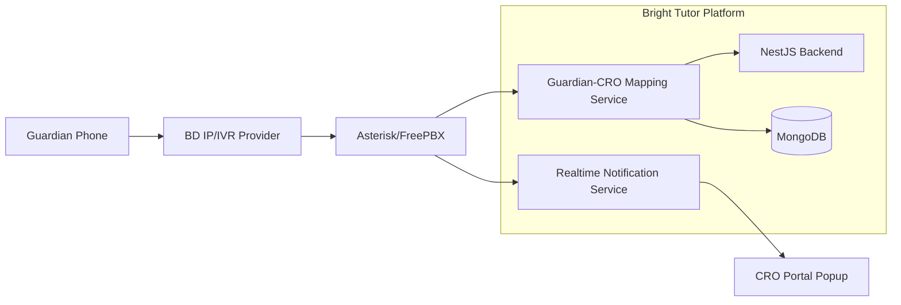
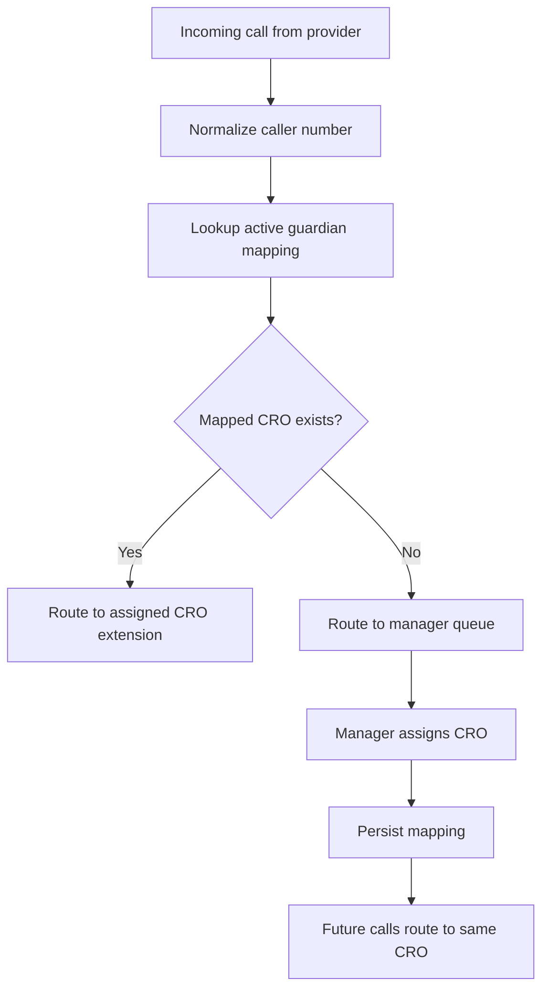
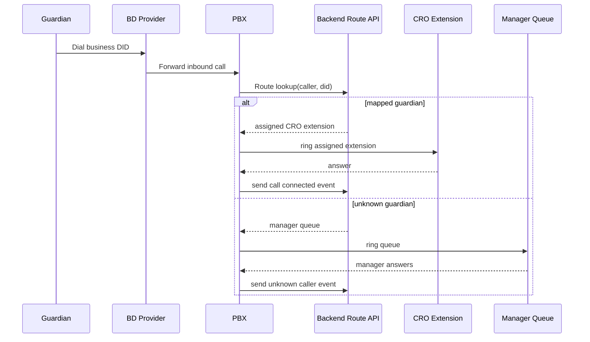

# Bangladesh IP/IVR Provider Integration Plan

## Document Control

| Field | Value |
|---|---|
| Client | Bright Tutor |
| Scope | IP Call and IVR Provider Selection + Integration Plan |
| Version | 1.0 |
| Date | March 2026 |
| Purpose | Practical roadmap to onboard a Bangladeshi IP/IVR provider into Bright Tutor platform |

## 1. Objective

Bright Tutor wants to use a Bangladesh-based IP/IVR provider so inbound guardian calls are managed from the platform with sticky guardian-to-CRO routing.

This document explains:

1. Top 5 Bangladesh provider options to evaluate.
2. Commercial and technical onboarding process.
3. Platform integration architecture.
4. Step-by-step implementation from pilot to production.

## 2. Top 5 Bangladesh Provider Options (Evaluation Shortlist)

Note: Final commercial selection should be based on latest enterprise proposal, API/SIP readiness, compliance, and SLA confirmation.

| # | Provider | Typical Fit for Bright Tutor | Check First |
|---|---|---|---|
| 1 | Banglalink Business | Enterprise telecom services, business voice plans, potential SIP/enterprise voice support via business team | SIP trunk availability, DID support, webhook/API capabilities |
| 2 | Grameenphone Business | Large enterprise network footprint and business communications offerings | SIP trunk, call detail export/API, support SLA |
| 3 | Robi Corporate/Enterprise | Corporate mobile and communication offerings (validate current enterprise channel) | Inbound DID, call routing features, integration support team |
| 4 | Teletalk (Enterprise/Official channel) | Government-owned operator; useful if policy/commercial alignment required | Enterprise voice product readiness, escalation and support model |
| 5 | BTCL (National telecom operator) | Fixed telecom backbone, enterprise/government connectivity options | IP telephony/call center service package, trunk specs, interconnect terms |

## 3. Provider Selection Criteria (Must-Have)

Use this scoring model before final contracting.

| Category | Weight | What to Validate |
|---|---|---|
| SIP Trunk and DID capability | 25% | Inbound DID(s), concurrent channels, codec support, CLI/caller-id pass-through |
| Integration readiness | 20% | API/webhook/AMI options, real-time call events, docs quality |
| SLA and support | 20% | 24/7 NOC, ticket escalation, MTTR, incident response |
| Cost model | 15% | Monthly trunk fee, per-minute billing, DID charges, setup fees |
| Compliance and legal | 10% | BTRC compliance, lawful interception policy, data policies |
| Scalability | 10% | Ability to increase channels and DIDs quickly |

## 4. Recommended Integration Pattern for Bright Tutor

### 4.1 Logical Architecture

### 4.2 Routing Decision Flow

## 5. End-to-End Integration Process (Provider Agnostic)

### Phase A: Commercial and Legal Onboarding

1. Share use-case document with provider (inbound guardian support + sticky CRO routing).
2. Request enterprise proposal with:
   1. DID numbers
   2. concurrent channel options
   3. per-minute pricing
   4. SLA and support matrix
3. Sign MSA/SLA/NDA and define escalation contacts.
4. Confirm billing model and test account provisioning timeline.

### Phase B: Technical Provisioning

1. Provider supplies SIP trunk credentials and allowed source IP.
2. Provider allocates DID(s) and caller-id format rules.
3. Bright Tutor configures PBX trunk, transport, codec, and dialplan.
4. Configure failover route (secondary queue/number).

### Phase C: Platform Integration

1. Build route lookup endpoint in backend.
2. Connect PBX dialplan to route lookup.
3. Implement unknown-caller manager queue.
4. Implement sticky mapping lifecycle (active/inactive/reassigned).
5. Push live call event to CRO portal popup.

### Phase D: Testing and UAT

1. Test known caller auto-routing.
2. Test unknown caller manager routing.
3. Test reassignment and next-call behavior.
4. Test unavailable CRO fallback path.
5. Validate call log, disposition, and timeline updates.

### Phase E: Production Rollout

1. Start with pilot DID and selected CRO group.
2. Measure routing accuracy and missed call rate.
3. Scale channels and extension groups.
4. Enable full operations after sign-off.

## 6. Provider-by-Provider Integration Playbook

## 6.1 Banglalink Business - Process

### Commercial Steps

1. Contact Banglalink enterprise sales and request business voice/SIP/call center package.
2. Share expected concurrent call volume and city coverage.
3. Request SLA, support escalation matrix, and test trunk.

### Technical Steps

1. Collect trunk endpoint, auth credentials, DID numbers.
2. Configure PBX inbound routes.
3. Validate caller-id pass-through format.
4. Run route API integration and failover tests.

### Acceptance Checklist

1. Inbound DID stable for peak hours.
2. Caller number arrives consistently.
3. Voice quality acceptable (low jitter/packet loss).

## 6.2 Grameenphone Business - Process

### Commercial Steps

1. Engage GP business account manager for enterprise calling solution.
2. Confirm SIP trunk + DID options and contract terms.
3. Request incident support SLA and escalation path.

### Technical Steps

1. Configure SIP trunk security (IP allowlist and auth).
2. Validate call event detail access (CDR/API/report).
3. Test fallback queue route for unavailable CRO.

### Acceptance Checklist

1. Route setup delay under target.
2. Event logs are available for reconciliation.
3. Escalation support responds within SLA.

## 6.3 Robi Corporate/Enterprise - Process

### Commercial Steps

1. Confirm current enterprise voice product track and technical integration support.
2. Obtain solution sheet including trunking and DID provisioning.
3. Lock support contacts for onboarding and production.

### Technical Steps

1. Setup SIP trunk and DID mapping to PBX.
2. Validate inbound call behavior and DTMF handling (if IVR used).
3. Test route lookup and sticky mapping behavior.

### Acceptance Checklist

1. Unknown caller queue works reliably.
2. Mapping-based repeat call route is consistent.
3. CDR granularity supports operation reports.

## 6.4 Teletalk Enterprise Channel - Process

### Commercial Steps

1. Engage official enterprise/public sector channel.
2. Confirm product model for enterprise voice/IP/IVR use-case.
3. Validate support turnaround and escalation path.

### Technical Steps

1. Configure provided voice interconnect or SIP details in PBX.
2. Validate CLI delivery format and normalization needs.
3. Perform pilot calls from different operator networks.

### Acceptance Checklist

1. Stable inbound routing across network.
2. Acceptable connection and answer delay.
3. Operational support responsiveness validated.

## 6.5 BTCL - Process

### Commercial Steps

1. Request enterprise IP telephony/call center offering via BTCL official channel.
2. Confirm DID range, concurrent channels, and service-level commitments.
3. Finalize agreement with implementation timeline.

### Technical Steps

1. Provision trunk and configure PBX interoperability.
2. Validate DID mapping and inbound caller-id behavior.
3. Test route API flow and fallback to manager queue.

### Acceptance Checklist

1. Trunk stability under load.
2. Complete call logs and reconciliation capability.
3. Failover paths validated.

## 7. Detailed Platform Integration Steps

### 7.1 Backend APIs Required

1. `POST /api/v1/calls/route` for PBX route decision.
2. `POST /api/v1/calls/events` for call start/answer/hangup events.
3. `POST /api/v1/call-mappings` to assign guardian to CRO.
4. `PATCH /api/v1/call-mappings/reassign` for reassignment.

### 7.2 PBX Dialplan Logic

1. Receive call from DID.
2. Extract caller number.
3. Normalize number to standard format.
4. Call backend route API.
5. Route to extension or manager queue.
6. Emit call event logs to backend.

### 7.3 Realtime CRO Experience

1. On incoming call, portal popup shows guardian profile.
2. If mapped, show assigned tuition and latest status.
3. After call, CRO must set disposition and follow-up task.

## 8. Sequence Diagram (Integration Runtime)

## 9. Risk and Mitigation

| Risk | Impact | Mitigation |
|---|---|---|
| Provider cannot expose required integration features | Delays or limited automation | Include API/SIP features in mandatory RFP checklist |
| Caller ID format inconsistency | Mapping mismatch | Build robust normalization and alternate phone matching |
| SIP trunk downtime | Missed calls | Dual trunk/fallback queue and incident playbook |
| CRO offline during inbound calls | Lead loss | Secondary hunt group + manager queue fallback |
| Slow provider support | Operational risk | Contractual SLA and named escalation contacts |

## 10. Recommended Execution Timeline

| Week | Outcome |
|---|---|
| 1 | Provider shortlisting and commercial RFP |
| 2 | Technical due diligence and provider finalization |
| 3 | Trunk/DID provisioning + PBX base setup |
| 4 | Route API integration and sticky mapping rollout |
| 5 | UAT with real calls and fallback testing |
| 6 | Pilot go-live and performance review |

## 11. Final Recommendation for Bright Tutor

1. Run a parallel technical trial with two providers from the shortlist.
2. Select final provider using measurable scorecard (SIP/API/SLA/cost).
3. Go live with one DID and limited CRO pilot before full rollout.
4. Keep architecture provider-agnostic so migration is possible later.

This approach gives Bright Tutor low risk, high control, and clear evidence-based provider selection while keeping the core sticky-routing business logic inside your own platform.
