# BRIGHT TUTOR PLATFORM


📧 neexg7@gmail.com | 🌐 www.neexg.com | ☎ +880 1743586381

## Enterprise Master Scope & Ecosystem Bible

**Document Type:** Master Scope Document (MSD)  
**Version:** 2.1  
**Status:** Draft for Client Approval  
**Classification:** Confidential – Client & Delivery Team  
**Last Updated:** March 2026

---

## Table of Contents

| Part  | Section    | Description                                                        |
| ----- | ---------- | ------------------------------------------------------------------ |
| **A** | 1          | Introduction, MVP/Lead Capture, Scope Summary                      |
| **B** | 2–3        | Status Engine, Task Engine                                         |
| **C** | 4          | Product Vision & Positioning                                       |
| **D** | 5          | Stakeholders, Roles, RBAC Permission Matrix, Role–Module Mapping   |
| **E** | 6          | System Design, Architecture, Tech Stack Justification, Deployment  |
| **F** | 7–11       | Module Overview, Guardian/Teacher/CRO/Admin Detailed Requirements  |
| **G** | 12         | Payment & Refund Engine, Bonus Slabs, Lock Rules                   |
| **H** | 13–14      | User Stories (by role), User Journeys & Sequence/Flow Diagrams     |
| **I** | 15–17      | Non-Functional Requirements, Delivery Roadmap, Acceptance Criteria |
| **J** | Appendices | Glossary, References, Revision History                             |

---

## Document Control

| Attribute         | Value                                       |
| ----------------- | ------------------------------------------- |
| Document ID       | BT-MSD-2026-002                             |
| Title             | Bright Tutor – Master Scope Document        |
| Scope             | App + Web + Admin + CRO Console             |
| Owner             | Product / Delivery Lead                     |
| Stakeholders      | Client, PO, Design, Engineering, QA, DevOps |
| Supersedes        | Version 1.0 (Draft)                         |
| Approval Required | Client Sign-off                             |

---

# PART A — EXECUTIVE & STRATEGY

📧 neexg7@gmail.com | 🌐 www.neexg.com | ☎ +880 1743586381

## 1. Introduction

### 1.1 Purpose

This document is the **single source of truth** for the Bright Tutor platform. It defines:

- **End-to-end scope** (A–Z) for Guardian (Parent) Web & App, Teacher Web & App, CRO Console, and Admin Panel.
- **Stakeholders, roles, permissions** (RBAC).
- **System architecture, technology stack rationale**, and design.
- **Modules, features, and detailed requirements** (functional & non-functional).
- **User stories, user journeys, and flows** with visual diagrams.
- **Engines** (Status, Task, Payment, Refund, Bonus, Lock, Ribbon).
- **Delivery roadmap** and acceptance criteria.

It consolidates:

- Figma prototypes (Bright Tutor App, Bright Tutor Admin Panel).
- Internal specs (status engine, payment, ribbon, bonus, workflows).
- Prior scope/SRS drafts.

**Audience:** Client, Product Owners, Designers, Engineers, QA, DevOps.

### 1.2 MVP / Phase-01 – Client-Provided Integrations & Current Process

For **MVP/Phase-01**, the client will provide the following external providers and integrations. These replace the current manual process (Excel/sheets) and are required for go-live.

| Provider / Integration | Purpose | Notes |
|------------------------|---------|--------|
| **IP call provider** | Inbound/outbound calls for CRO/Manager; caller ID capture | When a guardian calls the business number, the call is received via IP; the system shall receive caller number and optionally auto-populate the tuition create form. |
| **SSLCommerz** | Payment gateway | Online payment collection (e.g. Guardian pays 7d/30d/partial via web/app). Client provides credentials and sandbox/live config. |
| **SMS provider (e.g. Teletalk)** | SMS notifications and OTP | Used for reminders, alerts, and OTP; client provides API/credentials. |
| **Others as needed** | Push, social posting, etc. | Any additional providers required for Phase-01 will be supplied or approved by the client. |

**Current state (pre-platform):** All tuition pipeline, payments, and follow-ups are handled manually in **Excel/sheets**. The platform replaces this with the CRO Console, status/task engine, and integrated payments/communications.

**Lead capture flow (inbound call → tuition creation):**

1. Guardian calls the business number (advertised number).
2. Manager/CRO receives the call **via IP call provider** (softphone or integrated dialer).
3. **Caller number is auto-populated** in the **Tuition Create** form in the Guardian field (primary phone).
4. Manager/CRO asks the guardian: **“Is this your personal number or optional (alternate)?”** and sets:
   - **Primary phone** = main contact (e.g. personal).
   - **Alternate phone** = optional/second number (if provided).
5. Manager/CRO (or designated role) fills the rest of the tuition form: student(s), class, subjects, location, schedule, salary, other requirements, etc.
6. After **all required info is filled**, the form is submitted → tuition is created with **9-digit Tuition ID** in status **TUITION_DETAILS** ([Section 2](#2-status-engine)), and enters the CRO pipeline for broadcast, shortlisting, and further steps as per the master lifecycle.

This flow ensures that every inbound lead from a phone call is captured in the platform with the correct guardian number (primary/alternate) for future call recognition and communication.

**Lead capture – sequence (high level):**

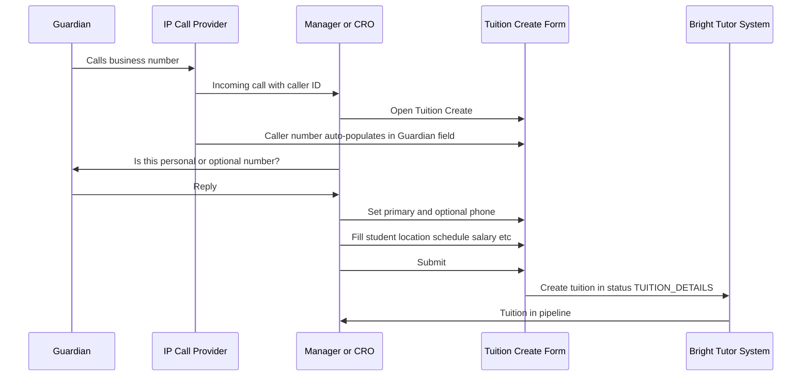

### 1.3 Tuition Creation, Suggestions & CRO Handover (MVP)

- **Source of tuition creation in MVP**
  - **Primary source**: Admin / CRO console via inbound IP call and manual form entry by Manager/CRO (as described above).
  - **Future source**: Guardian app/web will also create tuitions directly; those will enter the same CRO pipeline and cockpit, but **Phase‑01 focuses on console‑driven creation**.

- **Immediate tutor suggestion after form submit**
  - Once the Manager/CRO submits the **Tuition Create** form, the system shall:
    - Use the captured data (class, subjects, medium, area, budget, schedule, gender preference, etc.) to **query the teacher pool**.
    - Produce a **ranked suggestion list** of teachers based on matching rules (configurable later by Admin).
    - Pre‑populate the **“Suggestions”** section of the tuition cockpit for the assigned CRO (see §8.2).

- **Auto‑generated social media content**
  - For each newly created tuition, the system shall generate:
    - A **short, structured text block** suitable for posting on **Facebook, Instagram, WhatsApp, Telegram**, etc.
    - The text includes non‑sensitive tuition details (class, subject, area, approximate budget) and a call‑to‑action for teachers.
  - CRO can review/edit this text in the **“Suggestions / Outreach”** area before posting via the **CRO console actions**.

- **CRO assignment & cockpit entry**
  - On submit, the system:
    - Assigns the tuition to a **CRO owner** (e.g. Tanha, Bushra) based on load‑balancing/business rules.
    - Sets attributes such as:
      - **Tuition ID** (unique, display everywhere).
      - **Lifecycle status** (starts at **TUITION_DETAILS**; see [Section 2](#2-status-engine) for full lifecycle).
      - **Active/Inactive** flag, **Featured** flag (if promoted), **view count**, and **comment count**.
    - Opens the **Tuition Cockpit** for that CRO with all top tabs available (Info, Suggestions, Applications, Shortlist, Comments, Tasks, Call Records, Guardian Chat, Tutor Chat, Tutor↔Guardian Chat, Updates/Logs, Attendance).

**MVP tuition creation to cockpit – sequence (extended):**

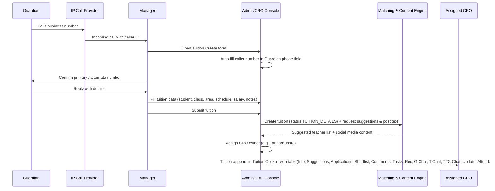

### 1.4 Scope Summary

| Category         | In Scope (Phase 1)                                                                                         | Out of Scope (Phase 1)                 |
| ---------------- | ---------------------------------------------------------------------------------------------------------- | -------------------------------------- |
| **Access**       | Authentication, RBAC, role-based UI                                                                        | —                                      |
| **Guardian**     | Tuition CRUD, shortlist view, chat (unlock), decisions, feedback, payments, refunds                        | —                                      |
| **Teacher**      | Onboarding, profile, apply/shortlist, chat, schedule, earnings, bonus view                                 | —                                      |
| **CRO**          | Pipeline, per-tuition cockpit, status/task engine, calls, SMS/app/social, payment/refund meta              | —                                      |
| **Admin**        | Config (status, protocols, payment, refund, bonus, lock), user/role management, analytics, refund approval | —                                      |
| **Engines**      | Status, Next Task, Time Protocols, Payment, Refund, Bonus, Lock, Ribbon, Notifications                     | Full AI matching, predictive scoring   |
| **Integrations** | SMS (e.g. Teletalk), Push, In-App, Social posting; **IP call provider** (client-provided); **SSLCommerz** (client-provided) | Full external CRM, ERP                 |
| **Data**         | Real-time sync Web + Apps, audit logs, exports                                                             | Detailed student attendance UI/reports |
| **Business**     | Fixed bonus slabs, configurable rules                                                                      | Dynamic pricing, automated negotiation |

---

### 1.5 Tuition Lifecycle At-a-Glance

The **Status Engine** defines the **10-status operational lifecycle** that replaces the current manual Excel/sheets process:

**Status Flow:**  
**TUITION_DETAILS** (IP call → create) → **MESSAGE_TO_TEACHERS** (broadcast SMS/app) → **POST_IN_SOCIAL_MEDIA** (FB/Insta/WhatsApp/Telegram) → **SHORTLISTED** (review applications) → **SEND_DETAILS** (share CV) → **RESPONSE** (call guardian) → **FEEDBACK** (2nd/3rd class) → **GUARDIAN_DECISION** (confirm/next/cancel) → **PAYMENT** (7d/30d/running) → **COMPLETED** ✅

**Key Principles:**
- Each major CRO operational step is an **explicit status** (not a task).
- Every status has **mandatory tasks** with **time protocols** (15h, 7d, 14d, 30d, 44d).
- CRO cannot advance status unless tasks complete, transition allowed, and no lock active.
- **Task Engine** auto-generates next-task checklists per status.

**In this document:** Full details on all 10 statuses, transition matrix, tasks, and protocols are documented in **Part B: Status & Task Lifecycle Engines (Sections 2–3)**.

---


# PART B — STATUS & TASK LIFECYCLE ENGINES

📧 neexg7@gmail.com | 🌐 www.neexg.com | ☎ +880 1743586381

## 2. Status Engine

This section defines the **canonical status machine** for the tuition lifecycle, replacing the current manual Google Sheets process with an automated, status-driven workflow.

**Key Principles:**

- Each major operational step in the CRO pipeline is modeled as an **explicit status** (not a task).
- Lifecycle is divided into **Publish Lifecycle** (statuses 1–3) and **Refining & Alignment** (statuses 4–8), followed by **Payment & Execution** (statuses 9–10) and **Terminal** states.
- The status list is **configurable by Admin** and extended with time protocols and advancement rules.
- Lifecycle starts when **CRO/Manager creates tuition from inbound IP call** flow (caller number auto-populated; primary/alternate phone set; tuition enters **TUITION_DETAILS** status).

---

### 2.1 Status List (Baseline – Configurable)

This is the **10-status operational lifecycle** that matches the draft flow and current business process.

| # | Code | Name | Phase | Badge/Color | Terminal | Description |
|---|------|------|-------|-------------|----------|-------------|
| 1 | TUITION_DETAILS | Tuition Details | Publish | Blue | No | IP call received; tuition created with full info; CRO assigned; call record/summary stored; auto-generated suggested tutors visible. |
| 2 | MESSAGE_TO_TEACHERS | Message to Teachers | Publish | Cyan | No | CRO broadcasts tuition via SMS, app inbox, app push notification to available/suggested teachers; teachers see in app and may apply. |
| 3 | POST_IN_SOCIAL_MEDIA | Post in Social Media | Publish | Purple | No | CRO posts tuition to Facebook, Instagram, WhatsApp, Telegram (template-based, auto-generated content editable). |
| 4 | SHORTLISTED | Shortlisted | Refining | Yellow | No | After receiving applications, CRO creates shortlist of candidate tutors. |
| 5 | SEND_DETAILS | Send Details (CV) | Refining | Orange | No | CRO sends shortlisted tutor CV/profile link to guardian; shares guardian contact to tutor (or vice versa). |
| 6 | RESPONSE | Response / Follow-Up | Refining | Amber | No | CRO calls guardian, collects response summary (demo feedback, meeting arranged, no impact, switch teacher, other); time protocols (15h, 30d) enforced. |
| 7 | FEEDBACK | Feedback (2nd/3rd Class) | Refining | Teal | No | Guardian + Teacher submit feedback after 2nd class (7d protocol) and 3rd class (14d protocol); CRO follows up; may loop to next teacher or confirm. |
| 8 | GUARDIAN_DECISION | Guardian Decision | Refining | Indigo | No | Guardian makes final decision: Confirm tutor / Request next teacher / Cancel tuition. |
| 9 | PAYMENT | Payment & Running | Payment | Green | No | Payment collection (7d, 30d, partial, clear) via SSLCommerz or manual Txn ID; once sufficient payment received, classes **run** (RUNNING sub-state). Refund application/verify/clear handled here. |
| 10 | COMPLETED | Successful | Terminal | Green (dark) | Yes | Tuition successfully completed; all classes done, feedback collected, payment cleared. |
| — | CANCELLED | Cancelled | Terminal | Red | Yes | Tuition cancelled at any stage (guardian/teacher/CRO/system); reason logged. |

**Note on RUNNING:** In this model, **RUNNING** is represented as a sub-state or flag within **PAYMENT** status (when `payment_state = 'running'`). Alternatively, if you prefer RUNNING as a separate status, the list becomes 11 statuses (PAYMENT → RUNNING → COMPLETED). For now, we keep it at 10 with RUNNING embedded in PAYMENT.

---

### 2.2 Status Phases

| Phase | Statuses | Owner | Description |
|-------|----------|-------|-------------|
| **Publish Lifecycle** | 1–3: TUITION_DETAILS, MESSAGE_TO_TEACHERS, POST_IN_SOCIAL_MEDIA | CRO | Creation, outreach, broadcasting to teachers and social channels. |
| **Refining & Alignment** | 4–7: SHORTLISTED, SEND_DETAILS, RESPONSE, FEEDBACK | CRO + Guardian + Teacher | Shortlisting, CV sharing, guardian response, demo/class feedback. |
| **Decision & Commitment** | 8: GUARDIAN_DECISION | Guardian + CRO | Final confirm/next/cancel decision. |
| **Payment & Execution** | 9: PAYMENT (includes RUNNING) | Guardian + Finance + Teacher | Payment collection, classes running, refund handling. |
| **Terminal** | 10: COMPLETED, CANCELLED | System / CRO | End states (success or failure). |

---

### 2.3 Status Transition Matrix (Configurable)

This matrix shows **allowed transitions** (✅) between statuses. Admin can configure this in the console.

| From \ To | MESSAGE_TO_TEACHERS | POST_IN_SOCIAL_MEDIA | SHORTLISTED | SEND_DETAILS | RESPONSE | FEEDBACK | GUARDIAN_DECISION | PAYMENT | COMPLETED | CANCELLED |
|-----------|---------------------|----------------------|-------------|--------------|----------|----------|-------------------|---------|-----------|-----------|
| **TUITION_DETAILS** | ✅ | ✅ | ✅¹ | — | — | — | — | — | — | ✅ |
| **MESSAGE_TO_TEACHERS** | — | ✅ | ✅ | — | — | — | — | — | — | ✅ |
| **POST_IN_SOCIAL_MEDIA** | — | — | ✅ | — | — | — | — | — | — | ✅ |
| **SHORTLISTED** | ✅² | — | — | ✅ | ✅³ | — | — | — | — | ✅ |
| **SEND_DETAILS** | — | — | ✅² | — | ✅ | ✅³ | — | — | — | ✅ |
| **RESPONSE** | — | — | ✅⁴ | ✅⁴ | — | ✅ | ✅ | — | — | ✅ |
| **FEEDBACK** | — | — | ✅⁴ | — | ✅ | — | ✅ | — | — | ✅ |
| **GUARDIAN_DECISION** | — | — | ✅⁴ | — | — | — | — | ✅ | — | ✅ |
| **PAYMENT** | — | — | — | — | — | ✅⁵ | — | — | ✅ | ✅ |
| **COMPLETED** | — | — | — | — | — | — | — | — | — | — |
| **CANCELLED** | — | — | — | — | — | — | — | — | — | — |

**Footnotes:**
1. ¹ Direct jump to SHORTLISTED if tutor applications arrive before broadcast steps complete (rare).
2. ² Loop back to earlier broadcast/shortlist if additional outreach needed.
3. ³ Fast-forward to RESPONSE or FEEDBACK if demo/class already started (CRO discretion).
4. ⁴ "Next Teacher" action: loops back to SHORTLISTED or SEND_DETAILS for new tutor selection.
5. ⁵ During PAYMENT/RUNNING, if issues arise, collect additional feedback before advancing to COMPLETED.

**Enforcement:** System shall enforce transition rules; CRO cannot advance unless:
- Transition is ✅ in matrix.
- All **mandatory tasks** for current status are completed (or skipped with reason).
- No **lock** is active (or Admin override with audit reason).

---

### 2.4 Status Lifecycle Flow (State Diagram)

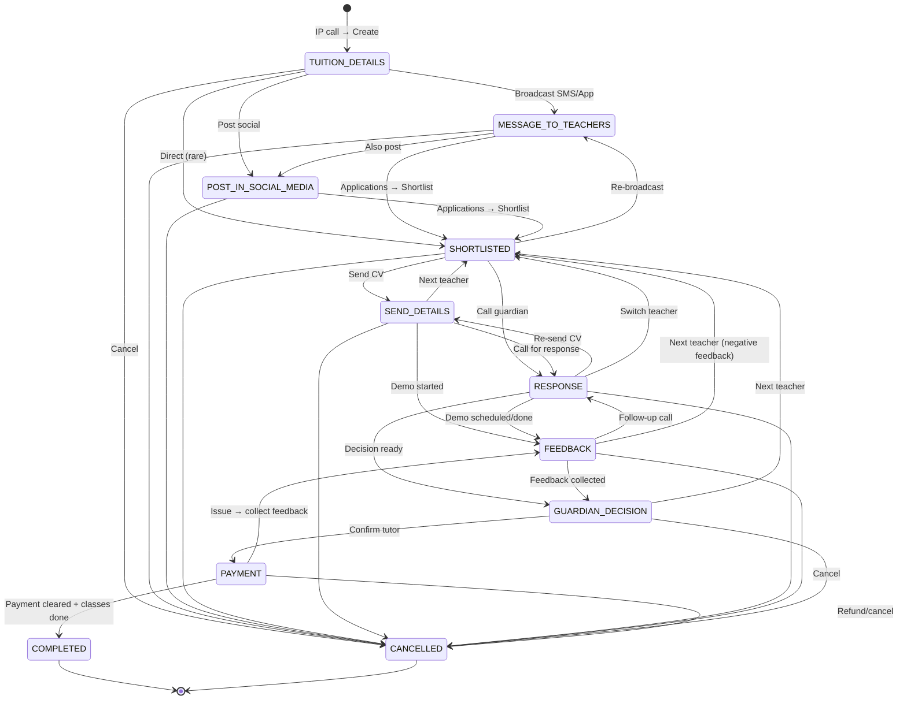

---

### 2.5 Detailed Status Descriptions & Actions

#### Status 1: TUITION_DETAILS

**Entry:** IP call received from guardian; Manager/CRO creates tuition.

**Key Actions:**
- Caller number **auto-populated** in form (primary phone).
- CRO asks: "Personal or optional number?" → set Primary/Alternate.
- Fill all tuition fields: student(s), class, subjects, curriculum, medium, location, schedule, salary range, special requirements, etc.
- Submit → tuition created with **9-digit Tuition ID**.
- **Call record/summary stored** for playback.
- System **auto-generates suggested tutor list** (filter by class, subject, medium, area).
- CRO assigned (or auto-assigned by system rules).

**Mandatory Tasks:**
- Capture tuition details (all required fields).
- Store call record.
- Assign CRO.

**Next Status Options:** MESSAGE_TO_TEACHERS, POST_IN_SOCIAL_MEDIA, SHORTLISTED (rare), CANCELLED.

**Protocol:** Immediate (no SLA; tuition must be created within call session or shortly after).

---

#### Status 2: MESSAGE_TO_TEACHERS

**Entry:** CRO chooses to broadcast tuition to teachers.

**Key Actions:**
- CRO selects teacher list (auto-suggested or custom filter: subject, area, medium, verified badge).
- System sends:
  - **Mobile SMS** (via client SMS provider, e.g. Teletalk).
  - **App inbox message** (in-app notification center).
  - **App push notification** (Firebase Cloud Messaging).
- Teachers open app → see tuition card → **Apply**, **Comment**, **Share**, or **Chat** (if enabled).
- Applications flow into **Applications** tab in Tuition Cockpit.

**Mandatory Tasks:**
- At least one broadcast channel used (SMS or app).
- Message template populated with tuition ID, class, subject, area, salary.

**Next Status Options:** POST_IN_SOCIAL_MEDIA, SHORTLISTED (when applications arrive), CANCELLED.

**Protocol:** RESPONSE_15H (15 hours) – teachers expected to respond within 15h; if no response, CRO may re-broadcast or move to social.

---

#### Status 3: POST_IN_SOCIAL_MEDIA

**Entry:** CRO chooses to post tuition on social media channels.

**Key Actions:**
- System **auto-generates social media post** text (tuition summary: class, subject, area, salary, contact method).
- CRO reviews/edits post in **Suggestions** tab.
- CRO clicks **Publish** → post goes to:
  - **Facebook** page/group (via Graph API or manual post with copy).
  - **Instagram** (via API or manual).
  - **WhatsApp** groups/status (manual or via Business API).
  - **Telegram** channels (via Bot API).
- External applicants may contact via social → CRO manually adds them to Applications or Shortlist.

**Mandatory Tasks:**
- Post to at least one social channel.
- Log post date/time and channel in tuition record.

**Next Status Options:** SHORTLISTED (applications come in), CANCELLED.

**Protocol:** Configurable (typically 24–48h to gather social responses before moving to shortlist).

---

#### Status 4: SHORTLISTED

**Entry:** Applications received (from MESSAGE_TO_TEACHERS, POST_IN_SOCIAL_MEDIA, or direct Teacher app job board search); CRO reviews and creates shortlist.

**Key Actions:**
- CRO opens **Applications** tab → sees all applicants with profile, rating, experience.
- CRO selects top candidates → **Add to Shortlist**.
- **Shortlist** tab now shows 2–5 (configurable) tutors.
- CRO may reorder, promote, or remove tutors from shortlist.
- CRO may call tutors to confirm availability.

**Mandatory Tasks:**
- At least 1 tutor added to shortlist (or mark "no suitable applicants" and loop back).

**Next Status Options:** SEND_DETAILS (proceed to share CV with guardian), RESPONSE (call guardian first), MESSAGE_TO_TEACHERS (re-broadcast if shortlist insufficient), CANCELLED.

**Protocol:** No strict SLA; driven by application arrival time and CRO workload.

---

#### Status 5: SEND_DETAILS

**Entry:** CRO ready to share shortlisted tutor(s) profile/CV with guardian (and vice versa).

**Key Actions:**
- CRO selects tutor(s) from **Shortlist** tab → **Send Details**.
- System sends **tutor CV/profile link** to guardian via:
  - SMS to primary/alternate phone.
  - App notification (if guardian has app).
  - Email (if configured).
- Simultaneously (or sequentially based on rule), CRO may:
  - Share **guardian contact (primary phone)** to tutor (via SMS/app).
  - Enable **T2G (Tutor-Guardian-CRO) chat** if allowed by status rule.
- Guardian reviews tutor profile; tutor reviews guardian summary.

**Mandatory Tasks:**
- CV/details sent to guardian (receipt logged).
- Guardian contact shared to tutor (if configured).

**Next Status Options:** RESPONSE (call guardian for feedback on CV), FEEDBACK (if demo already scheduled), SHORTLISTED (guardian rejects all, need new shortlist), CANCELLED.

**Protocol:** RESPONSE_15H or GUARDIAN_DECIDE (15h to 30d depending on guardian availability).

---

#### Status 6: RESPONSE

**Entry:** CRO calls guardian to collect response summary after CV shared or demo scheduled.

**Key Actions:**
- CRO makes **outbound call** to guardian (via IP call provider).
- After call ends, **modal pops up** in CRO Console → CRO logs:
  - **Call outcome:** No result, Will confirm later, Meeting scheduled, Demo arranged, No impact, Guardian will decide later, Other (free text in comment box).
  - **Next follow-up date** (from calendar picker; system attaches time protocol, e.g. 30d if "will decide later").
- If outcome = **"Switch Teacher"**, system may allow transition back to SHORTLISTED.
- CRO may also send **app message to teacher** for status update (with RESPONSE_15H protocol).
- If no response after protocol expires, system marks tuition **Pending** (exceeds date) in ribbon.

**Mandatory Tasks:**
- Call made and outcome logged (or skippable with reason if guardian unreachable after 3 attempts).
- Follow-up date set if decision deferred.

**Next Status Options:** FEEDBACK (demo happened, collect feedback), GUARDIAN_DECISION (decision ready), SEND_DETAILS (resend CV), SHORTLISTED (switch teacher), CANCELLED.

**Protocol:** RESPONSE_15H (app/SMS response), GUARDIAN_DECIDE (30d for guardian to confirm if "will decide later").

---

#### Status 7: FEEDBACK

**Entry:** Classes started (2nd or 3rd class reached); time to collect satisfaction feedback.

**Key Actions:**
- System triggers **feedback flow** automatically based on class count and time protocol:
  - **After 2nd class (FEEDBACK_2ND_CLASS protocol = 7 days from start):** CRO calls guardian + teacher; collects satisfaction, any issues, continuation intent.
  - **After 3rd class (FEEDBACK_3RD_CLASS protocol = 14 days from start):** Follow-up feedback; confirm continuation or switch/terminate.
- Guardian feedback options:
  - **Continue** (satisfied) → proceed to GUARDIAN_DECISION (confirm) or stay in PAYMENT/RUNNING.
  - **Next Teacher** (not satisfied) → loop back to SHORTLISTED.
  - **Cancel** → CANCELLED.
- Teacher feedback: satisfaction, guardian cooperation, payment status, any issues.
- CRO logs all feedback in **Comments** tab and may attach to tuition timeline.

**Mandatory Tasks:**
- At least one feedback round completed (2nd class or 3rd class).
- Guardian + Teacher responses logged.

**Next Status Options:** GUARDIAN_DECISION (positive feedback → confirm), RESPONSE (additional follow-up call needed), SHORTLISTED (negative feedback → switch teacher), CANCELLED.

**Protocol:** FEEDBACK_2ND_CLASS (7d), FEEDBACK_3RD_CLASS (14d).

---

#### Status 8: GUARDIAN_DECISION

**Entry:** Guardian ready to make final decision after demo, feedback, and interaction with tutor.

**Key Actions:**
- CRO collects guardian's final decision (via call, app, or chat):
  - **Confirm tutor:** Guardian agrees to proceed with this tutor; tuition advances to PAYMENT.
  - **Next Teacher:** Guardian wants to try another tutor; loop back to SHORTLISTED.
  - **Cancel tuition:** Guardian no longer needs tuition; move to CANCELLED (reason logged).
- If decision = **Confirm**, system may:
  - Change tuition flag to **Confirmed** (visible in ribbon metrics: Confirmed count).
  - Unlock **Guardian-Teacher direct chat/contact** (if not already unlocked).
  - Trigger **payment flow** (advance to PAYMENT status).

**Mandatory Tasks:**
- Guardian decision captured and logged.

**Next Status Options:** PAYMENT (confirmed), SHORTLISTED (next teacher), CANCELLED.

**Protocol:** GUARDIAN_DECIDE (30d max; if exceeds, tuition flagged as **Pending** in ribbon).

---

#### Status 9: PAYMENT (includes RUNNING)

**Entry:** Guardian confirmed tutor; payment collection begins; classes run.

**Key Actions:**
- **Payment types** (per Section 12):
  - **Payment 7 Days** (PAYMENT_7D protocol = 7–15 days from confirmation): first instalment or trial period payment.
  - **Payment 30 Days** (PAYMENT_30D protocol = 30–44 days): monthly/end-of-month payment.
  - **Partial Payment:** custom amount, custom due date (entered by CRO/Finance).
  - **Payment Clear:** all dues cleared; total_paid ≥ total_due.
- **Payment methods:**
  - **SSLCommerz** (auto): Guardian pays online via app/web; payment notification received in real-time.
  - **Manual (Transaction ID):** Guardian pays offline (bank transfer, cash to teacher); CRO/Finance records Txn ID, amount, date/time in system.
- Once payment received (7d or partial), classes officially **start** (RUNNING sub-state/flag set to `true`).
- **Attendance:** Teacher marks attendance after each class (in Teacher app); visible in **Attendance** tab in Tuition Cockpit.
- **Refund handling** (if guardian requests refund):
  - Guardian submits **Refund Application** (amount, reason) in app/web.
  - Status: Applied → Verifying (CRO/Finance, REFUND_VERIFY protocol = 15d) → Approved/Rejected (Admin).
  - If Approved → **Refund Clear** → Successful (payment disbursed to guardian).
  - Refund does **not change tuition core status**; it's a parallel sub-flow (see Section 12.3).

**Mandatory Tasks:**
- At least one payment recorded (7d or 30d or partial).
- Classes running (attendance logged by teacher for at least 2–3 classes before advancing to COMPLETED).

**Next Status Options:** FEEDBACK (if issue arises, collect additional feedback), COMPLETED (payment cleared + all classes done), CANCELLED (refund + cancel).

**Protocol:** PAYMENT_7D (7–15d), PAYMENT_30D (30–44d), attendance tracking ongoing.

**Ribbon Impact:**
- **Pay 7 days within next 7 days (including today):** tuitions in PAYMENT status with 7d payment due within 7 days.
- **Payment Date Over:** tuitions in PAYMENT status where 7d or 30d payment due date exceeded (red alert).

---

#### Status 10: COMPLETED (Successful)

**Entry:** All conditions met for successful completion.

**Criteria:**
- Payment cleared (total_paid ≥ total_due) or all agreed payments received.
- All classes completed (attendance confirmed; schedule met).
- Feedback collected (2nd and 3rd class).
- No outstanding issues or refund pending.

**Key Actions:**
- CRO or system marks tuition **COMPLETED**.
- Tuition removed from active CRO pipeline → moved to **History/Archive**.
- **Success Rate** updated: `Success Rate = Confirmed ÷ Assigned` (per CRO; see Section 8.1).
- Guardian and Teacher may rate each other (if not done earlier).
- **Bonus** paid to teacher (per bonus slab; see Section 12.4).

**Terminal:** Yes. No further transitions allowed.

---

#### Status: CANCELLED

**Entry:** Tuition cancelled at any stage.

**Reasons (logged and visible in Comments/Logs tab):**
- Guardian cancelled (no longer needs tuition, moved, budget issue).
- Teacher cancelled (unavailable, conflict).
- CRO cancelled (duplicate, spam, no suitable tutors after prolonged effort).
- System cancelled (SLA exceeded, locked, policy violation).

**Key Actions:**
- CRO selects **Cancel** action → modal pops → select reason + free-text note.
- If payment already received, **refund flow** may trigger (see PAYMENT status refund handling).
- Tuition removed from active pipeline → archived in **Cancelled** section.
- **Ribbon metrics:** does NOT count toward Success Rate; may appear in **Pending exceed count** if cancelled after prolonged delay.

**Terminal:** Yes. No further transitions (except Admin can reopen if mistake).

---

### 2.6 Status Advancement Rules

Status **may advance** only when **all three conditions** are met:

1. **Transition Allowed:** The from→to transition is ✅ in the **Status Transition Matrix** (Section 2.3).
2. **Mandatory Tasks Complete:** All tasks marked **mandatory** for the current status are **completed** or **skipped with reason** (see Section 3 – Next Task Engine).
3. **No Active Lock:** No tuition-level, CRO-level, or system-level **lock** is active (see Section 12.5 – Lock Rules), **unless** Admin overrides with audit reason.

**Enforcement:**
- CRO Console UI **disables** next-status buttons if conditions not met.
- System logs all status changes with timestamp, actor (CRO/Guardian/Teacher/Admin/System), and reason.
- **Status Timeline** visible in tuition detail for Guardian/Teacher/CRO/Admin (audit trail).

---

### 2.7 Lifecycle Flow (OperationalSequence)

Below is the **happy-path operational flow** from IP call to successful completion:

```mermaid
sequenceDiagram
  autonumber
  participant G as Guardian (Caller)
  participant IP as IP Call Provider
  participant CRO as CRO/Manager
  participant SYS as System
  participant T as Teacher(s)
  participant SM as Social Media
  
  G->>IP: Calls business number
  IP->>CRO: Inbound call (caller ID)
  CRO->>SYS: Create Tuition (auto-populate phone)
  SYS->>SYS: Status = TUITION_DETAILS
  SYS->>CRO: Show suggested tutors
  CRO->>SYS: Advance to MESSAGE_TO_TEACHERS
  SYS->>T: Send SMS/App notification
  SYS->>SYS: Status = MESSAGE_TO_TEACHERS
  CRO->>SYS: Advance to POST_IN_SOCIAL_MEDIA
  SYS->>SM: Post tuition (FB, Insta, WA, Telegram)
  SYS->>SYS: Status = POST_IN_SOCIAL_MEDIA
  T->>SYS: Apply to tuition
  CRO->>SYS: Review applications → Shortlist
  SYS->>SYS: Status = SHORTLISTED
  CRO->>SYS: Send Details (CV to guardian)
  SYS->>G: SMS/App with tutor CV
  SYS->>T: Guardian contact shared
  SYS->>SYS: Status = SEND_DETAILS
  CRO->>G: Call to collect response
  G->>CRO: "Will meet tutor tomorrow"
  CRO->>SYS: Log outcome (meeting scheduled)
  SYS->>SYS: Status = RESPONSE
  Note over G,T: Demo class happens
  SYS->>CRO: 7d protocol triggers feedback
  CRO->>G: Call for 2nd class feedback
  G->>CRO: "Satisfied, continue"
  CRO->>SYS: Log feedback (positive)
  SYS->>SYS: Status = FEEDBACK
  CRO->>G: "Please confirm tutor"
  G->>CRO: "Confirmed"
  SYS->>SYS: Status = GUARDIAN_DECISION
  CRO->>SYS: Advance to PAYMENT
  SYS->>G: Payment reminder (7d due)
  G->>SYS: Pay via SSLCommerz
  SYS->>SYS: Payment received; RUNNING=true
  SYS->>SYS: Status = PAYMENT (running)
  Note over T,G: Classes continue; attendance logged
  SYS->>CRO: 14d protocol triggers 3rd class feedback
  CRO->>G: Call for 3rd class feedback
  G->>CRO: "All good"
  Note over G,T: All classes done; payment cleared
  CRO->>SYS: Mark COMPLETED
  SYS->>SYS: Status = COMPLETED
  SYS->>T: Calculate & pay bonus
  SYS->>CRO: Update Success Rate
```

---

### 2.8 Ribbon Filters & Status Grouping

CRO Console **Ribbon** (Section 8.1) provides quick filters based on status and date/task conditions:

| Ribbon Filter | Logic | Statuses Included |
|---------------|-------|-------------------|
| **Today** | Tuitions with tasks due **today** (any status with task.due_date = today) | All non-terminal |
| **Pending** | Tuitions that **exceed any date** of current status protocol (e.g. RESPONSE with GUARDIAN_DECIDE 30d exceeded) | All non-terminal where protocol exceeded |
| **Assigned** | All tuitions assigned to this CRO (any non-terminal status) | All non-terminal |
| **Confirmed** | Tuitions in **GUARDIAN_DECISION → confirmed** or **PAYMENT** (RUNNING=true) | GUARDIAN_DECISION (confirmed), PAYMENT |
| **Pay 7 days** (within next 7 days) | Tuitions in **PAYMENT** with 7d payment due within next 7 days (including today) | PAYMENT |
| **Payment Date Over** | Tuitions in **PAYMENT** where 7d or 30d due date **exceeded** | PAYMENT (overdue) |
| **Date Over** (lifecycle > 60 days) | Tuitions where `created_at` > 60 days ago and still not COMPLETED/CANCELLED (configurable threshold by Admin) | All non-terminal (old) |
| **Success Rate** | `Confirmed ÷ Assigned` (per CRO; dynamically calculated) | N/A (metric, not filter) |

CRO can **search** tuitions by:
- **Tuition ID** (9-digit)
- **Title** (subject/class keyword)
- **Status** (dropdown: all 11 statuses)
- **Location/Area** (dropdown)
- **Date range** (created_at or updated_at)

---

---

## 3. Next Task Engine

The **Next Task Engine** generates and tracks tasks dynamically based on the current tuition **status** and configured **task templates**. Tasks enforce the **status advancement rules** (Section 2.6) and provide actionable checklists for CRO, Guardian, and Teacher.

---

### 3.1 Task Template Schema

Each status may have **one or more task templates** that define what actions must be taken before advancing to the next status.

| Attribute | Description | Example |
|-----------|-------------|---------|
| `status_id` | Link to status (TUITION_DETAILS, MESSAGE_TO_TEACHERS, etc.) | `TUITION_DETAILS` |
| `owner_role` | Who must complete the task: `CRO`, `Guardian`, `Teacher`, or `System` | `CRO` |
| `name` | Short task name (3–7 words) | "Capture tuition details" |
| `description` | Detailed instructions | "Fill all required tuition form fields (class, subject, area, schedule, salary)." |
| `protocol_id` | Default time protocol (determines due date) | `IMMEDIATE` (no delay), `RESPONSE_15H` (15 hours), `GUARDIAN_DECIDE` (30 days) |
| `mandatory` | If `true`, task must be completed (or skipped with reason) to advance status | `true` |
| `skippable` | If `true`, CRO/Admin can mark "Skip" with reason (e.g. "Guardian unreachable after 3 attempts") | `false` |
| `order_index` | Display order in task list (ascending) | `1`, `2`, `3` |

---

### 3.2 Task Instance Lifecycle

When a tuition enters a **status**, the system creates **task instances** from the task templates for that status.

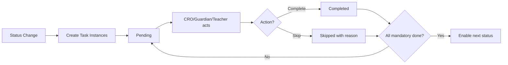

**Task States:**
- **Pending:** Task created, not yet acted upon.
- **Completed:** Task successfully completed by owner.
- **Skipped:** Task skipped (only if `skippable = true`); reason logged.
- **Overdue:** Task due date exceeded (protocol expired); task flagged in ribbon/today view.

**Enforcement:**
- System **disables** status advance buttons in CRO Console UI until all **mandatory** tasks are **completed** or **skipped** (with valid reason).
- Overdue tasks appear in **Ribbon → Today** and **Ribbon → Pending** (see Section 2.8).

---

### 3.3 Protocol Catalogue (Baseline – Configurable)

Protocols define **how long** a task owner has to complete a task before it becomes **overdue**.

| Protocol Name | Duration | Use Case | Trigger Event |
|---------------|----------|----------|---------------|
| **IMMEDIATE** | 0 (instant) | Tasks that must be done synchronously (e.g. capture tuition details during call) | Status entry |
| **RESPONSE_15H** | 15 hours | Teacher app/SMS response deadline; CRO follow-up to guardian | Task created |
| **FEEDBACK_2ND_CLASS** | 7 days | Collect feedback after 2nd class | 2nd class attendance logged |
| **FEEDBACK_3RD_CLASS** | 14 days | Collect feedback after 3rd class | 3rd class attendance logged |
| **REFUND_VERIFY** | 15 days | CRO/Finance verify refund application | Refund application submitted |
| **PAYMENT_7D** | 7–15 days | Pay 7 days payment window (e.g. 7 days from confirmation + 8-day grace) | Tuition confirmed (GUARDIAN_DECISION → PAYMENT) |
| **PAYMENT_30D** | 30–44 days | Pay 30 days / end-of-month (30 days + 14-day grace) | Classes running (PAYMENT status, RUNNING=true) |
| **GUARDIAN_DECIDE** | 30 days | Guardian decision deadline (e.g. after demo, after feedback) | RESPONSE or FEEDBACK status entry |
| **CUSTOM** | Admin-defined | Special tasks with custom SLA (e.g. 2 hours, 3 days, 60 days) | Admin/CRO creates special task |

**Admin Configuration:**
- Admin can **create/edit/delete** protocols in Admin Console → **Settings → Time Protocols**.
- Each protocol stores: `name`, `duration_value`, `duration_unit` (hours/days), `max_override` (how much CRO can extend, e.g. +7 days).

---

### 3.4 Default Task Templates (Per Status)

Below are **example task templates** for each status. Admin can customize these in the Admin Console.

#### Status 1: TUITION_DETAILS

| Task Name | Owner | Description | Protocol | Mandatory | Skippable |
|-----------|-------|-------------|----------|-----------|-----------|
| Capture tuition details | CRO | Fill all required tuition form fields: student(s), class, subjects, medium, location, schedule, salary range, special requirements. | IMMEDIATE | ✅ Yes | ❌ No |
| Store call record | System | Save call recording and summary for playback in Tuition Cockpit → Rec tab. | IMMEDIATE | ✅ Yes | ❌ No |
| Assign CRO | System/Manager | Assign tuition to CRO (or auto-assign by round-robin/area rules). | IMMEDIATE | ✅ Yes | ❌ No |
| Review suggested tutors | CRO | Check auto-generated suggested tutor list; confirm list is valid before broadcasting. | IMMEDIATE | ❌ No | ✅ Yes |

---

#### Status 2: MESSAGE_TO_TEACHERS

| Task Name | Owner | Description | Protocol | Mandatory | Skippable |
|-----------|-------|-------------|----------|-----------|-----------|
| Select teacher list | CRO | Choose teachers from suggestions or custom filter (subject, area, medium, verified). | IMMEDIATE | ✅ Yes | ❌ No |
| Send SMS broadcast | System | Send SMS to selected teachers (via client SMS provider, e.g. Teletalk). | IMMEDIATE | ✅ Yes (if SMS enabled) | ✅ Yes (can skip if app-only) |
| Send app notification | System | Push tuition notification to Teacher app inbox and push notification. | IMMEDIATE | ✅ Yes (if app enabled) | ✅ Yes (can skip if SMS-only) |
| Monitor teacher responses | CRO | Check Applications tab for incoming applications within 15h. | RESPONSE_15H | ❌ No | ✅ Yes |

---

#### Status 3: POST_IN_SOCIAL_MEDIA

| Task Name | Owner | Description | Protocol | Mandatory | Skippable |
|-----------|-------|-------------|----------|-----------|-----------|
| Review auto-generated post | CRO | Check social media post text in Suggestions tab; edit if needed. | IMMEDIATE | ✅ Yes | ❌ No |
| Post to Facebook | CRO | Publish to Facebook page/group (manual or via API). | IMMEDIATE | ✅ Yes (if FB enabled) | ✅ Yes |
| Post to Instagram | CRO | Publish to Instagram (manual or via API). | IMMEDIATE | ❌ No | ✅ Yes |
| Post to WhatsApp/Telegram | CRO | Share to WhatsApp groups or Telegram channels. | IMMEDIATE | ❌ No | ✅ Yes |
| Log post timestamp | System | Record post date/time and channel in tuition record. | IMMEDIATE | ✅ Yes | ❌ No |

---

#### Status 4: SHORTLISTED

| Task Name | Owner | Description | Protocol | Mandatory | Skippable |
|-----------|-------|-------------|----------|-----------|-----------|
| Review applications | CRO | Open Applications tab; review tutor profiles, ratings, experience. | IMMEDIATE | ✅ Yes | ❌ No |
| Add tutors to shortlist | CRO | Select 2–5 (configurable) top candidates → Add to Shortlist tab. | IMMEDIATE | ✅ Yes | ❌ No (must add at least 1) |
| Call tutors for availability | CRO | Call shortlisted tutors to confirm availability and interest (optional but recommended). | RESPONSE_15H | ❌ No | ✅ Yes |
| Reorder shortlist | CRO | Arrange tutors in priority order (best candidate first). | IMMEDIATE | ❌ No | ✅ Yes |

---

#### Status 5: SEND_DETAILS

| Task Name | Owner | Description | Protocol | Mandatory | Skippable |
|-----------|-------|-------------|----------|-----------|-----------|
| Send tutor CV to guardian | System | SMS/app notification with tutor profile link (CV, rating, experience) to guardian. | IMMEDIATE | ✅ Yes | ❌ No |
| Share guardian contact to tutor | System | SMS/app with guardian primary phone to shortlisted tutor(s). | IMMEDIATE | ✅ Yes | ❌ No |
| Enable T2G chat | System | Unlock Tutor-Guardian-CRO three-party chat in Tuition Cockpit (if allowed by status rule). | IMMEDIATE | ❌ No | ✅ Yes |
| Wait for guardian review | CRO | Monitor for guardian response (call, app message, or chat) within 15h–30d (based on guardian availability). | GUARDIAN_DECIDE | ❌ No | ✅ Yes |

---

#### Status 6: RESPONSE

| Task Name | Owner | Description | Protocol | Mandatory | Skippable |
|-----------|-------|-------------|----------|-----------|-----------|
| Call guardian for response | CRO | Outbound call to guardian; collect feedback on tutor CV and schedule demo if agreed. | IMMEDIATE | ✅ Yes | ✅ Yes (skip if guardian called CRO first) |
| Log call outcome | CRO | After call, fill modal with outcome: No result, Will confirm, Meeting scheduled, Demo arranged, No impact, Will decide later, Switch teacher, Other. | IMMEDIATE | ✅ Yes | ❌ No |
| Set follow-up date | CRO | If outcome = "Will decide later", set next follow-up date (protocol GUARDIAN_DECIDE = 30d). | GUARDIAN_DECIDE | ✅ Yes (if deferred) | ❌ No |
| Send app message to teacher | System | Notify teacher of guardian's response (e.g. "Demo scheduled for [date]"). | RESPONSE_15H | ❌ No | ✅ Yes |

---

#### Status 7: FEEDBACK

| Task Name | Owner | Description | Protocol | Mandatory | Skippable |
|-----------|-------|-------------|----------|-----------|-----------|
| Collect guardian feedback (2nd class) | CRO | Call guardian after 2nd class; ask satisfaction, continuation intent, issues. | FEEDBACK_2ND_CLASS (7d) | ✅ Yes | ✅ Yes (skip if guardian unreachable after 3 attempts) |
| Collect teacher feedback (2nd class) | CRO | Call teacher; ask satisfaction, guardian cooperation, payment status, issues. | FEEDBACK_2ND_CLASS (7d) | ✅ Yes | ✅ Yes |
| Log feedback (2nd class) | CRO | Record responses in Comments tab or tuition timeline. | IMMEDIATE | ✅ Yes | ❌ No |
| Collect guardian feedback (3rd class) | CRO | Follow-up call after 3rd class; confirm continuation or switch/terminate. | FEEDBACK_3RD_CLASS (14d) | ✅ Yes | ✅ Yes |
| Collect teacher feedback (3rd class) | CRO | Follow-up with teacher. | FEEDBACK_3RD_CLASS (14d) | ✅ Yes | ✅ Yes |
| Log feedback (3rd class) | CRO | Record responses. | IMMEDIATE | ✅ Yes | ❌ No |
| Decide next action | CRO | Based on feedback: Continue (→ GUARDIAN_DECISION), Switch teacher (→ SHORTLISTED), or Cancel (→ CANCELLED). | IMMEDIATE | ✅ Yes | ❌ No |

---

#### Status 8: GUARDIAN_DECISION

| Task Name | Owner | Description | Protocol | Mandatory | Skippable |
|-----------|-------|-------------|----------|-----------|-----------|
| Call guardian for final decision | CRO | Ask guardian: Confirm tutor / Next teacher / Cancel tuition. | IMMEDIATE | ✅ Yes | ✅ Yes (skip if guardian acted via app) |
| Log guardian decision | CRO | Record decision in system with timestamp. | IMMEDIATE | ✅ Yes | ❌ No |
| Notify tutor (if confirmed) | System | SMS/app to tutor: "Guardian confirmed. Classes start soon. Payment reminder sent." | IMMEDIATE | ✅ Yes (if confirmed) | ❌ No |
| Trigger payment flow | System | Advance tuition to PAYMENT status; create payment tasks (7d, 30d). | IMMEDIATE | ✅ Yes (if confirmed) | ❌ No |

---

#### Status 9: PAYMENT (includes RUNNING)

| Task Name | Owner | Description | Protocol | Mandatory | Skippable |
|-----------|-------|-------------|----------|-----------|-----------|
| Send payment reminder (7d) | System | SMS/app to guardian: "Payment 7 Days due on [date]. Please pay via app or contact CRO." | PAYMENT_7D (7–15d) | ✅ Yes | ❌ No |
| Record payment (7d) | Finance/CRO | When guardian pays (SSLCommerz or manual Txn ID), mark payment received with amount, date/time. | PAYMENT_7D | ✅ Yes | ❌ No |
| Start classes (RUNNING=true) | System | Once 7d payment received, set tuition flag RUNNING=true; unlock Teacher attendance tab. | IMMEDIATE | ✅ Yes | ❌ No |
| Monitor attendance | CRO | Check Attendance tab regularly; ensure teacher logs attendance after each class. | Ongoing | ❌ No | ✅ Yes |
| Send payment reminder (30d) | System | SMS/app to guardian: "Payment 30 Days due on [date]." | PAYMENT_30D (30–44d) | ✅ Yes | ❌ No |
| Record payment (30d or partial) | Finance/CRO | Mark subsequent payments (30d, partial, clear) with Txn ID, amount, date/time. | PAYMENT_30D or CUSTOM | ✅ Yes (if due) | ❌ No |
| Handle refund application (if any) | Finance/CRO | If guardian submits refund: verify within 15d (REFUND_VERIFY protocol) → Admin approves/rejects → disburse if approved. | REFUND_VERIFY (15d) | ✅ Yes (if refund requested) | ❌ No |
| Confirm payment cleared | Finance | Verify total_paid ≥ total_due; mark payment state "Cleared". | IMMEDIATE | ✅ Yes (to advance to COMPLETED) | ❌ No |
| Confirm all classes completed | CRO | Check attendance; ensure all scheduled classes done (or contract period ended). | IMMEDIATE | ✅ Yes (to advance to COMPLETED) | ❌ No |

---

#### Status 10: COMPLETED

| Task Name | Owner | Description | Protocol | Mandatory | Skippable |
|-----------|-------|-------------|----------|-----------|-----------|
| Calculate teacher bonus | System | Apply bonus slab (Section 12.4) based on tuition amount; add to teacher earnings. | IMMEDIATE | ✅ Yes | ❌ No |
| Request guardian rating | System | SMS/app to guardian: "Please rate your experience with [teacher name]." | IMMEDIATE | ❌ No | ✅ Yes |
| Request teacher rating | System | SMS/app to teacher: "Please rate your experience with [guardian name]." | IMMEDIATE | ❌ No | ✅ Yes |
| Update CRO success rate | System | Increment CRO's Confirmed count; recalculate Success Rate = Confirmed ÷ Assigned. | IMMEDIATE | ✅ Yes | ❌ No |
| Archive tuition | System | Move tuition from active CRO pipeline to History/Archive section. | IMMEDIATE | ✅ Yes | ❌ No |

---

### 3.5 Special Tasks

In addition to **default status tasks**, CRO or Admin may create **Special Tasks** for unique situations (e.g. escalation, VIP tuition, investigation).

**Special Task Attributes:**
- **Title:** Custom task name (e.g. "Escalate to Manager", "Call guardian for payment follow-up").
- **Owner:** CRO, Guardian, Teacher, Manager, Admin.
- **Priority:** Low / Medium / High / Critical.
- **Due Date:** Custom date/time (not tied to protocol).
- **Notes:** Free-text description.

**Where Created:**
- CRO Console → Tuition Cockpit → **Tasks** tab → **Add Special Task** button.

**Enforcement:**
- Special tasks do NOT block status advancement (non-mandatory by default).
- But CRO/Admin can mark a special task as **Blocking** (mandatory) if needed; then status cannot advance until task completed.

---

### 3.6 Task Completion Workflow (CRO Console)

**How CRO completes tasks:**

1. **Open Tuition Cockpit** → **Tasks** tab.
2. See list of **Next Tasks** (pending for current status):
   - Task name, owner, due date (protocol-based), mandatory/skippable flag, status (Pending/Completed/Skipped/Overdue).
3. Complete task:
   - **Click "Complete"** → task marked Completed; timestamp + actor logged.
   - **OR Click "Skip"** (if skippable) → modal pops → enter reason → task marked Skipped with reason.
4. System checks: **Are all mandatory tasks done?**
   - **Yes** → **Next Status buttons** (e.g. "Advance to SHORTLISTED", "Advance to SEND_DETAILS") become **enabled**.
   - **No** → buttons remain **disabled**; tooltip shows "Complete mandatory tasks first."
5. CRO clicks enabled next-status button → status changes → new tasks auto-created for new status.

**Overdue Tasks:**
- If task due date exceeded (protocol expired), task flagged **Overdue** (red badge).
- Appears in **Ribbon → Today** (if due today) and **Ribbon → Pending** (if overdue).
- CRO sees overdue count in ribbon: **"Pending: 12 (3 overdue)"**.

---

### 3.7 Admin Task Template Management

**Admin Console → Settings → Task Templates:**

- **View all task templates** (filterable by status).
- **Create new template:** Select status, owner role, name, description, protocol, mandatory/skippable flags.
- **Edit template:** Change name, description, protocol, flags.
- **Delete template:** Remove template (with confirmation; impacts future tuitions only, not existing).
- **Default vs Custom:** System provides **default** templates (as listed in Section 3.4); Admin can customize or add org-specific templates.

**Per-Tuition Override:**
- CRO cannot edit task templates at tuition level (to maintain consistency).
- But CRO can create **Special Tasks** (Section 3.5) for one-off needs


# PART C — PRODUCT VISION & POSITIONING

📧 neexg7@gmail.com | 🌐 www.neexg.com | ☎ +880 1743586381

## 4. Product Vision & Positioning

### 4.1 Vision Statement

**Bright Tutor** is an **operations-first, SLA-driven tuition lifecycle platform** that connects guardians, teachers, and operations teams through a single ecosystem—from lead capture to payment closure—with full auditability and no-code configurability.

### 4.2 Strategic Differentiators

| Differentiator       | Description                                                                   |
| -------------------- | ----------------------------------------------------------------------------- |
| **Operations-first** | Not a simple listing app; CRO-driven pipeline with status + task engine.      |
| **SLA & protocols**  | Every critical step is time-bound (15h, 7d, 14d, 15d, 30d, 44d).              |
| **No-code rules**    | Admin configures statuses, transitions, protocols, bonus, locks without code. |
| **Audit-ready**      | Status changes, payments, refunds, config changes are logged.                 |
| **Multi-channel**    | Guardian/Teacher apps + CRO/Admin web; data synced in near real-time.         |

### 4.3 High-Level Value Proposition

| Stakeholder  | Value                                                                                 |
| ------------ | ------------------------------------------------------------------------------------- |
| **Guardian** | Trusted teacher shortlist, clear communication, flexible payments, refund protection. |
| **Teacher**  | Transparent pipeline, earnings & bonus visibility, verified profile.                  |
| **CRO**      | Clear pipeline, next-task clarity, success rate visibility, no missed follow-ups.     |
| **Admin**    | Full control over rules, financial discipline, reporting, scalability.                |

---

### 4.4 Channels, Portals & Landing Pages

📧 neexg7@gmail.com | 🌐 www.neexg.com | ☎ +880 1743586381

- **Portals / Channels**
  - **P1 – Public Marketing Website**
    - Landing & marketing content, funneling users to register/post tuition or download the app.
  - **P2 – Web Job Board & Account Portal (Guardian / Teacher)**
    - Web interface for browsing open tuitions and accessing Guardian/Teacher accounts.
  - **P3 – Mobile Apps**
    - Bright Tutor mobile apps (Guardian and Teacher) for day-to-day usage.
  - **P4 – Internal CRO / Admin Console**
    - Back-office console for CRO, Manager, Admin, Finance, and internal staff.

- **Marketing Landing (P1) – Core Sections**
  - **Home**: Hero message for Guardians and Teachers, key CTAs (**Post a Tuition**, **Join as Tutor**, **Download App**), stats (total tutors, total guardians, success rate, completed tuitions).
  - **About Us**: Story, mission, team, trust & safety messaging.
  - **How It Works / Process**: Step-by-step journeys for Guardians and Teachers, from lead capture to successful tuition.
  - **Features**: Guardian-focused (curated tutors, safe payments, dedicated CRO support) and Teacher-focused (job board, fair commission, on-time payment).
  - **Pricing / Commission**: High-level description of commission slabs, fees, and refund policy (no internal formulas exposed).
  - **FAQs**: Guardian and Teacher FAQs around process, payments, refunds, cancellations.
  - **Testimonials / Success Stories**: Ratings, reviews, case studies.
  - **Blog / Resources**: Learning and exam-prep content.
  - **Contact / Support**: Contact form, phone, email, WhatsApp, social links.
  - **Join as Tutor**: Entry to Teacher onboarding (web form + deep-link to app stores).
  - **Post a Tuition**: Short Guardian capture form that feeds directly into the CRO tuition-creation pipeline.
  - **App Download**: Links/QR for Android/iOS apps.

- **Job Board & Account Portal (P2) – Key Pages**
  - **Public Job Board** (guest view): Anonymized open tuitions list with filters; click-through prompts login as Teacher.
  - **Login as Guardian**: Access to Guardian dashboard (My Tuitions, Payments, Messages).
  - **Login as Teacher**: Access to Teacher web profile, job board, basic payment entries, and chat (when unlocked).

# PART D — ROLES, RBAC & STAKEHOLDERS

## 5. Stakeholders, Roles & Permissions

### 5.1 Role Definitions

| Role                              | Definition                                                                                  | Primary Interface |
| --------------------------------- | ------------------------------------------------------------------------------------------- | ----------------- |
| **Guardian (Parent)**             | Posts tuitions, selects teachers, pays, gives feedback, requests refunds.                   | Mobile App  |
| **Teacher (Tutor)**               | Applies to tuitions, communicates with guardians, delivers classes, earns payments & bonus. | Mobile App  |
| **CRO**                           | Customer/Conversion/Relationship Officer; owns assigned tuition pipeline, drives lifecycle. | Web Console       |
| **Admin / Manager / Super Admin** | Configures rules, manages users, approves refunds, views analytics.                         | Web Admin Panel   |

### 5.2 RBAC Permission Matrix

**Legend:** ✅ Full access | 🔶 Limited/Conditional | ❌ No access

| Capability                                               | Guest | Guardian | Teacher | CRO    | Admin |
| -------------------------------------------------------- | ----- | -------- | ------- | ------ | ----- |
| View marketing / sample content                          | ✅    | ✅       | ✅      | ❌     | ✅    |
| Register / Login (OTP)                                   | 🔶    | ✅       | ✅      | ✅     | ✅    |
| Create / Edit own profile                                | ❌    | ✅       | ✅      | ✅     | ✅    |
| Post tuition                                             | ❌    | ✅       | ❌      | ❌     | ❌    |
| View own tuitions & history                              | ❌    | ✅       | ❌      | ❌     | ✅    |
| View shortlisted teachers (per tuition)                  | ❌    | ✅       | 🔶      | ✅     | ✅    |
| Chat Guardian ↔ Teacher                                  | ❌    | 🔶\*     | 🔶\*    | ✅     | ✅    |
| View contact (phone) Guardian/Teacher                    | ❌    | 🔶\*     | 🔶\*    | ✅     | ✅    |
| Confirm / Reject / Next teacher                          | ❌    | ✅       | ❌      | 🔶     | ✅    |
| Give feedback (2nd/3rd class)                            | ❌    | ✅       | ✅      | ❌     | ❌    |
| Make payment (7d/30d/partial/clear)                      | ❌    | ✅       | ❌      | 🔶\*\* | ✅    |
| Request refund                                           | ❌    | ✅       | ❌      | ❌     | ❌    |
| Apply to tuition                                         | ❌    | ❌       | ✅      | ❌     | ❌    |
| View earnings & bonus                                    | ❌    | ❌       | ✅      | ✅     | ✅    |
| View assigned tuition pipeline                           | ❌    | ❌       | ❌      | ✅     | ✅    |
| Change tuition status                                    | ❌    | ❌       | ❌      | ✅     | ✅    |
| Create/complete/skip tasks                               | ❌    | ❌       | ❌      | ✅     | ✅    |
| Log call & outcome                                       | ❌    | ❌       | ❌      | ✅     | ✅    |
| Send SMS / App notification / Social post                | ❌    | ❌       | ❌      | ✅     | ✅    |
| Shortlist / Switch teacher                               | ❌    | ❌       | ❌      | ✅     | ✅    |
| Configure rules (status, protocol, payment, bonus, lock) | ❌    | ❌       | ❌      | ❌     | ✅    |
| Manage users (create, verify, deactivate)                | ❌    | ❌       | ❌      | ❌     | ✅    |
| Override lock / status                                   | ❌    | ❌       | ❌      | ❌     | ✅    |
| Approve / Reject refund                                  | ❌    | ❌       | ❌      | ❌     | ✅    |
| View all analytics & exports                             | ❌    | ❌       | ❌      | 🔶     | ✅    |

\*Unlocked only when status allows (e.g. SEND_DETAILS, RESPONSE, FEEDBACK, PAYMENT).  
\*\*CRO may input payment metadata (Txn ID, date) as per policy; cannot approve refunds.

### 5.3 Role–Module Mapping (Summary Table)

| Module                              | Guardian | Teacher | CRO    | Admin   |
| ----------------------------------- | -------- | ------- | ------ | ------- |
| Auth & Profile                      | ✅       | ✅      | ✅     | ✅      |
| Tuition Posting & List              | ✅       | —       | —      | View    |
| Tuition Discovery & Application     | —        | ✅      | —      | View    |
| Shortlist & Teacher View            | ✅       | 🔶      | ✅     | ✅      |
| Chat & Contact Unlock               | ✅       | ✅      | ✅     | ✅      |
| Decisions & Feedback                | ✅       | ✅      | —      | View    |
| Payments (view / act)               | ✅       | View    | 🔶     | ✅      |
| Refund (request / verify / approve) | Request  | —       | Verify | Approve |
| CRO Dashboard & Ribbon              | —        | —       | ✅     | ✅      |
| Tuition Cockpit (per tuition)       | —        | —       | ✅     | ✅      |
| Call Log & Outcome                  | —        | —       | ✅     | ✅      |
| Config & Rule Engine                | —        | —       | —      | ✅      |
| User & Role Management              | —        | —       | —      | ✅      |
| Analytics & Reporting               | —        | —       | 🔶     | ✅      |

---

### 5.4 Portal–Role Access Matrix

📧 neexg7@gmail.com | 🌐 www.neexg.com | ☎ +880 1743586381

| Portal / Channel                                    | Guardian            | Teacher             | CRO    | Admin / Manager / SuperAdmin | Finance | Staff   |
| --------------------------------------------------- | ------------------- | ------------------- | ------ | ----------------------------- | ------- | ------- |
| **P1 – Public Marketing Website**                  | View                | View                | View   | View                          | View    | View    |
| **P2 – Web Job Board & Account Portal (G/T)**      | Full (own account)  | Full (own account)  | ❌      | View                          | View    | ❌      |
| **P3 – Mobile Apps (Guardian / Teacher)**          | Full (Guardian app) | Full (Teacher app)  | ❌      | View (QA/UAT only if needed) | ❌      | ❌      |
| **P4 – CRO / Admin Console (Back Office Web App)** | ❌                   | ❌                   | Full   | Full                          | Partial | Partial |

- Guardians and Teachers access only their **own** records in P2 and P3 via RBAC.
- CROs, Admins, Finance, and Staff perform operational work only in the internal console (P4), not in the public apps.

# PART E — SYSTEM ARCHITECTURE & TECHNOLOGY

📧 neexg7@gmail.com | 🌐 www.neexg.com | ☎ +880 1743586381

## 6. System Design & Architecture

### 6.1 System Context (Actors & System Boundary)

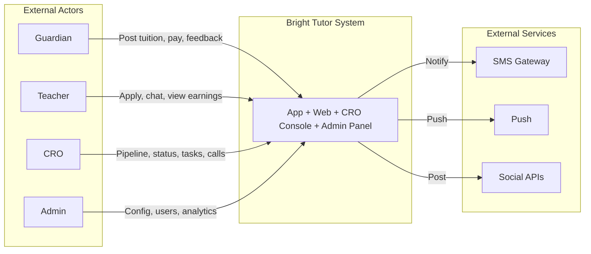

### 6.2 High-Level Component View

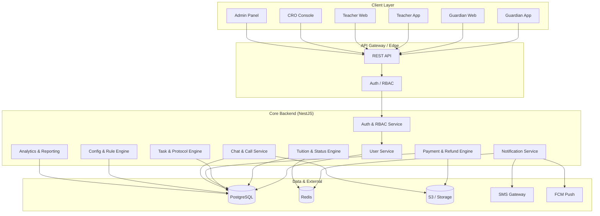

### 6.3 Logical Service Breakdown

| Service                   | Responsibility                                                          | Key Data                                                    |
| ------------------------- | ----------------------------------------------------------------------- | ----------------------------------------------------------- |
| **Auth & RBAC**           | Login (OTP), JWT issue/validate, role resolution, permission checks     | users, roles, sessions                                      |
| **User**                  | Guardian/Teacher/CRO/Admin profiles, stats, verification                | guardian_profiles, teacher_profiles                         |
| **Tuition & Status**      | Tuition CRUD, status lifecycle, transition validation, lock check       | tuitions, statuses, status_transitions, tuition_status_logs |
| **Task & Protocol**       | Task templates, task instances, due dates, completion/skip              | time_protocols, status_task_templates, tuition_tasks        |
| **Payment & Refund**      | Payments, refund applications, verification, approval                   | payments, payment_status, refunds                           |
| **Chat & Call**           | Threads, messages, tags, call records, outcomes                         | chat_threads, chat_messages, call_records                   |
| **Notification**          | In-app, push, SMS triggers from events                                  | queues, templates                                           |
| **Config & Rule**         | Status matrix, protocols, payment/refund rules, bonus slabs, lock rules | config_entries, bonus_slabs, system_locks                   |
| **Analytics & Reporting** | Aggregates, ribbon metrics, reports, exports                            | materialized views, report jobs                             |

### 6.4 Technology Stack & Justification

| Layer              | Choice                              | Why This Stack                                                                           |
| ------------------ | ----------------------------------- | ---------------------------------------------------------------------------------------- |
| **Web Frontend**   | React + Next.js + TypeScript        | SSR/SEO for marketing; shared types with backend; strong ecosystem.                      |
| **Web UI**         | Tailwind CSS + Ant Design / MUI     | Fast UI development; design system alignment with Figma.                                 |
| **State (Web)**    | React Query + Zustand/Redux Toolkit | Server state (React Query), minimal client state (Zustand).                              |
| **Mobile**         | Flutter or React Native + Expo        | Single team can do iOS/Android; shared logic with web via API.                           |
| **Backend**        | Node.js + NestJS                    | TypeScript end-to-end; modular structure; built-in guards for RBAC; enterprise patterns. |
| **API**            | REST (GraphQL optional later)       | Clear contracts; easy integration with mobile; tooling support.                          |
| **Auth**           | JWT + OTP                           | Stateless auth; mobile-friendly; OTP fits local UX. **MVP:** SMS provider (e.g. Teletalk) client-provided. |
| **Primary DB**     | PostgreSQL                          | ACID; JSONB for configs; strong relational model for status/task/payment.                |
| **Chat/Realtime-communication**     | socket.io                          | Socket.IO is a popular JavaScript library designed for real-time, bidirectional, and event-based communication between a web client (browser) and a server               |
| **Cache & Queues** | Redis                               | Caching ribbon/dashboards; BullMQ for jobs (notifications, reports).                     |
| **File Storage**   | S3-compatible (AWS S3 / MinIO)      | Call recordings, exports, attachments.                                                   |
| **Push**           | Firebase Cloud Messaging            | Reliable mobile push.                                                                    |
| **SMS**            | Client-provided (e.g. Teletalk)      | **MVP/Phase-01:** Client provides SMS provider API/credentials for OTP, reminders, alerts. |
| **Payment Gateway** | **SSLCommerz** (client-provided)   | **MVP/Phase-01:** Client provides credentials; online payment collection (7d/30d/partial). |
| **IP Telephony**  | **Client-provided IP call provider** | **MVP/Phase-01:** Inbound/outbound calls; caller ID passed to CRO Console for tuition create auto-populate. |
| **Containers**     | Docker                              | Consistent dev/prod.                                                                     |
| **Orchestration**  | Kubernetes or ECS                   | Scale and resilience.                                                                    |
| **CI/CD**          | GitHub Actions / GitLab CI          | Automated build, test, deploy.                                                           |
| **Monitoring**     | Prometheus + Grafana                | Metrics and dashboards.                                                                  |
| **Logging**        | ELK or CloudWatch                   | Centralized logs and audit trail.                                                        |

### 6.5 Data Flow (Conceptual)

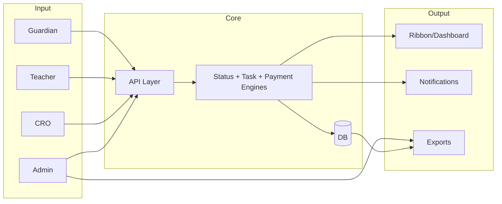

### 6.6 Deployment Architecture (Simplified)

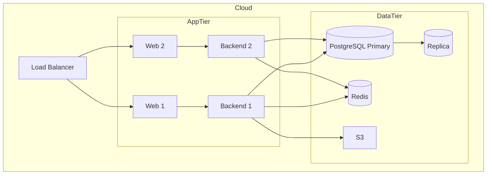

---

# PART F — MODULES & FEATURES (DEEP REQUIREMENTS)

📧 neexg7@gmail.com | 🌐 www.neexg.com | ☎ +880 1743586381

## 7. Module Breakdown

### 7.1 Module Overview Table

| #   | Module                                    | Owner Roles                   | Description                                                |
| --- | ----------------------------------------- | ----------------------------- | ---------------------------------------------------------- |
| M1  | Auth & Identity                           | All                           | OTP login, profile, primary/alternate phone.               |
| M2  | Guardian – Tuition Lifecycle              | Guardian                      | Post, list, detail, status timeline, decisions, feedback.  |
| M3  | Guardian – Interaction                    | Guardian                      | Shortlist view, chat, contact unlock.                      |
| M4  | Guardian – Payments & Refunds             | Guardian                      | Payment summary, pay 7d/30d/partial/clear, refund request. |
| M5  | Teacher – Profile & Verification          | Teacher                       | Profile CRUD, verification badge, metrics.                 |
| M6  | Teacher – Tuition Discovery & Application | Teacher                       | Browse, filter, apply, application status.                 |
| M7  | Teacher – Communication & Earnings        | Teacher                       | Chat, schedule, feedback, earnings, bonus.                 |
| M8  | CRO – Dashboard & Ribbon                  | CRO                           | Ribbon KPIs, today’s tasks, filters.                       |
| M9  | CRO – Tuition Cockpit                     | CRO                           | Per-tuition status, tasks, call log, profiles, actions.    |
| M10 | CRO – Communication & Outreach            | CRO                           | SMS, app, social post, shortlist, contact unlock.          |
| M11 | Admin – Configuration                     | Admin                         | Status, protocols, payment/refund rules, bonus, locks.     |
| M12 | Admin – User & Role Management            | Admin                         | CRUD users, verify, blacklist, roles.                      |
| M13 | Admin – Finance & Refunds                 | Admin                         | Payment view/correct, refund verify/approve.               |
| M14 | Admin – Analytics & Reporting             | Admin                         | Dashboards, KPIs, exports.                                 |
| M15 | Shared – Chat & Call                      | Guardian, Teacher, CRO, Admin | Threads, messages, tags, call records, outcomes.           |
| M16 | Shared – Notifications                    | All                           | In-app, push, SMS triggers.                                |

---

## 8. Guardian Domain – Detailed Requirements

### 8.1 Guardian – Auth & Profile

| Req ID    | Requirement                                                                                                                                    | Priority | Notes                             |
| --------- | ---------------------------------------------------------------------------------------------------------------------------------------------- | -------- | --------------------------------- |
| G-AUTH-01 | System shall allow sign-up/login with mobile number + OTP.                                                                                     | Must     | Primary + alternate numbers.      |
| G-AUTH-02 | System shall store and display primary and alternate phone numbers.                                                                            | Must     | Used for call-to-tuition mapping. |
| G-AUTH-03 | System shall show role-based home (Guardian dashboard) after login.                                                                            | Must     |                                   |
| G-AUTH-04 | Guardian shall be able to edit: full name, address (area, city, details).                                                                      | Must     |                                   |
| G-AUTH-05 | System shall display read-only Guardian stats: total tuitions posted, confirmed, running, trial count, average rating, trust tag (e.g. Green). | Must     | Backend/CRO maintained.           |
| G-AUTH-06 | System shall associate incoming calls from primary/alternate numbers to correct tuition.                                                       | Must     | Business rule from specs.         |

### 8.2 Guardian – Tuition Posting & Management

| Req ID   | Requirement                                                                                                                | Priority | Notes |
| -------- | -------------------------------------------------------------------------------------------------------------------------- | -------- | ----- |
| G-TUI-01 | System shall allow creating a tuition with: class, medium, subjects, budget range, area, schedule, special requirements.   | Must     |       |
| G-TUI-02 | System shall auto-generate a unique 9-digit Tuition ID.                                                                    | Must     |       |
| G-TUI-03 | Guardian shall see list of all own tuitions with status tag (chip with color/icon).                                        | Must     |       |
| G-TUI-04 | Guardian shall open tuition detail: full details, assigned teacher, schedule, status timeline, chat summary, payment card. | Must     |       |
| G-TUI-05 | System shall show history: status changes, call summary (no full recording), feedback entries.                             | Should   |       |

### 8.3 Guardian – Interaction, Decisions, Feedback

| Req ID   | Requirement                                                                                           | Priority | Notes |
| -------- | ----------------------------------------------------------------------------------------------------- | -------- | ----- |
| G-INT-01 | Guardian shall view shortlisted teachers per tuition (profile, rating, experience).                   | Must     |       |
| G-INT-02 | Guardian shall open chat with teacher only when status allows (e.g. SEND_DETAILS, RESPONSE, FEEDBACK).                  | Must     |       |
| G-INT-03 | Guardian shall see teacher contact (phone) only when unlocked by status.                              | Must     |       |
| G-INT-04 | Guardian shall be able to Confirm teacher, Request next teacher, or Cancel.                           | Must     |       |
| G-INT-05 | System shall trigger feedback flows after 2nd class (7-day protocol) and 3rd class (14-day protocol). | Must     |       |
| G-INT-06 | Guardian shall submit satisfaction feedback, continuation/change/terminate, star rating and comment.  | Must     |       |

### 8.4 Guardian – Payments & Refunds

| Req ID   | Requirement                                                                                                                         | Priority | Notes                                                 |
| -------- | ----------------------------------------------------------------------------------------------------------------------------------- | -------- | ----------------------------------------------------- |
| G-PAY-01 | Guardian shall see per-tuition: total due, paid, remaining, next due date, payment state (On Time / Due Soon / Overdue) with color. | Must     |                                                       |
| G-PAY-02 | Guardian shall be able to record/trigger Payment 7 Days, Payment 30 Days, Partial, Payment Clear.                                   | Must     | As per product flow (e.g. via bank then mark in app). |
| G-PAY-03 | Guardian shall see transaction history: Txn ID, amount, type, date/time.                                                            | Must     |                                                       |
| G-PAY-04 | Guardian shall submit refund application (tuition, amount, reason).                                                                 | Must     |                                                       |
| G-PAY-05 | System shall show refund status: Applied → Verifying (15d) → Clear → Successful/Rejected.                                           | Must     |                                                       |

---

## 9. Teacher Domain – Detailed Requirements

### 9.1 Teacher – Profile & Verification

| Req ID   | Requirement                                                                                                                         | Priority | Notes |
| -------- | ----------------------------------------------------------------------------------------------------------------------------------- | -------- | ----- |
| T-PRO-01 | Teacher shall sign up and log in with mobile + OTP.                                                                                 | Must     |       |
| T-PRO-02 | Teacher shall maintain profile: name, photo, education, subjects, classes, medium, preferred areas, experience.                     | Must     |       |
| T-PRO-03 | System shall show "Verified" badge after admin verification.                                                                        | Must     |       |
| T-PRO-04 | System shall display: confirmed count, running count, processing count, rating, payment history (Txn ID, date, amount), bonus band. | Must     |       |

### 9.2 Teacher – Discovery & Application

| Req ID   | Requirement                                                                                      | Priority | Notes |
| -------- | ------------------------------------------------------------------------------------------------ | -------- | ----- |
| T-DIS-01 | Teacher shall browse available tuitions with filters (subject, area, medium, budget).            | Must     |       |
| T-DIS-02 | Teacher shall view tuition detail (class, area, budget, schedule, notes).                        | Must     |       |
| T-DIS-03 | Teacher shall apply / show interest; system shall create application and expose to CRO pipeline. | Must     |       |
| T-DIS-04 | Teacher shall see application status: Applied, Shortlisted, Rejected, Confirmed, Running.        | Must     |       |

### 9.3 Teacher – Communication & Earnings

| Req ID   | Requirement                                                                             | Priority | Notes |
| -------- | --------------------------------------------------------------------------------------- | -------- | ----- |
| T-COM-01 | Teacher shall chat with guardian when status allows; mark important messages; see tags. | Must     |       |
| T-COM-02 | Teacher shall view upcoming classes/schedule.                                           | Must     |       |
| T-COM-03 | Teacher shall submit feedback at 2nd/3rd class checkpoints.                             | Must     |       |
| T-COM-04 | Teacher shall view per-tuition earnings, bonus (by slab), and full payment history.     | Must     |       |

---

## 10. CRO Domain – Detailed Requirements

### 10.1 CRO – Dashboard & Ribbon

| Req ID     | Requirement                                                                           | Priority | Notes      |
| ---------- | ------------------------------------------------------------------------------------- | -------- | ---------- |
| CRO-RIB-01 | System shall show Ribbon: Payment date over (count).                                  | Must     | Red/alert. |
| CRO-RIB-02 | System shall show: Pay 7 days within next 7 days (including today).                   | Must     |            |
| CRO-RIB-03 | System shall show: Those that exceeded payment dates (7d/30d).                        | Must     |            |
| CRO-RIB-04 | System shall show: Today’s tasks (all tasks due today for this CRO, with time slots). | Must     |            |
| CRO-RIB-05 | System shall show: Confirmed count, Assigned count, Pending exceed count.             | Must     |            |
| CRO-RIB-06 | System shall show Success Rate = Confirmed ÷ Assigned Tuitions (per CRO).             | Must     |            |
| CRO-RIB-07 | Ribbon metrics shall update from status and task engine (near real-time/cache).       | Must     |            |

### 10.1a CRO – Tuition Creation (Lead Capture from Inbound Call)

| Req ID        | Requirement                                                                                                                                 | Priority | Notes       |
| ------------- | ------------------------------------------------------------------------------------------------------------------------------------------- | -------- | ----------- |
| CRO-CREATE-01 | When Manager/CRO receives an inbound call via the **client-provided IP call provider**, the **caller number shall auto-populate** in the Tuition Create form (Guardian phone field). | Must     | MVP/Phase-01. |
| CRO-CREATE-02 | CRO/Manager shall confirm with guardian whether the number is **personal (primary)** or **optional (alternate)** and set Primary and Alternate phone accordingly. | Must     |             |
| CRO-CREATE-03 | After filling all required tuition info (student(s), class, subjects, location, schedule, salary, etc.), submission shall create the tuition in status **TUITION_DETAILS** ([Section 2](#2-status-engine)) and add it to the CRO pipeline. | Must     |             |

### 10.2 CRO – Tuition Cockpit

| Req ID     | Requirement                                                                                                                   | Priority | Notes |
| ---------- | ----------------------------------------------------------------------------------------------------------------------------- | -------- | ----- |
| CRO-COK-01 | CRO shall see Tuition ID, full tuition details, current status chip, allowed next statuses.                                   | Must     |       |
| CRO-COK-02 | CRO shall see next-task list (Guardian/Teacher/CRO) with due date, mandatory/skippable, complete/skip.                        | Must     |       |
| CRO-COK-03 | CRO shall add Special tasks (title, owner, priority, due).                                                                    | Should   |       |
| CRO-COK-04 | CRO shall play call recording and log outcome (No result, Will confirm, Meeting scheduled, Cancelled, Switch teacher, Other). | Must     |       |
| CRO-COK-05 | System shall attach time protocol to call outcome when configured (e.g. 15h, 7d, 30d).                                        | Must     |       |
| CRO-COK-06 | CRO shall see Guardian and Teacher mini-profiles (name, trust/rating, counts).                                                | Must     |       |
| CRO-COK-07 | CRO shall change status only when transition is allowed and mandatory tasks complete; system shall enforce lock.              | Must     |       |

#### 10.2.1 Tuition Cockpit Tabs & Actions

For each tuition, the CRO sees a **top navigation strip** of tabs in the cockpit (similar to the UI concept you shared). These tabs centralize all actions and journeys for that specific tuition:

- **Info**
  - Tuition ID, title, class, subjects, medium, area, schedule, salary/budget, protocol tags.
  - Lifecycle status chip (current status from [Section 2](#2-status-engine): e.g. TUITION_DETAILS, MESSAGE_TO_TEACHERS, SHORTLISTED, SEND_DETAILS, RESPONSE, FEEDBACK, GUARDIAN_DECISION, PAYMENT, COMPLETED, CANCELLED).
  - Flags: **Active/Inactive**, **Featured**, **view count**, **comment count**.
  - Assigned CRO name (e.g. Tanha, Bushra), created/updated timestamps.

- **Suggestions**
  - Auto‑generated **suggested tutor list** from the teacher pool based on the tuition form data.
  - CRO can add/remove tutors from this list and convert them to broadcasts or shortlist entries.
  - Contains the **auto‑generated social media post content** that CRO may edit and publish to FB/Insta/WhatsApp/Telegram.

- **Applications**
  - All tutor **applications** to this tuition (from Teacher app/web).
  - Columns: teacher name, profile badges, application time, status (Applied, Shortlisted, Rejected, Confirmed, Running).
  - Actions: move application to Shortlist or Reject with reasons.

- **Shortlist**
  - Current shortlist of candidate tutors.
  - CRO can reorder, promote/demote, or remove tutors, and trigger **send_details** to Guardian/Tutor from here.

- **Comments**
  - Internal notes and commentary from CRO/Manager/Admin.
  - System‑generated comments for major events (status changes, protocol breaches, payment events).

- **Tasks**
  - All **Next Tasks** (Guardian / Teacher / CRO) with owner, due date (from time protocol), mandatory/skippable flag, and status.
  - CRO can complete or skip tasks (with reason), create ad‑hoc tasks, and reassign tasks to other CROs where allowed.

- **Rec (Call Records)**
  - List of related call recordings (Guardian↔CRO, CRO↔Teacher).
  - CRO can play recordings and tag outcomes such as Will confirm, No impact, Meeting scheduled, Cancelled, Switch teacher, Other.

- **G Chat (Guardian Chat)**
  - Chat thread between CRO and Guardian scoped to this tuition.
  - Used for clarifications, scheduling, decision follow‑up, and payment reminders.

- **T Chat (Tutor Chat)**
  - Chat thread between CRO and each tutor for this tuition.
  - Used for availability checks, negotiation within rules, and sharing logistics.

- **T2G Chat (Tutor & Guardian Chat)**
  - Three‑party chat (Tutor + Guardian + CRO), enabled only at allowed statuses (e.g. SEND_DETAILS, RESPONSE, FEEDBACK, PAYMENT with RUNNING=true).
  - CRO can mute or temporarily lock the channel; all messages are logged against the tuition.

- **Update / Logs**
  - Chronological log of all important events:
    - Status changes, task completions/skips.
    - Payments and refunds events.
    - CRO assignment changes, lock/unlock operations.
  - Filter by actor (CRO, Guardian, Teacher, Admin) and action type.

- **Attendance**
  - Per‑tuition attendance summary from Teacher app (date/time, present/absent, notes).
  - MVP may start with read‑only view; later phases can add detailed attendance analytics.

### 10.3 CRO – Communication & Outreach

| Req ID     | Requirement                                                                                                                                          | Priority | Notes |
| ---------- | ---------------------------------------------------------------------------------------------------------------------------------------------------- | -------- | ----- |
| CRO-OUT-01 | CRO shall send tuition to teachers via: Mobile SMS, App Inbox, App push.                                                                             | Must     |       |
| CRO-OUT-02 | CRO shall post to Facebook & Instagram, WhatsApp, Telegram (template-based).                                                                         | Must     |       |
| CRO-OUT-03 | CRO shall shortlist teachers; send details/CV to guardian; call about CV; share Guardian number to Teacher and Teacher to Guardian (simultaneously). | Must     |       |
| CRO-OUT-04 | CRO shall unlock Guardian–Teacher chat and contact at allowed status.                                                                                | Must     |       |

---

## 11. Admin Domain – Detailed Requirements

### 11.1 Admin – Configuration

| Req ID     | Requirement                                                                                                                     | Priority | Notes                             |
| ---------- | ------------------------------------------------------------------------------------------------------------------------------- | -------- | --------------------------------- |
| ADM-CFG-01 | Admin shall define status list and transition matrix (from → to), with flags: mandatory, skippable, rollback allowed, lockable. | Must     |                                   |
| ADM-CFG-02 | Admin shall define time protocols (name, duration value, unit, max override).                                                   | Must     | e.g. 7d, 14d, 15h, 15d, 30d, 44d. |
| ADM-CFG-03 | Admin shall configure payment rules (Pay 7d, Pay 30d, partial, clear, grace, overdue logic).                                    | Must     |                                   |
| ADM-CFG-04 | Admin shall configure refund rules (eligibility, verification SLA, approver role).                                              | Must     |                                   |
| ADM-CFG-05 | Admin shall edit bonus slabs (min, max, bonus amount); system shall recalc teacher bonus.                                       | Must     |                                   |
| ADM-CFG-06 | Admin shall define lock rules (triggers, scope) and override unlock with reason (audit).                                        | Must     |                                   |

### 11.2 Admin – Users, Finance, Analytics

| Req ID     | Requirement                                                                                                                                 | Priority | Notes |
| ---------- | ------------------------------------------------------------------------------------------------------------------------------------------- | -------- | ----- |
| ADM-USR-01 | Admin shall create/edit/deactivate Guardians, Teachers, CROs, Admins; set roles.                                                            | Must     |       |
| ADM-USR-02 | Admin shall verify/reject Teacher profile (Verified badge).                                                                                 | Must     |       |
| ADM-FIN-01 | Admin shall view all payments (filter by tuition, guardian, teacher, CRO, status); correct with audit log.                                  | Must     |       |
| ADM-FIN-02 | Admin shall view refund applications, verify, approve/reject, mark Clear/Successful.                                                        | Must     |       |
| ADM-ANA-01 | Admin shall view dashboards: CRO success rate, teacher conversion, guardian metrics, payment/refund, operational (status, locked, overdue). | Must     |       |
| ADM-ANA-02 | Admin shall export reports (CSV/Excel) by date, CRO, area, subject, status.                                                                 | Must     |       |

---

# PART G — PAYMENT, REFUND & BONUS ENGINE

📧 neexg7@gmail.com | 🌐 www.neexg.com | ☎ +880 1743586381

## 12. Payment & Refund Engine

### 12.1 Payment Types

| Type          | Description      | Typical Window              |
| ------------- | ---------------- | --------------------------- |
| Pay 7 Days    | First instalment | Day 7–15 from start         |
| Pay 30 Days   | Monthly / EOM    | e.g. 44 days from start     |
| Partial       | Custom amount    | Custom due                  |
| Payment Clear | All dues cleared | When total_paid ≥ total_due |

### 12.2 Payment State

| State    | Condition                   | UI Color |
| -------- | --------------------------- | -------- |
| ON_TIME  | due_date > today            | Green    |
| DUE_SOON | due_date within next 7 days | Amber    |
| OVERDUE  | due_date < today            | Red      |

### 12.3 Refund State Machine

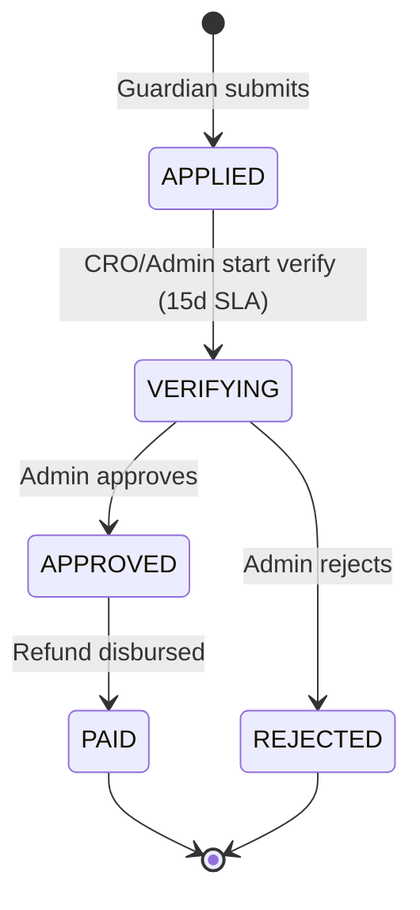

### 12.4 Bonus Slabs (Baseline – Configurable)

| Tuition Amount (BDT) | Bonus (BDT) |
| -------------------- | ----------- |
| 500 – 999            | 250         |
| 1,000 – 2,000        | 300         |
| 2,000 – 3,000        | 350         |
| 3,000 – 5,000        | 400         |
| 5,000 – 7,000        | 500         |
| 7,000 – 9,000        | 600         |
| 9,000 – 12,000       | 800         |
| 12,000+              | 1,000       |

---

### 12.5 Lock Rules & Overload Control

**Purpose:** Prevent CRO/system overload by temporarily **locking** tuitions or CROs when certain thresholds or conditions are breached. Locks **block status advancement** until resolved or overridden by Admin.

#### 12.5.1 Lock Scopes

| Lock Scope | Applies To | Trigger Examples |
|------------|-----------|------------------|
| **Tuition-level lock** | Single tuition | Payment overdue > 30 days; refund under investigation; guardian flagged as high-risk; duplicate tuition detected. |
| **CRO-level lock** | All tuitions assigned to a CRO | CRO assigned > max_tuitions threshold (e.g. 50 active tuitions); CRO on leave; CRO under performance review. |
| **System-level lock** | All tuitions (global) | Emergency maintenance; policy change pending; major incident (e.g. payment gateway down). |

#### 12.5.2 Lock Triggers (Configurable by Admin)

| Trigger Rule | Lock Scope | Auto Lock? | Example Condition |
|-------------|------------|------------|-------------------|
| **Payment Overdue Exceed Threshold** | Tuition | ✅ Yes | Payment 7d or 30d overdue by > 30 days (Admin sets threshold in days). |
| **CRO Tuition Count Exceed Limit** | CRO | ✅ Yes | CRO has > 50 active (non-terminal) tuitions assigned (Admin sets limit). |
| **Guardian High-Risk Flag** | Tuition | ❌ Manual | Admin/Finance manually flags guardian as high-risk (e.g. fraud, payment dispute). |
| **Refund Under Investigation** | Tuition | ✅ Yes (if refund state = VERIFYING and investigation flag set) | Refund amount disputed or suspicious. |
| **Duplicate Tuition** | Tuition | ❌ Manual | CRO or system detects same guardian posted very similar tuition twice; CRO manually locks one. |
| **Policy Violation** | Tuition or CRO | ❌ Manual | Admin locks due to policy breach (e.g. unauthorized discount, tutor collusion). |

#### 12.5.3 Lock Behavior

**When a tuition/CRO is locked:**

1. **Status Advance Blocked:** CRO **cannot** advance tuition to next status (even if all mandatory tasks completed).
   - UI displays **red "Locked" badge** on tuition card and cockpit.
   - Next-status buttons **disabled** with tooltip: _"Tuition locked due to [reason]. Contact Admin."_

2. **Edit Restricted (optional):** Admin may configure locks to also **block edits** (e.g. cannot change tutor shortlist, cannot log payments).

3. **Visibility:**
   - **CRO Console:** Locked tuitions appear with 🔒 icon in tuition list; Ribbon may show "Locked: 5 tuitions."
   - **Admin Console:** Admin sees all locked tuitions in **Analytics → Locked Tuitions** dashboard.

4. **Unlock:**
   - **Auto-unlock:** If lock was auto-triggered (e.g. payment overdue), system may auto-unlock once condition resolved (e.g. payment received, overdue cleared).
   - **Manual Admin Override:** Admin can manually **unlock** any tuition/CRO with **reason** (logged in audit trail).
     - **Admin Console → Locked Tuitions → Select tuition → Unlock → Enter reason** (e.g. "Payment issue resolved", "Guardian verified", "Emergency approval").
     - Unlock reason **must be entered**; audit log records Admin name, timestamp, reason.

#### 12.5.4 Admin Lock Management

**Admin Console → Settings → Lock Rules:**

- **View Lock Triggers:** List of all lock rules (payment overdue, CRO limit, etc.) with ON/OFF toggle.
- **Configure Thresholds:** Edit threshold values (e.g. payment overdue threshold = 30 days → change to 45 days).
- **Create Custom Lock Rule:** Admin can define new triggers (e.g. "Lock if tuition in RESPONSE status > 60 days without advancement").
- **Manual Lock/Unlock:** Admin can lock/unlock any tuition or CRO manually (with reason).

**Locked Tuitions Dashboard (Admin):**

- Filter: All Locked / Tuition-level / CRO-level / System-level.
- Columns: Tuition ID, Guardian, CRO, Status, Lock Reason, Locked Since, Actions (Unlock, View Details).
- Bulk Unlock (Admin only): Select multiple tuitions → Unlock All (confirm + reason).

# PART H — USER STORIES & USER JOURNEYS

📧 neexg7@gmail.com | 🌐 www.neexg.com | ☎ +880 1743586381

## 13. User Stories (Structured)

### 13.1 Guardian

| ID      | Story                                                                                                                                              | Acceptance                                                       |
| ------- | -------------------------------------------------------------------------------------------------------------------------------------------------- | ---------------------------------------------------------------- |
| US-G-01 | As a **Guardian**, I want to **register with primary and alternate phone** so that **all my calls are linked to the correct tuition**.             | OTP login; both numbers stored and used for call mapping.        |
| US-G-02 | As a **Guardian**, I want to **post a tuition** with class, subjects, budget, area, schedule so that **Bright Tutor can find a matching teacher**. | 9-digit ID generated; tuition appears in CRO pipeline.           |
| US-G-03 | As a **Guardian**, I want to **see shortlisted teachers** with profile and rating so that **I can choose confidently**.                            | Shortlist view per tuition with cards.                           |
| US-G-04 | As a **Guardian**, I want to **chat and call the teacher** only after Bright Tutor unlocks it so that **I can conduct a demo safely**.             | Chat/contact visible only at allowed status.                     |
| US-G-05 | As a **Guardian**, I want to **confirm, change, or cancel the teacher** so that **I stay in control**.                                             | Confirm / Next teacher / Cancel actions available.               |
| US-G-06 | As a **Guardian**, I want to **pay in flexible ways** (7 days / 30 days / partial) so that **I can manage cash flow**.                             | Payment types and history visible and actionable.                |
| US-G-07 | As a **Guardian**, I want to **request a refund and track status** so that **I feel protected**.                                                   | Refund form and status (Applied → Verifying → Clear/Successful). |

### 13.2 Teacher

| ID      | Story                                                                                                      | Acceptance                                         |
| ------- | ---------------------------------------------------------------------------------------------------------- | -------------------------------------------------- |
| US-T-01 | As a **Teacher**, I want to **create a verified profile** so that **guardians and CROs trust me**.         | Profile CRUD; Verified badge after admin approval. |
| US-T-02 | As a **Teacher**, I want to **see only relevant tuitions** (area, subject) so that **I don’t waste time**. | Filtered list and apply.                           |
| US-T-03 | As a **Teacher**, I want to **know if I am shortlisted or rejected** so that **I understand my pipeline**. | Application status visible.                        |
| US-T-04 | As a **Teacher**, I want to **chat with the guardian** only when allowed so that **privacy is respected**. | Chat enabled by status.                            |
| US-T-05 | As a **Teacher**, I want to **see my earnings and bonus** clearly so that **I can plan**.                  | Per-tuition earnings and bonus band visible.       |

### 13.3 CRO

| ID        | Story                                                                                                                           | Acceptance                                   |
| --------- | ------------------------------------------------------------------------------------------------------------------------------- | -------------------------------------------- |
| US-CRO-01 | As a **CRO**, I want a **ribbon with overdue, today’s tasks, success rate** so that **I can prioritize my day**.                | Ribbon blocks as specified.                  |
| US-CRO-02 | As a **CRO**, I want a **per-tuition cockpit** (status, tasks, call, profiles) so that **I can act without switching screens**. | All sections on one screen.                  |
| US-CRO-03 | As a **CRO**, I want to **log call outcomes** that auto-create next tasks with SLA so that **follow-ups are never missed**.     | Outcome dropdown and protocol attachment.    |
| US-CRO-04 | As a **CRO**, I want to **broadcast tuitions** (SMS, app, social) so that **I can build a shortlist fast**.                     | Message to teachers and social post actions. |
| US-CRO-05 | As a **CRO**, I want to **see my success rate** so that **I can improve**.                                                      | Success Rate = Confirmed ÷ Assigned.         |

### 13.4 Admin

| ID      | Story                                                                                                                           | Acceptance                           |
| ------- | ------------------------------------------------------------------------------------------------------------------------------- | ------------------------------------ |
| US-A-01 | As an **Admin**, I want to **configure statuses and transitions** in the UI so that **business rules can change without code**. | Status matrix configurable.          |
| US-A-02 | As an **Admin**, I want to **set time protocols and payment/refund rules** so that **SLA and finance are consistent**.          | Protocols and rules editable.        |
| US-A-03 | As an **Admin**, I want to **set lock rules and override with reason** so that **overload is controlled and auditable**.        | Lock config and override with audit. |
| US-A-04 | As an **Admin**, I want to **see full analytics and export** so that **I can report and improve**.                              | Dashboards and CSV/Excel export.     |

---

## 14. User Journeys & Flows (with Diagrams)

### 14.1 End-to-End Tuition Lifecycle (Guardian → CRO → Teacher → Payment)

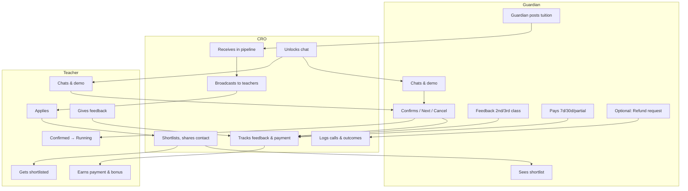

### 14.2 Guardian Journey – Step-by-Step

| Step | Actor    | Action                                                      | System Response                                      |
| ---- | -------- | ----------------------------------------------------------- | ---------------------------------------------------- |
| 0a   | Guardian | **Alternative:** Calls business number                      | CRO receives via IP; caller number auto-populates in Tuition Create; CRO sets primary/optional, fills form, submits (§1.3). |
| 1    | Guardian | Opens app, enters phone, requests OTP                       | OTP sent; login on verify                            |
| 2    | Guardian | Fills tuition form (class, subject, budget, area, schedule) | Tuition created; 9-digit ID; appears in CRO pipeline |
| 3    | Guardian | Views "My Tuitions"                                         | List with status chips                               |
| 4    | CRO      | Shortlists teachers, shares with guardian                   | Guardian sees shortlist                              |
| 5    | Guardian | Opens teacher cards, later chat (when unlocked)             | Chat and contact visible at allowed status           |
| 6    | Guardian | Attends demo                                                | —                                                    |
| 7    | Guardian | Clicks Confirm / Next teacher / Cancel                      | Status updated; if Confirm → Running                 |
| 8    | Guardian | Receives feedback prompt (after 2nd/3rd class)              | Submits feedback within 7d/14d                       |
| 9    | Guardian | Opens payment card, pays (7d/30d/partial)                   | Payment recorded; history updated                    |
| 10   | Guardian | Optionally requests refund                                  | Refund APPLIED; status trackable                     |

### 14.3 Teacher Application → Shortlist → Confirm (Sequence)

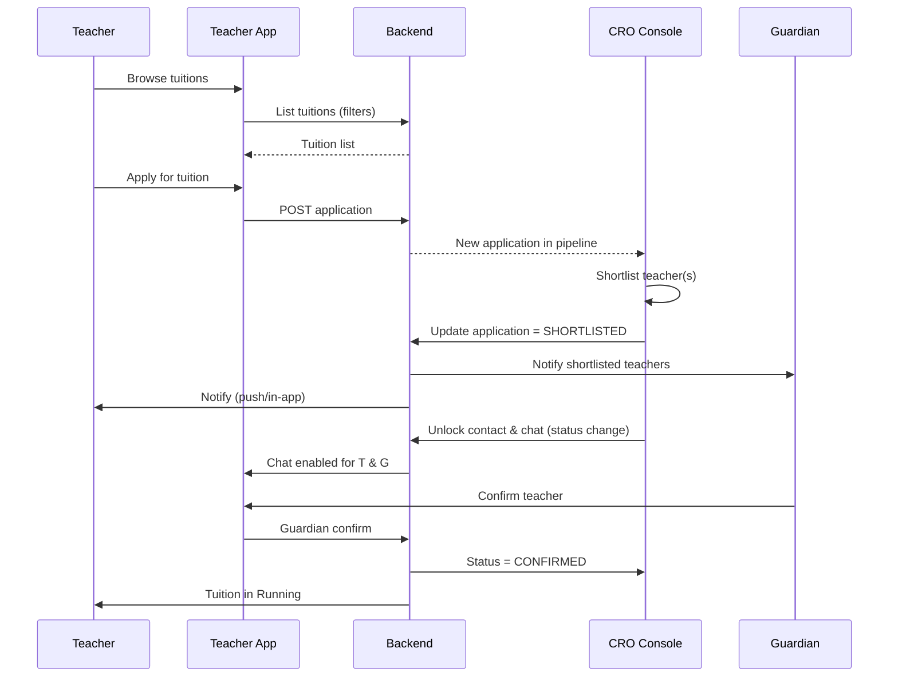

### 14.4 CRO Daily Flow – Task & Status (Sequence)

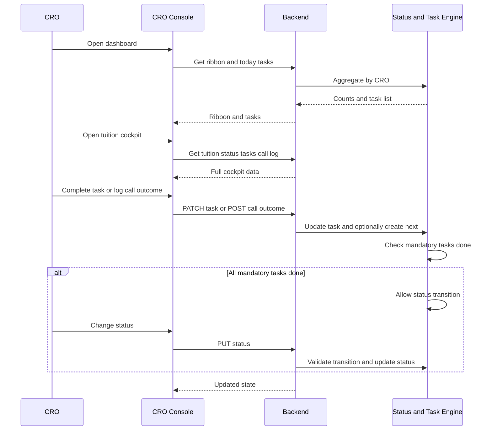

### 14.5 Payment & Refund Flow (Sequence)

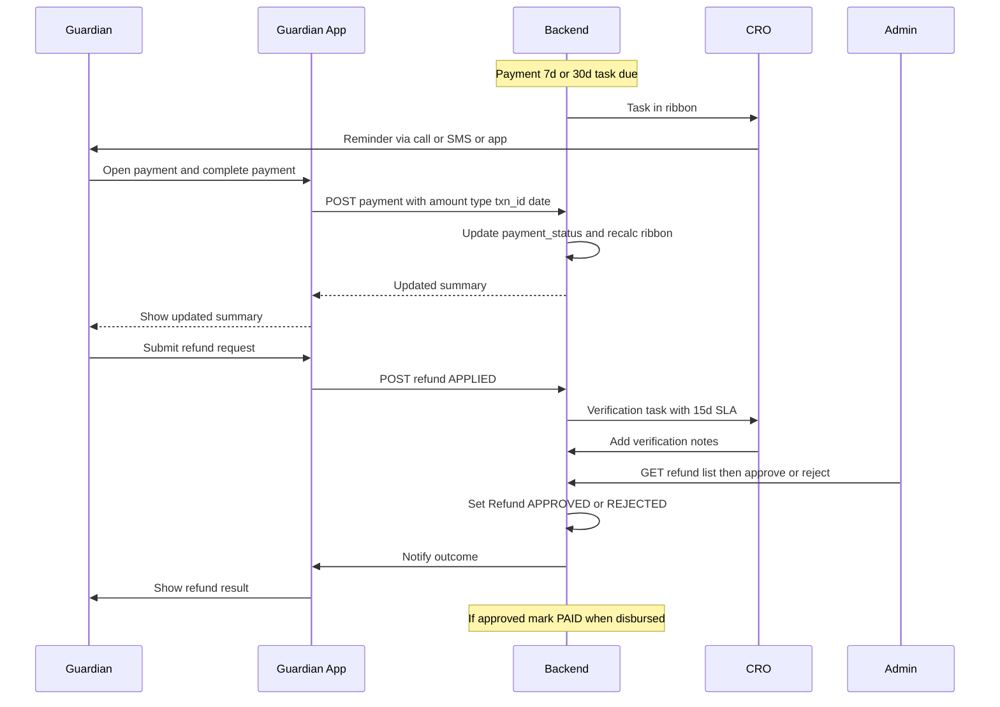

### 14.6 Full Tuition Lifecycle (Flowchart)

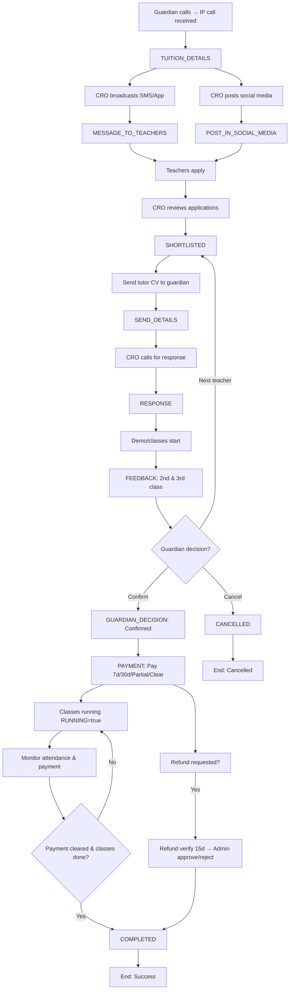

# PART I — NON-FUNCTIONAL &OPERATIONS

📧 neexg7@gmail.com | 🌐 www.neexg.com | ☎ +880 1743586381

## 15. Non-Functional Requirements

### 15.1 Performance

| ID     | Requirement                    | Target                                |
| ------ | ------------------------------ | ------------------------------------- |
| NFR-P1 | API response time (p95)        | < 300 ms under normal load            |
| NFR-P2 | Status / ribbon update latency | Within seconds (event-driven + cache) |
| NFR-P3 | Concurrent users               | Scale to 100K+ users                  |
| NFR-P4 | Active tuitions                | Tens of thousands                     |

### 15.2 Security

| ID     | Requirement                                                           |
| ------ | --------------------------------------------------------------------- |
| NFR-S1 | RBAC enforced at API and UI.                                          |
| NFR-S2 | JWT-based authentication; token expiry and refresh.                   |
| NFR-S3 | Payment and call data access restricted by role.                      |
| NFR-S4 | Sensitive data encrypted in transit (TLS) and at rest where required. |

### 15.3 Reliability & Availability

| ID     | Requirement                                      |
| ------ | ------------------------------------------------ |
| NFR-R1 | Target uptime ≥ 99.5%.                           |
| NFR-R2 | Database backups and recovery procedure defined. |
| NFR-R3 | Graceful degradation under load (no data loss).  |

### 15.4 Audit & Compliance

| ID     | Requirement                                                                       |
| ------ | --------------------------------------------------------------------------------- |
| NFR-A1 | Audit log: status changes, payment/refund actions, config changes, lock override. |
| NFR-A2 | Logs retained per retention policy; tamper-evident where required.                |

---

## 16. Delivery Roadmap

### 16.1 Phase Overview

| Phase        | Duration   | Focus                                                                                 |
| ------------ | ---------- | ------------------------------------------------------------------------------------- |
| **Phase 0**  | 2–3 weeks  | BRD/PRD sign-off; status matrix & RBAC freeze; design alignment                       |
| **Phase 1**  | 8–12 weeks | Core lifecycle: Guardian/Teacher apps, CRO console, status+task engine, basic payment |
| **Phase 2**  | 6–8 weeks  | Payment/refund engine, bonus, lock, ribbon, analytics                                 |
| **Phase 3**  | 4–6 weeks  | Hardening, security audit, UAT, go-live readiness                                     |
| **Phase 4+** | Future     | AI matching, CRM, attendance, dynamic pricing                                         |

### 16.2 Phase 1 – Feature vs Module

| Module                  | Phase 1 Deliverable                                                               |
| ----------------------- | --------------------------------------------------------------------------------- |
| M1 Auth                 | OTP login, profile (Guardian/Teacher/CRO/Admin)                                   |
| M2 Guardian Tuition     | Post, list, detail, status timeline                                               |
| M3 Guardian Interaction | Shortlist view, chat (unlock), contact                                            |
| M4 Guardian Payment     | Summary, pay 7d/30d/partial/clear, refund request                                 |
| M5–M7 Teacher           | Profile, apply, shortlist status, chat, earnings, bonus view                      |
| M8–M10 CRO              | Ribbon, cockpit, status/task, call log, SMS/app/social, shortlist, unlock         |
| M11–M14 Admin           | Basic config (status, protocols), user CRUD, payment/refund view, basic analytics |
| M15–M16 Shared          | Chat, call metadata, in-app + push + SMS triggers                                 |

---

## 17. Acceptance Criteria (Traceability)

### 17.1 Summary Table

| #    | Criterion                                                                           | Verifiable By          |
| ---- | ----------------------------------------------------------------------------------- | ---------------------- |
| AC-1 | All roles (Guardian, Teacher, CRO, Admin) log in and see only authorized modules.   | RBAC test matrix       |
| AC-2 | Status transitions follow configured matrix; illegal transitions rejected.          | Status engine tests    |
| AC-3 | Mandatory tasks block status advance until completed/skipped.                       | Task engine tests      |
| AC-4 | Payment types (7d, 30d, partial, clear) work; overdue and ribbon reflect correctly. | Payment + ribbon tests |
| AC-5 | Refund flow: Applied → Verifying → Approve/Reject → Clear/Successful.               | Refund flow E2E        |
| AC-6 | Ribbon shows correct counts (confirmed, pending exceed, success rate).              | Dashboard tests        |
| AC-7 | Admin config changes (protocols, bonus, status) apply without code deploy.          | Config tests           |
| AC-8 | Critical actions (status, payment, refund, config, lock) are audit logged.          | Audit log checks       |

---

# PART J — APPENDICES

📧 neexg7@gmail.com | 🌐 www.neexg.com | ☎ +880 1743586381

## Appendix A – Glossary

| Term              | Definition                                                                                 |
| ----------------- | ------------------------------------------------------------------------------------------ |
| **CRO**           | Customer / Conversion / Relationship Officer; operations role owning tuition pipeline.     |
| **Tuition**       | A tutoring request posted by a Guardian (one student, one or more subjects).               |
| **Status**        | Current stage of a tuition in the lifecycle (e.g. CREATED, SHORTLISTED, RUNNING).          |
| **Next Task**     | Action item tied to a status (Guardian/Teacher/CRO) with due date and mandatory/skippable. |
| **Time Protocol** | SLA duration (e.g. 7 days for feedback) used to set task due dates.                        |
| **Ribbon**        | CRO dashboard strip of KPIs (overdue, today’s tasks, success rate, etc.).                  |
| **Bonus Slab**    | Tuition amount range → teacher bonus amount (configurable).                                |
| **Lock**          | System or admin restriction preventing certain operations (e.g. new assignments).          |

## Appendix B – Document References

- Figma Mobile App: https://www.figma.com/proto/DPmjQcGgItttaVnQ58U9Kx/Bright-Tutor-App?page-id=1%3A3&node-id=22199-9064&viewport=4872%2C1670%2C0.06&t=wviRiBGTjNTLcITE-8&scaling=scale-down&content-scaling=fixed&starting-point-node-id=22111%3A37521&hide-ui=1
- Figma Admin Panel: https://www.figma.com/proto/Ctwmm2AT1BtedgWR1Ny1lC/Bright-Tutor-Admin-Panel?page-id=7706%3A26321&node-id=12096-19076&viewport=-752%2C-2876%2C0.46&t=7qj8f8yvrEDHPw0c-1&scaling=min-zoom&content-scaling=fixed&starting-point-node-id=7777%3A28438
- Attached reference file: Work.pdf (CRO process, tuition lifecycle).
- Internal: Documentation.pdf (badge, status, payment, bonus).
- Internal: Notes, সেকশন (status, chat, payment, bonus, task sequencing).
- Prior baseline: Master Scope v1.0 draft.

## Appendix C – Revision History

| Version | Date       | Author | Changes                                                                                                                                                    |
| ------- | ---------- | ------ | ---------------------------------------------------------------------------------------------------------------------------------------------------------- |
| 1.0     | —          | —      | Initial draft (client-provided).                                                                                                                           |
| 2.0     | March 2026 | —      | Restructure; RBAC tables; architecture & stack justification; modules & requirements; user stories; journeys; diagrams; NFR; roadmap; acceptance criteria. |
| 2.1     | March 2026 | —      | MVP/Phase-01: client-provided IP call provider, SSLCommerz, SMS (e.g. Teletalk); lead capture flow (inbound call → auto-populate guardian number → primary/optional → tuition create); CRO requirements CRO-CREATE-01/02/03; lead capture sequence diagram; tech stack table updated; sequence diagram syntax fixes (14.4, 14.5). |

---

**End of Master Scope Document**

_This document is the single source of truth for the Bright Tutor ecosystem and is intended for client approval and delivery team execution._
