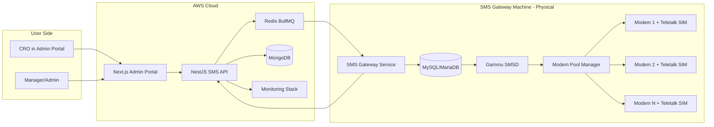
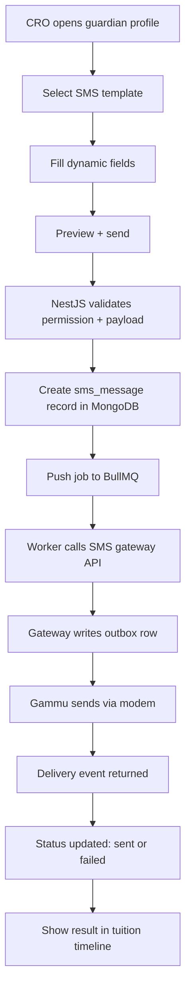
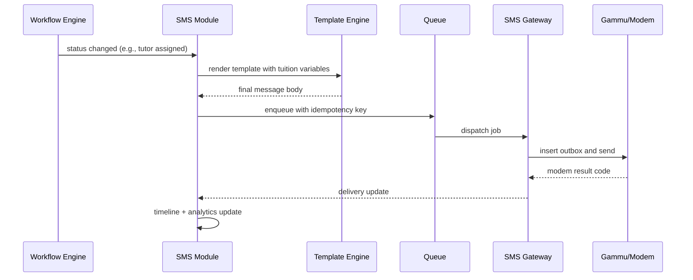
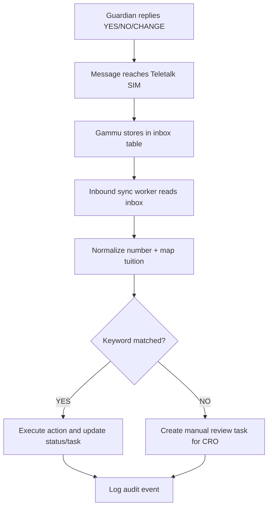
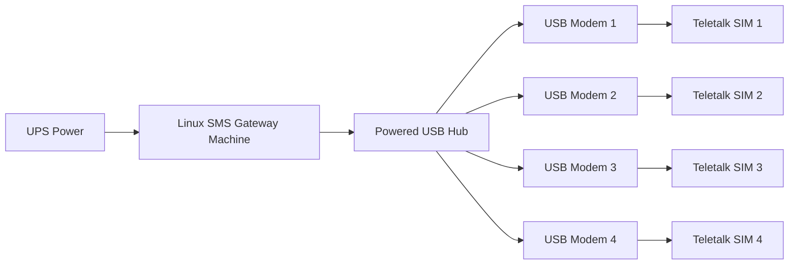

# SMS Automation Module - End-to-End Technical Proposal

## Document Control

| Field | Value |
|---|---|
| Client | Bright Tutor |
| Module | SMS Automation |
| Version | 1.0 |
| Date | March 2026 |
| Purpose | Production-ready replacement of SMSCaster/manual SMS with centralized portal-driven SMS operations |

## 1. Business Goal (Simple Language)

Bright Tutor team currently uses laptop-level tools (SMSCaster + modem), which creates operational issues:

1. CROs must switch tools and cannot work from one portal.
2. SMS sending is fragmented across machines.
3. No clean delivery tracking, retry policy, or centralized audit.
4. Scaling is difficult when SMS volume increases.

This module centralizes SMS in one controlled architecture so every SMS is sent from Bright Tutor admin portal with full logs, reliability, and monitoring.

## 2. What Success Looks Like

1. CRO clicks send SMS from portal.
2. System queues request safely.
3. Message is delivered via Teletalk SIM modem gateway.
4. Delivery status is visible in tuition timeline and SMS logs.
5. Failed SMS retries automatically and reports reason.

## 3. Module Boundaries

### In Scope

1. Manual and automated SMS sending from portal.
2. Template-based transactional SMS.
3. Queue, retry, delivery tracking, and audit logs.
4. Incoming SMS capture for keyword-based actions.
5. Multi-modem scaling with health checks.

### Out of Scope (Phase-1)

1. Marketing bulk SMS campaigns.
2. AI-based template optimization.
3. Multi-operator dynamic SIM routing.

## 4. Functional Modules Inside SMS System

1. SMS API Layer (NestJS)
2. Template Engine
3. Queue and Worker Engine
4. SMS Gateway Adapter
5. Modem Orchestration Layer
6. Delivery Event Processor
7. Monitoring and Dashboard Layer

## 5. End-to-End Architecture View



## 6. Deep Workflow Breakdown

### 6.1 Workflow A: Manual SMS from CRO Portal



### 6.2 Workflow B: Auto SMS Trigger from Tuition Status



### 6.3 Workflow C: Incoming SMS (Guardian Reply)



## 7. Hardware Breakdown (User-Friendly)

### 7.1 Minimum Production Starter Kit

| Component | Recommended | Why Needed |
|---|---|---|
| SMS Gateway Machine | 4 cores, 8 GB RAM, 256 GB SSD | Runs gateway service and modem stack 24/7 |
| Powered USB Hub | Industrial 10-20 port | Stable USB current for multiple modems |
| GSM Modems | 4 units to start | Parallel SMS and basic failover |
| SIM Cards | Teletalk (1 per modem) | Existing operator agreement continuity |
| Network | Primary broadband + backup LTE | Avoid downtime due to single ISP failure |
| UPS | 30-60 min backup | Prevent SMS outage during power cuts |

### 7.2 Hardware Topology



## 8. Software Breakdown (Layer by Layer)

### 8.1 Application Layer

1. Next.js admin portal for CRO actions.
2. NestJS API for validation, template rendering, and orchestration.
3. MongoDB for business logs and state.

### 8.2 Queue and Reliability Layer

1. Redis + BullMQ queue.
2. Retry with backoff.
3. Dead-letter queue for repeated failures.

### 8.3 Gateway Layer

1. Lightweight gateway API service.
2. Gammu SMSD for modem interaction.
3. MySQL/MariaDB transport tables (`outbox`, `sentitems`, `inbox`).

### 8.4 Observability Layer

1. Dashboard metrics: sent, failed, pending, retry.
2. Modem health and uptime checks.
3. Alerting on failure threshold.

## 9. Data Design (Practical View)

### 9.1 Core Business Collections (MongoDB)

| Collection | Key Fields |
|---|---|
| sms_messages | message_id, tuition_id, guardian_id, phone, text, status, retry_count |
| sms_templates | code, channel, template_body, variables |
| sms_delivery_events | message_id, modem_id, provider_code, event_time |
| sms_inbound_events | from_phone, text, matched_keyword, action_result |

### 9.2 Gateway Transport Tables (MySQL/MariaDB)

| Table | Purpose |
|---|---|
| outbox | Pending messages for modem send |
| sentitems | Sent history and result state |
| inbox | Incoming SMS from users |

## 10. API Contract Examples

### 10.1 Send SMS

Endpoint: `POST /api/v1/sms/send`

```json
{
  "tuitionId": "T-901234567",
  "guardianId": "G-10292",
  "phone": "88017XXXXXXXX",
  "templateCode": "TUTOR_ASSIGNED",
  "variables": {
    "guardianName": "Mr Rahman",
    "tutorName": "Rahim",
    "croName": "Tanha"
  },
  "idempotencyKey": "2ec8f46d-6e0f-4b4f-a083-4f86d4e3fbf8"
}
```

### 10.2 Delivery Status Query

Endpoint: `GET /api/v1/sms/{messageId}`

Response:

```json
{
  "messageId": "SMS-100145",
  "status": "SENT",
  "modemId": "MODEM-02",
  "sentAt": "2026-03-17T10:24:52Z",
  "lastProviderCode": "OK"
}
```

## 11. Security and Governance

1. API key + HMAC signing between backend and gateway machine.
2. IP allowlist so only backend server can call gateway API.
3. RBAC at portal level for who can send which template.
4. Immutable audit log for every send, retry, and failure reason.
5. PII masking in UI for restricted roles.

## 12. Capacity and Performance Planning

Assumption baseline:

1. Single modem average throughput: 6 to 10 SMS per minute.
2. With 4 modems: roughly 24 to 40 SMS per minute.
3. With 8 modems: roughly 48 to 80 SMS per minute.

Sizing rule:

Modem count = peak required SMS per minute divided by average modem throughput.

## 13. Step-by-Step Implementation Plan (From Scratch)

### Step 1: Environment Preparation

1. Provision AWS backend environment.
2. Prepare physical SMS gateway machine.
3. Connect modem bank and verify serial ports.

### Step 2: Gateway Foundation

1. Install Gammu + database on gateway machine.
2. Configure and test each modem.
3. Build secure gateway API wrapper.

### Step 3: Backend Integration

1. Build NestJS SMS module.
2. Implement template engine and queue.
3. Integrate delivery event sync.

### Step 4: Portal UX Integration

1. Add send SMS panel in guardian and tuition pages.
2. Add timeline and SMS logs.
3. Add failure reason and retry controls.

### Step 5: Hardening

1. Rate limits and anti-spam rules.
2. Modem failover and health alerts.
3. UAT and load testing.

### Step 6: Go-Live

1. Release with runbook.
2. Track first-week metrics daily.
3. Tune queue worker and retry policy.

## 14. Test and Acceptance Checklist

1. Portal send to real guardian number works.
2. Queue retry works when gateway is temporarily down.
3. Modem failover works when one modem is unplugged.
4. Duplicate send is blocked by idempotency key.
5. Inbound YES or NO creates expected workflow action.
6. All SMS events are visible in audit timeline.

## 15. Operational Runbook (Day-2)

### Daily

1. Check modem online status.
2. Check failed/pending queue count.
3. Check SIM balance and recharge status.

### Weekly

1. Review failure trend by modem.
2. Rotate unhealthy modem hardware if needed.
3. Validate backup internet failover path.

### Incident Handling

1. If gateway unreachable: queue only, do not drop messages.
2. If modem fails: mark unavailable and reroute to healthy modem.
3. If delivery failure spikes: pause non-critical templates and alert operations.

## 16. Client-Friendly Closing Note

This SMS module gives Bright Tutor a reliable, auditable, and scalable communication backbone while preserving Teletalk SIM investment. CROs stay fully inside the admin portal and operations get measurable control over every message in the tuition lifecycle.
