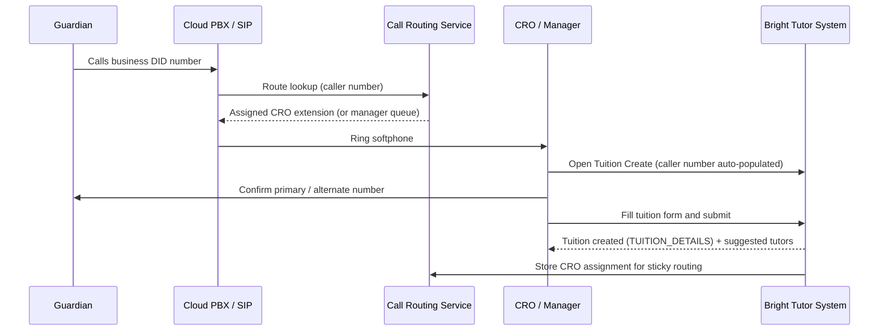
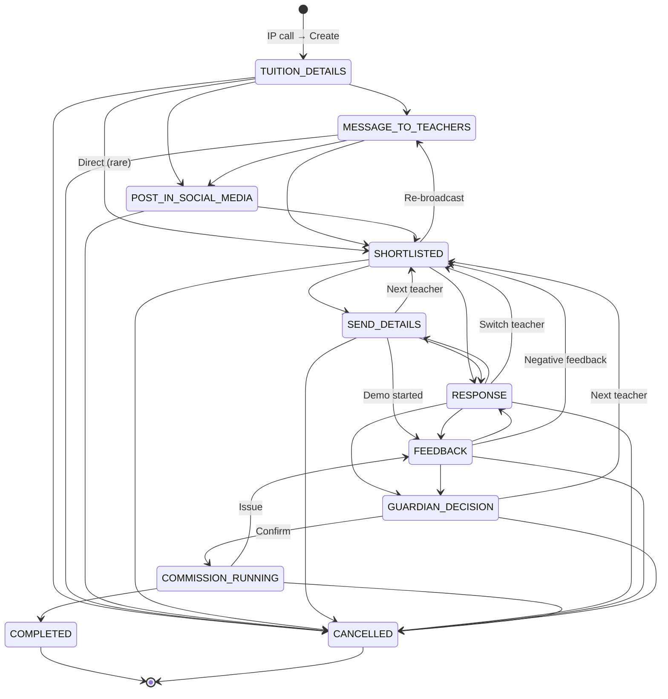
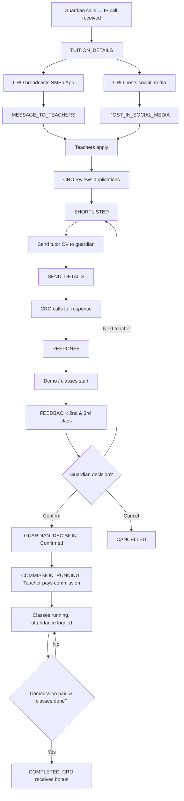
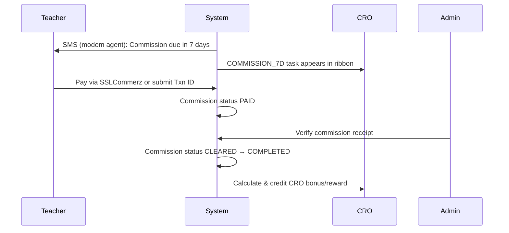
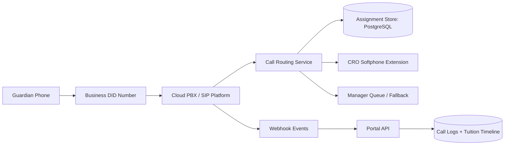
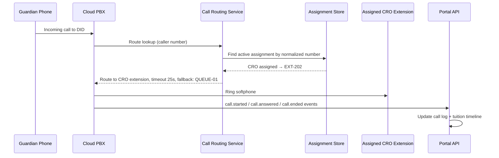
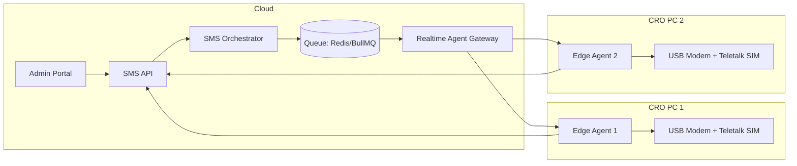
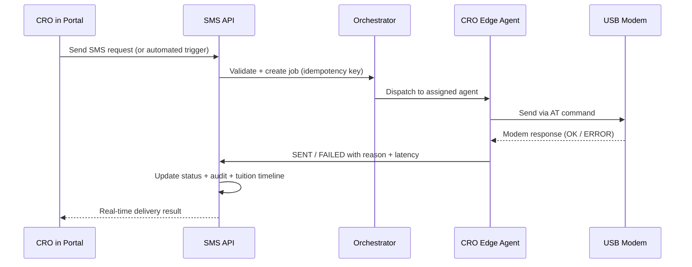

# BRIGHT TUTOR PLATFORM
## Enterprise Master Scope & Ecosystem Bible

**Document ID:** BT-MSD-2026-003
**Version:** 3.0 – Final Consolidated
**Status:** Draft for Client Approval
**Classification:** Confidential – Client & Delivery Team
**Last Updated:** March 2026
**Contact:** neexg7@gmail.com | www.neexg.com | +880 1743586381
**Supersedes:** Version 2.1 (Draft)
**Approval Required:** Client Sign-off Before Delivery Execution

---

## Table of Contents

| Part | Section | Description |
|------|---------|-------------|
| A | 1 | Introduction, MVP/Lead Capture, Scope Summary |
| B | 2–3 | Status Engine, Task Engine |
| C | 4 | Product Vision & Positioning |
| D | 5 | Stakeholders, Roles, RBAC Permission Matrix |
| E | 6 | System Design, Architecture, Tech Stack |
| F | 7–11 | Module Overview, Guardian/Teacher/CRO/Admin Requirements |
| G | 12 | Commission & Bonus Engine, Lock Rules |
| H | 13–14 | User Stories, User Journeys & Flow Diagrams |
| I | 15–17 | Non-Functional Requirements, Delivery Roadmap, Acceptance Criteria |
| J | 18 | Call Mapping & Routing (Integrated) |
| K | 19 | SMS Automation (Integrated) |
| L | App. | Glossary, References, Revision History |

---

# PART A — EXECUTIVE & STRATEGY

## 1. Introduction

### 1.1 Purpose

This document is the **single source of truth** for the Bright Tutor platform. It consolidates the Master Scope, Call Mapping & Routing, and SMS Automation specifications into one authoritative reference. It defines:

- End-to-end scope for Guardian (Parent) Web & App, Teacher Web & App, CRO Console, and Admin Panel
- Stakeholders, roles, and permissions (RBAC)
- System architecture, technology stack rationale, and design
- Modules, features, and detailed requirements (functional & non-functional)
- User stories, user journeys, and flows
- Engines: Status, Task, Commission, CRO Bonus, Lock, Ribbon
- Integrated call routing and sticky CRO assignment
- Integrated SMS automation via dedicated CRO modems
- Delivery roadmap and acceptance criteria

**Audience:** Client, Product Owners, Designers, Engineers, QA, DevOps.

### 1.2 MVP / Phase-01 – Client-Provided Integrations & Current Process

For MVP/Phase-01, the client provides the following integrations, replacing the current manual Excel/sheets process:

| Provider / Integration | Purpose | Notes |
|------------------------|---------|-------|
| **IP Call Provider (Cloud PBX/SIP)** | Inbound/outbound calls; caller ID capture; sticky CRO routing | Client provides SIP trunk, DID numbers, and softphone extensions. See Section 18. |
| **SSLCommerz** | Payment gateway | Online commission collection from teachers. Client provides credentials. |
| **SMS – Teletalk SIMs + USB Modems** | SMS notifications, OTP, tuition broadcasts | Each CRO PC has one Teletalk SIM in a USB modem. Edge agent sends from that SIM. See Section 19. |
| **Others as needed** | Push, social posting, etc. | Any additional providers will be supplied or approved by the client. |

> **Current state:** All tuition pipeline, payments, and follow-ups are handled manually in Excel/sheets. The platform replaces this with the CRO Console, status/task engine, integrated call routing, SMS automation, and commission/payment tracking.

### 1.3 Lead Capture Flow – Inbound Call to Tuition Creation

1. Guardian calls the advertised business DID number.
2. Cloud PBX/SIP receives the call; the call routing service looks up the guardian's number for an active CRO assignment.
3. If an active assignment exists, the call routes to the assigned CRO's softphone extension. If not, it routes to the manager queue.
4. The caller number **auto-populates** in the Tuition Create form (Guardian phone field).
5. CRO asks: *"Is this your personal (primary) or optional (alternate) number?"* and sets both fields accordingly.
6. CRO fills all tuition fields: student(s), class, subjects, location, schedule, salary, requirements, etc.
7. On submit, tuition is created with a **9-digit Tuition ID** in status `TUITION_DETAILS`. The system stores the call record, generates suggested tutors, and assigns a CRO owner.
8. The CRO assignment is stored in the call routing service — future calls from this guardian route to the same CRO until the tuition lifecycle closes.



### 1.4 Scope Summary

| Category | In Scope (Phase 1) | Out of Scope (Phase 1) |
|----------|--------------------|------------------------|
| Access | Authentication, RBAC, role-based UI | — |
| Guardian | Tuition CRUD, shortlist view, chat (unlock), decisions, feedback | — |
| Teacher | Onboarding, profile, apply/shortlist, chat, schedule, commission payment | — |
| CRO | Pipeline, cockpit, status/task engine, call routing, SMS/social, commission tracking, bonus | — |
| Admin | Config (status, protocols, commission, CRO bonus, lock), user/role management, analytics | — |
| Engines | Status, Next Task, Time Protocols, Commission, Bonus, Lock, Ribbon, Notifications | Full AI matching, predictive scoring |
| Call Routing | Cloud PBX/SIP, sticky CRO assignment, call logs, escalation to manager queue | AI transcription, predictive dialer |
| SMS | CRO-modem edge agent, template-based sends, automated triggers, inbound SMS, delivery tracking | Marketing campaign engine |
| Integrations | SMS (Teletalk modem), Push (FCM), In-App, Social posting, IP call provider, SSLCommerz | Full external CRM, ERP |
| Data | Real-time sync Web + Apps, audit logs, exports | Detailed student attendance analytics |
| Business | CRO bonus slabs, configurable rules | Dynamic pricing, automated negotiation |

### 1.5 Tuition Lifecycle At-a-Glance

**Status Flow:**
`TUITION_DETAILS` → `MESSAGE_TO_TEACHERS` → `POST_IN_SOCIAL_MEDIA` → `SHORTLISTED` → `SEND_DETAILS` → `RESPONSE` → `FEEDBACK` → `GUARDIAN_DECISION` → `COMMISSION_RUNNING` → `COMPLETED` ✅

**Key Principles:**
- Each major CRO operational step is an explicit status (not a task)
- Every status has mandatory tasks with time protocols (15h, 7d, 14d, 30d)
- CRO cannot advance status unless tasks are complete and no lock is active
- Task Engine auto-generates next-task checklists per status
- Call routing maintains guardian–CRO continuity across the entire lifecycle

---

# PART B — STATUS & TASK LIFECYCLE ENGINES

## 2. Status Engine

### 2.1 Status List (Baseline – Configurable)

| # | Code | Name | Phase | Badge | Terminal | Description |
|---|------|------|-------|-------|----------|-------------|
| 1 | `TUITION_DETAILS` | Tuition Details | Publish | Blue | No | IP call received; tuition created; CRO assigned; call record stored; suggested tutors visible. |
| 2 | `MESSAGE_TO_TEACHERS` | Message to Teachers | Publish | Cyan | No | CRO broadcasts via SMS (modem agent), app inbox, and push to available teachers. |
| 3 | `POST_IN_SOCIAL_MEDIA` | Post in Social Media | Publish | Purple | No | CRO posts to Facebook, Instagram, WhatsApp, Telegram (auto-generated template). |
| 4 | `SHORTLISTED` | Shortlisted | Refining | Yellow | No | CRO reviews applications and creates shortlist of candidate tutors. |
| 5 | `SEND_DETAILS` | Send Details (CV) | Refining | Orange | No | CRO sends tutor CV/profile to guardian; shares guardian contact to tutor. |
| 6 | `RESPONSE` | Response / Follow-Up | Refining | Amber | No | CRO calls guardian, collects response summary; time protocols enforced. |
| 7 | `FEEDBACK` | Feedback (2nd/3rd Class) | Refining | Teal | No | Guardian + Teacher feedback after 2nd class (7d) and 3rd class (14d). |
| 8 | `GUARDIAN_DECISION` | Guardian Decision | Decision | Indigo | No | Guardian makes final decision: Confirm / Next teacher / Cancel. |
| 9 | `COMMISSION_RUNNING` | Commission & Classes | Running | Green | No | Teacher pays commission to platform. Classes run. Attendance tracked. |
| 10 | `COMPLETED` | Successful | Terminal | Dark Green | Yes | All classes done, feedback collected, commission received. |
| — | `CANCELLED` | Cancelled | Terminal | Red | Yes | Cancelled at any stage; reason logged. |

> **Payment note:** Guardian pays teacher directly (cash/hand) — NOT tracked by platform. Teacher pays commission to Bright Tutor platform via SSLCommerz or manual Txn ID.

### 2.2 Status Transition Matrix (Configurable by Admin)

| From → To | MSG_TO_TCH | POST_SOCIAL | SHORTLISTED | SEND_DETAILS | RESPONSE | FEEDBACK | GUARDIAN_DEC | COMM_RUN | COMPLETED | CANCELLED |
|-----------|-----------|-------------|-------------|--------------|----------|----------|--------------|----------|-----------|-----------|
| TUITION_DETAILS | ✅ | ✅ | ✅¹ | — | — | — | — | — | — | ✅ |
| MSG_TO_TEACHERS | — | ✅ | ✅ | — | — | — | — | — | — | ✅ |
| POST_SOCIAL_MEDIA | — | — | ✅ | — | — | — | — | — | — | ✅ |
| SHORTLISTED | ✅² | — | — | ✅ | ✅³ | — | — | — | — | ✅ |
| SEND_DETAILS | — | — | ✅² | — | ✅ | ✅³ | — | — | — | ✅ |
| RESPONSE | — | — | ✅⁴ | ✅⁴ | — | ✅ | ✅ | — | — | ✅ |
| FEEDBACK | — | — | ✅⁴ | — | ✅ | — | ✅ | — | — | ✅ |
| GUARDIAN_DECISION | — | — | ✅⁴ | — | — | — | — | ✅ | — | ✅ |
| COMMISSION_RUNNING | — | — | — | — | — | ✅⁵ | — | — | ✅ | ✅ |
| COMPLETED | — | — | — | — | — | — | — | — | — | — |
| CANCELLED | — | — | — | — | — | — | — | — | — | — |

¹ Direct jump if applications arrive before broadcast. ² Loop back for additional outreach. ³ Fast-forward if demo already started. ⁴ Next Teacher: loops back for new tutor selection. ⁵ Collect additional feedback before COMPLETED.

**Enforcement:** CRO can advance status only when: (1) transition is ✅, (2) all mandatory tasks are complete or skipped with reason, (3) no active lock exists.

### 2.3 Status Lifecycle Flow



### 2.4 Ribbon Filters

| Ribbon Filter | Logic | Statuses Included |
|---------------|-------|-------------------|
| Today | Tasks due today for this CRO | All non-terminal |
| Pending | Protocol date exceeded | All non-terminal (overdue) |
| Assigned | All tuitions assigned to this CRO | All non-terminal |
| Confirmed | Guardian confirmed or commission running | GUARDIAN_DECISION (confirmed), COMMISSION_RUNNING |
| Commission Due | Commission not yet paid | COMMISSION_RUNNING (pending) |
| Commission Overdue | Commission exceeded 7d due date | COMMISSION_RUNNING (overdue) |
| Date Over | Created > 60 days, still not terminal | All non-terminal (old) |
| Success Rate | Confirmed ÷ Assigned (per CRO) | N/A – metric |

---

## 3. Next Task Engine

### 3.1 Task Template Schema

| Attribute | Description | Example |
|-----------|-------------|---------|
| `status_id` | Link to status | `TUITION_DETAILS` |
| `owner_role` | CRO, Guardian, Teacher, or System | `CRO` |
| `name` | Short task name (3–7 words) | "Capture tuition details" |
| `protocol_id` | Default time protocol for due date | `IMMEDIATE`, `RESPONSE_15H`, `GUARDIAN_DECIDE` |
| `mandatory` | If true, must complete/skip to advance | `true` |
| `skippable` | If true, can skip with logged reason | `false` |
| `order_index` | Display order | `1`, `2`, `3` |

### 3.2 Protocol Catalogue (Baseline – Configurable)

| Protocol | Duration | Use Case |
|----------|----------|----------|
| `IMMEDIATE` | 0 (instant) | Tasks completed synchronously during call/session |
| `RESPONSE_15H` | 15 hours | Teacher response deadline; CRO follow-up to guardian |
| `FEEDBACK_2ND_CLASS` | 7 days | Collect feedback after 2nd class |
| `FEEDBACK_3RD_CLASS` | 14 days | Collect feedback after 3rd class |
| `COMMISSION_7D` | 7 days | Teacher commission due from tuition confirmation |
| `GUARDIAN_DECIDE` | 30 days | Guardian decision deadline after demo/feedback |
| `CUSTOM` | Admin-defined | Special tasks with org-specific SLA |

### 3.3 Default Task Templates by Status

| Status | Key Mandatory Tasks | Owner | Protocol |
|--------|---------------------|-------|----------|
| TUITION_DETAILS | Capture tuition details; store call record; assign CRO | CRO / System | IMMEDIATE |
| MESSAGE_TO_TEACHERS | Select teacher list; send SMS (modem agent); send app push | CRO / System | IMMEDIATE → RESPONSE_15H |
| POST_IN_SOCIAL_MEDIA | Review auto-generated post; post to at least one channel; log timestamp | CRO | IMMEDIATE |
| SHORTLISTED | Review applications; add at least 1 tutor to shortlist | CRO | IMMEDIATE |
| SEND_DETAILS | Send tutor CV to guardian (SMS); share guardian contact to tutor | System | IMMEDIATE → GUARDIAN_DECIDE |
| RESPONSE | Call guardian; log outcome; set follow-up date if deferred | CRO | IMMEDIATE → GUARDIAN_DECIDE |
| FEEDBACK | Collect guardian + teacher feedback (2nd class); log; 3rd class follow-up | CRO | FEEDBACK_2ND/3RD |
| GUARDIAN_DECISION | Log guardian decision; notify tutor if confirmed; trigger commission flow | CRO / System | IMMEDIATE |
| COMMISSION_RUNNING | Send commission reminder (SMS); record payment; confirm all classes done | System / CRO | COMMISSION_7D |
| COMPLETED | Calculate CRO bonus; update success rate; archive tuition | System | IMMEDIATE |

---

# PART C — PRODUCT VISION & POSITIONING

## 4. Product Vision & Positioning

### 4.1 Vision Statement

**Bright Tutor** is an operations-first, SLA-driven tuition lifecycle platform that connects guardians, teachers, and operations teams through a single ecosystem — from lead capture to payment closure — with full auditability and no-code configurability.

### 4.2 Strategic Differentiators

| Differentiator | Description |
|----------------|-------------|
| Operations-first | Not a simple listing app; CRO-driven pipeline with status + task engine |
| SLA & Protocols | Every critical step is time-bound (15h, 7d, 14d, 30d) |
| No-code Rules | Admin configures statuses, transitions, protocols, bonus, and locks without code |
| Audit-ready | Status changes, commission payments, call events, and config changes are all logged |
| Sticky Call Routing | Guardian calls always route to their assigned CRO via Cloud PBX/SIP |
| CRO-owned SMS | Each CRO sends SMS from their own Teletalk SIM via local modem edge agent |
| Multi-channel | Guardian/Teacher apps + CRO/Admin web; data synced in near real-time |

### 4.3 Portals & Channels

| ID | Portal | Description |
|----|--------|-------------|
| P1 | Public Marketing Website | Landing, marketing, CTAs: Post a Tuition / Join as Tutor / Download App / stats |
| P2 | Web Job Board & Account Portal | Guardian and Teacher web accounts; public job board for teachers |
| P3 | Mobile Apps | Bright Tutor mobile apps (Guardian and Teacher) for day-to-day usage |
| P4 | Internal CRO / Admin Console | Back-office for CRO, Manager, Admin, Finance. Includes call cockpit and SMS dispatch |

---

# PART D — ROLES, RBAC & STAKEHOLDERS

## 5. Stakeholders, Roles & Permissions

### 5.1 Role Definitions

| Role | Definition | Primary Interface |
|------|------------|-------------------|
| Guardian (Parent) | Posts tuitions, selects teachers, gives feedback, pays teacher directly (cash) | Mobile App (P3) |
| Teacher (Tutor) | Applies to tuitions, communicates with guardians, delivers classes, pays commission to platform | Mobile App (P3) |
| CRO | Owns assigned tuition pipeline, drives lifecycle, handles calls/SMS, earns bonus | Web Console (P4) |
| Admin / Manager / SuperAdmin | Configures rules, manages users, views analytics, tracks commission, pays CRO bonus | Web Admin Panel (P4) |
| Finance | Verifies commission payments, manages manual Txn IDs, approves waivers | Web Admin Panel (P4) |

### 5.2 RBAC Permission Matrix

> Legend: ✅ Full access | 🔶 Limited/Conditional | ❌ No access | \* Unlocked at allowed status

| Capability | Guest | Guardian | Teacher | CRO | Admin |
|------------|-------|----------|---------|-----|-------|
| Register / Login (OTP) | 🔶 | ✅ | ✅ | ✅ | ✅ |
| Create / Edit own profile | ❌ | ✅ | ✅ | ✅ | ✅ |
| Post tuition | ❌ | ✅ | ❌ | ❌ | ❌ |
| Apply to tuition | ❌ | ❌ | ✅ | ❌ | ❌ |
| View shortlisted teachers | ❌ | ✅ | 🔶 | ✅ | ✅ |
| Chat Guardian ↔ Teacher (status-unlocked) | ❌ | 🔶\* | 🔶\* | ✅ | ✅ |
| Confirm / Reject / Next teacher | ❌ | ✅ | ❌ | 🔶 | ✅ |
| Give feedback (2nd/3rd class) | ❌ | ✅ | ✅ | ❌ | ❌ |
| Pay commission to platform | ❌ | ❌ | ✅ | 🔶 | ✅ |
| View CRO dashboard, ribbon, pipeline | ❌ | ❌ | ❌ | ✅ | ✅ |
| Change tuition status | ❌ | ❌ | ❌ | ✅ | ✅ |
| Create / complete / skip tasks | ❌ | ❌ | ❌ | ✅ | ✅ |
| Log call & outcome | ❌ | ❌ | ❌ | ✅ | ✅ |
| Send SMS via modem agent | ❌ | ❌ | ❌ | ✅ | ✅ |
| Manage call routing assignments | ❌ | ❌ | ❌ | ❌ | ✅ |
| Configure rules (status, protocol, commission, lock) | ❌ | ❌ | ❌ | ❌ | ✅ |
| Manage users (create, verify, deactivate) | ❌ | ❌ | ❌ | ❌ | ✅ |
| Override lock / status | ❌ | ❌ | ❌ | ❌ | ✅ |
| View all analytics & exports | ❌ | ❌ | ❌ | 🔶 | ✅ |

---

# PART E — SYSTEM ARCHITECTURE & TECHNOLOGY

## 6. System Design & Architecture

### 6.1 Logical Service Breakdown

| Service | Responsibility | Key Data |
|---------|---------------|----------|
| Auth & RBAC | Login (OTP), JWT issue/validate, role resolution, permission checks | users, roles, sessions |
| User | Guardian/Teacher/CRO/Admin profiles, stats, verification | guardian_profiles, teacher_profiles |
| Tuition & Status | Tuition CRUD, status lifecycle, transition validation, lock check | tuitions, statuses, tuition_status_logs |
| Task & Protocol | Task templates, task instances, due dates, completion/skip | time_protocols, task_templates, tuition_tasks |
| Commission | Teacher commission payments, CRO bonus/rewards | commission_payments, cro_bonuses |
| Chat & Call | Chat threads, messages, call records, outcomes, call event ingestion | chat_threads, call_records, call_events |
| Call Routing | Sticky assignment store, route resolve API, PBX webhook ingestion | call_assignments, call_events, call_route_attempts |
| SMS Orchestrator | SMS job queue, template rendering, modem agent dispatch, delivery tracking | sms_messages, sms_attempts, inbound_sms, agents |
| Notification | In-app, push, SMS triggers from lifecycle events | notification_queues, templates |
| Config & Rule | Status matrix, protocols, commission rules, bonus slabs, lock rules | config_entries, bonus_slabs, commission_slabs |
| Analytics | Aggregates, ribbon metrics, reports, exports | materialized views, report_jobs |

### 6.2 Technology Stack

| Layer | Choice | Why |
|-------|--------|-----|
| Web Frontend | React + Next.js + TypeScript | SSR/SEO for marketing; shared types; strong ecosystem |
| Web UI | Tailwind CSS + Ant Design / MUI | Fast UI development; Figma alignment |
| State (Web) | React Query + Zustand | Server state (React Query), minimal client state (Zustand) |
| Mobile | Flutter or React Native + Expo | Single team for iOS/Android; shared logic via API |
| Backend | Node.js + NestJS | TypeScript end-to-end; modular; built-in RBAC guards |
| API | REST (GraphQL optional later) | Clear contracts; easy mobile integration |
| Auth | JWT + OTP (SMS via Teletalk modem agent) | Stateless; mobile-friendly; OTP fits local UX |
| Primary DB | PostgreSQL | ACID; JSONB for configs; strong relational model |
| Realtime / Chat | Socket.IO | Bidirectional real-time events for chat and status updates |
| Cache & Queues | Redis + BullMQ | Ribbon/dashboard caching; job queues for SMS and notifications |
| File Storage | S3-compatible (AWS S3 / MinIO) | Call recordings, exports, attachments |
| Push | Firebase Cloud Messaging | Reliable mobile push notifications |
| SMS | Teletalk SIM + USB Modem (Edge Agent) | Client SIM investment preserved; CRO-owned sends |
| Call Platform | Cloud PBX / SIP (client-provided) | Inbound/outbound; caller ID; sticky CRO routing; webhooks |
| Payment Gateway | SSLCommerz (client-provided) | Online commission collection from teachers |
| Containers | Docker | Consistent dev/prod environments |
| Orchestration | Kubernetes or ECS | Scale and resilience |
| CI/CD | GitHub Actions / GitLab CI | Automated build, test, deploy |
| Monitoring | Prometheus + Grafana | Metrics and dashboards |
| Logging | ELK or CloudWatch | Centralized logs and audit trail |

---

# PART F — MODULES & FEATURES

## 7. Module Overview

| # | Module | Owner Roles | Description |
|---|--------|-------------|-------------|
| M1 | Auth & Identity | All | OTP login, profile, primary/alternate phone |
| M2 | Guardian – Tuition Lifecycle | Guardian | Post, list, detail, status timeline, decisions, feedback |
| M3 | Guardian – Interaction | Guardian | Shortlist view, chat, contact unlock |
| M4 | Guardian – Status Tracking | Guardian | View tuition status, timeline, teacher details, attendance |
| M5 | Teacher – Profile & Verification | Teacher | Profile CRUD, verification badge, metrics |
| M6 | Teacher – Tuition Discovery | Teacher | Browse, filter, apply, application status |
| M7 | Teacher – Communication & Earnings | Teacher | Chat, schedule, feedback, commission payment history |
| M8 | CRO – Dashboard & Ribbon | CRO | Ribbon KPIs, today's tasks, filters |
| M9 | CRO – Tuition Cockpit | CRO | Per-tuition status, tasks, call log, profiles, actions |
| M10 | CRO – Communication & Outreach | CRO | SMS (modem), app push, social post, shortlist, contact unlock |
| M11 | Admin – Configuration | Admin | Status, protocols, commission rules, CRO bonus, locks |
| M12 | Admin – User & Role Management | Admin | CRUD users, verify, blacklist, roles |
| M13 | Admin – Finance & Commission | Admin | Commission view/verify/correct, CRO bonus management |
| M14 | Admin – Analytics & Reporting | Admin | Dashboards, KPIs, exports |
| M15 | Shared – Chat & Call | All | Threads, messages, tags, call records, PBX events |
| M16 | Shared – Notifications | All | In-app, push, SMS triggers |
| M17 | Call Routing Service | CRO, Admin | Sticky assignment store, route resolve, webhook ingestion, call logs |
| M18 | SMS Edge Agent + Orchestrator | CRO, Admin | Per-modem agent, job queue, delivery tracking, inbound SMS |

---

## 8. Guardian Domain – Requirements

### 8.1 Auth & Profile

| Req ID | Requirement | Priority |
|--------|-------------|----------|
| G-AUTH-01 | Sign-up/login with mobile number + OTP | Must |
| G-AUTH-02 | Store and display primary and alternate phone numbers; map incoming calls to correct tuition | Must |
| G-AUTH-03 | Show role-based home (Guardian dashboard) after login | Must |
| G-AUTH-04 | Guardian can edit: full name, address (area, city, details) | Must |
| G-AUTH-05 | Display read-only stats: total tuitions posted, confirmed, running, trial count, average rating | Must |

### 8.2 Tuition Posting, Tracking & Interaction

| Req ID | Requirement | Priority |
|--------|-------------|----------|
| G-TUI-01 | Create tuition: class, medium, subjects, budget, area, schedule, requirements | Must |
| G-TUI-02 | Auto-generate unique 9-digit Tuition ID | Must |
| G-TUI-03 | View list of own tuitions with status chip | Must |
| G-TUI-04 | View tuition detail: full info, assigned teacher, schedule, status timeline, attendance | Must |
| G-INT-01 | View shortlisted teachers per tuition (profile, rating, experience) | Must |
| G-INT-02 | Open chat with teacher only when status allows (SEND_DETAILS, RESPONSE, FEEDBACK) | Must |
| G-INT-03 | See teacher contact (phone) only when unlocked by status | Must |
| G-INT-04 | Confirm teacher / Request next teacher / Cancel tuition | Must |
| G-INT-05 | Receive feedback prompts after 2nd class (7d) and 3rd class (14d) | Must |
| G-STA-01 | View real-time tuition status with color-coded chip | Must |
| G-STA-02 | See full status timeline: each change with timestamp and actor | Must |

---

## 9. Teacher Domain – Requirements

| Req ID | Requirement | Priority |
|--------|-------------|----------|
| T-PRO-01 | Sign up/login with mobile + OTP | Must |
| T-PRO-02 | Maintain profile: name, photo, education, subjects, classes, medium, preferred areas, experience | Must |
| T-PRO-03 | Show Verified badge after Admin verification | Must |
| T-PRO-04 | Display stats: confirmed count, running, processing, rating, commission payment history | Must |
| T-DIS-01 | Browse available tuitions with filters (subject, area, medium, budget) | Must |
| T-DIS-03 | Apply / show interest; system creates application visible in CRO pipeline | Must |
| T-DIS-04 | See application status: Applied, Shortlisted, Rejected, Confirmed, Running | Must |
| T-COM-01 | Chat with guardian when status allows; mark important messages | Must |
| T-COM-04 | View per-tuition commission paid to platform and full commission payment history | Must |
| T-COM-05 | Pay commission via SSLCommerz (online) or notify Finance of manual payment (Txn ID) | Must |
| T-COM-06 | Receive SMS reminders about commission due dates from assigned CRO modem | Must |

---

## 10. CRO Domain – Requirements

### 10.1 Dashboard & Ribbon

| Req ID | Requirement | Priority |
|--------|-------------|----------|
| CRO-RIB-01 | Ribbon: Payment date over (count, red alert) | Must |
| CRO-RIB-02 | Pay within next 7 days (count, includes today) | Must |
| CRO-RIB-03 | Exceeded payment dates (count) | Must |
| CRO-RIB-04 | Today's tasks: all tasks due today with time slots | Must |
| CRO-RIB-05 | Confirmed count, Assigned count, Pending exceed count | Must |
| CRO-RIB-06 | Success Rate = Confirmed ÷ Assigned tuitions (per CRO) | Must |
| CRO-RIB-07 | Ribbon metrics update in near real-time via event-driven cache | Must |

### 10.2 Tuition Creation – Lead Capture from Inbound Call

| Req ID | Requirement | Priority |
|--------|-------------|----------|
| CRO-CREATE-01 | When CRO/Manager receives an inbound call via Cloud PBX/SIP, the caller number shall auto-populate in the Tuition Create form (Guardian phone field) | Must |
| CRO-CREATE-02 | CRO confirms with guardian whether the number is personal (primary) or optional (alternate); sets both fields | Must |
| CRO-CREATE-03 | On submit, tuition created in status TUITION_DETAILS and added to CRO pipeline; CRO assignment stored in call routing service for sticky routing | Must |

### 10.3 Tuition Cockpit Tabs

| Tab | Contents & Actions |
|-----|--------------------|
| Info | Tuition ID, class, subjects, area, schedule, salary, status chip, CRO assignment, flags (Active/Featured/view count) |
| Suggestions | Auto-generated tutor suggestion list; auto-generated social media post text (editable before posting) |
| Applications | All tutor applications: profile, rating, status. Actions: Shortlist / Reject |
| Shortlist | Current shortlisted tutors. Actions: reorder, promote/remove, trigger Send Details |
| Comments | Internal CRO/Manager/Admin notes; system-generated event comments |
| Tasks | All next tasks: owner, due date, mandatory/skippable, status. Actions: Complete, Skip with reason, Add special task |
| Rec (Calls) | Call recordings from PBX; tag outcomes (Will confirm / No impact / Meeting scheduled / Switch teacher / Other) |
| G Chat | CRO ↔ Guardian chat thread scoped to this tuition |
| T Chat | CRO ↔ Tutor chat thread scoped to this tuition |
| T2G Chat | Three-party chat (Tutor + Guardian + CRO). Enabled only at allowed statuses. CRO can mute/lock. |
| Update/Logs | Chronological audit log: status changes, task events, commission events, lock/unlock operations |
| Attendance | Per-tuition attendance summary logged by Teacher app (date/time, present/absent, notes) |

### 10.4 Communication & Outreach

| Req ID | Requirement | Priority |
|--------|-------------|----------|
| CRO-OUT-01 | Send tuition to teachers via: SMS (modem edge agent), App inbox, App push notification | Must |
| CRO-OUT-02 | Post to Facebook, Instagram, WhatsApp, Telegram (template-based, auto-generated content) | Must |
| CRO-OUT-03 | Shortlist teachers; send CV to guardian; share guardian contact to teacher | Must |
| CRO-OUT-04 | Unlock Guardian–Teacher chat and contact at allowed status | Must |

---

## 11. Admin Domain – Requirements

| Req ID | Requirement | Priority |
|--------|-------------|----------|
| ADM-CFG-01 | Configure status list and transition matrix with flags (mandatory, skippable, lockable) | Must |
| ADM-CFG-02 | Define time protocols (name, duration value, unit, max override) | Must |
| ADM-CFG-03 | Configure commission slabs (percentage or fixed per tuition value range) | Must |
| ADM-CFG-04 | Edit CRO bonus slabs; system recalculates bonus on COMPLETED | Must |
| ADM-CFG-05 | Define lock rules (triggers, scope, threshold); override unlock with reason (audit) | Must |
| ADM-CFG-06 | Configure call routing rules: ring timeout, escalation queue, fallback behavior | Must |
| ADM-CFG-07 | Manage SMS modem agents: view health, override fallback policy, toggle templates | Must |
| ADM-USR-01 | Create/edit/deactivate Guardians, Teachers, CROs, Admins | Must |
| ADM-USR-02 | Verify/reject Teacher profile (Verified badge) | Must |
| ADM-FIN-01 | View all commission payments; correct with audit log | Must |
| ADM-FIN-02 | View and trigger CRO bonus/reward payments | Must |
| ADM-ANA-01 | Dashboards: CRO success rate, teacher conversion, commission tracking, locked/overdue tuitions | Must |
| ADM-ANA-02 | Export reports (CSV/Excel) by date, CRO, area, subject, status | Must |

---

# PART G — COMMISSION & BONUS ENGINE

## 12. Commission & Bonus Engine

### 12.1 Payment Flow Overview

| Flow | Direction | Tracked by Platform? |
|------|-----------|----------------------|
| Salary | Guardian → Teacher (cash/hand-to-hand/bKash/Nagad) | ❌ No |
| Commission | Teacher → Bright Tutor Platform (SSLCommerz or manual Txn ID) | ✅ Yes |
| Bonus/Reward | Platform → CRO (on COMPLETED) | ✅ Yes |

### 12.2 Commission Slabs (Baseline – Configurable)

| Tuition Monthly Salary (BDT) | Commission (BDT or %) | Example |
|------------------------------|----------------------|---------|
| 500 – 1,999 | 10% or 150 BDT | Earns 1,000 → pays ~100 BDT |
| 2,000 – 4,999 | 12% or 300 BDT | Earns 3,000 → pays ~360 BDT |
| 5,000 – 9,999 | 15% or 600 BDT | Earns 7,000 → pays ~1,050 BDT |
| 10,000+ | 15% or 1,200 BDT | Earns 15,000 → pays ~2,250 BDT |

### 12.3 CRO Bonus Slabs (Baseline – Configurable)

| Tuition Amount (BDT) | CRO Bonus (BDT) |
|----------------------|-----------------|
| 500 – 999 | 250 |
| 1,000 – 2,000 | 300 |
| 2,000 – 3,000 | 350 |
| 3,000 – 5,000 | 400 |
| 5,000 – 7,000 | 500 |
| 7,000 – 9,000 | 600 |
| 9,000 – 12,000 | 800 |
| 12,000+ | 1,000 |

> Teacher does NOT receive bonus from platform. CRO receives bonus as performance reward for driving tuition to COMPLETED.

### 12.4 Commission Payment States

| State | Description | Trigger |
|-------|-------------|---------|
| PENDING | Commission due; teacher notified via SMS and app; 7-day countdown starts | Tuition confirmed (GUARDIAN_DECISION → COMMISSION_RUNNING) |
| OVERDUE | 7 days exceeded; flagged in CRO ribbon (Commission Overdue) | COMMISSION_7D protocol expires |
| PAID | Teacher paid: SSLCommerz (online) or manual Txn ID recorded by Finance/CRO | Payment received |
| CLEARED | Finance/Admin verified receipt; tuition can advance to COMPLETED | Admin verification |

### 12.5 Lock Rules & Overload Control

| Lock Scope | Applies To | Trigger Examples | Auto Lock? |
|------------|-----------|------------------|------------|
| Tuition-level | Single tuition | Commission overdue > 30 days; teacher flagged high-risk; duplicate detected | ✅ (payment overdue) / ❌ manual (others) |
| CRO-level | All tuitions of a CRO | CRO assigned > max_tuitions; CRO on leave; performance review | ✅ (limit exceeded) / ❌ manual |
| System-level | All tuitions (global) | Emergency maintenance; payment gateway down; policy change pending | ❌ Manual only |

When locked: CRO cannot advance status; UI shows red **Locked** badge; next-status buttons disabled. Admin can unlock with mandatory reason (fully audited). Auto-unlock occurs when the triggering condition resolves.

---

# PART H — USER STORIES & JOURNEYS

## 13. User Stories

### 13.1 Guardian

| ID | Story | Acceptance Criteria |
|----|-------|---------------------|
| US-G-01 | As a Guardian, I want to register with primary and alternate phone so that all my calls are linked to the correct tuition | OTP login; both numbers stored; incoming calls route to assigned CRO |
| US-G-02 | As a Guardian, I want to post a tuition so that Bright Tutor can find a matching teacher | 9-digit ID generated; tuition appears in CRO pipeline |
| US-G-03 | As a Guardian, I want to see shortlisted teachers with profile and rating so that I can choose confidently | Shortlist view per tuition with profile cards |
| US-G-04 | As a Guardian, I want to chat with the teacher only after Bright Tutor unlocks it | Chat/contact visible only at allowed status |
| US-G-05 | As a Guardian, I want to confirm, change, or cancel the teacher | Confirm / Next teacher / Cancel actions available |
| US-G-06 | As a Guardian, I want to see tuition status and updates | Status visible in app; SMS notifications for key milestones |

### 13.2 Teacher

| ID | Story | Acceptance Criteria |
|----|-------|---------------------|
| US-T-01 | As a Teacher, I want to create a verified profile so that guardians and CROs trust me | Profile CRUD; Verified badge after Admin approval |
| US-T-02 | As a Teacher, I want to see only relevant tuitions so that I do not waste time | Filtered list; apply flow |
| US-T-03 | As a Teacher, I want to know if I am shortlisted or rejected | Application status visible in app |
| US-T-04 | As a Teacher, I want to chat with the guardian only when allowed | Chat enabled by status |
| US-T-05 | As a Teacher, I want to pay commission when tuition is confirmed so that I can start classes | Commission via SSLCommerz or manual Txn ID; status visible |
| US-T-06 | As a Teacher, I want to receive SMS reminders about commission due dates | SMS sent from assigned CRO modem 7 days before due date |

### 13.3 CRO

| ID | Story | Acceptance Criteria |
|----|-------|---------------------|
| US-CRO-01 | As a CRO, I want a ribbon with overdue tasks and success rate so that I can prioritize my day | Ribbon blocks as specified |
| US-CRO-02 | As a CRO, I want a per-tuition cockpit so that I can act without switching screens | All tabs on one screen |
| US-CRO-03 | As a CRO, I want guardian calls to ring my softphone directly so that I maintain continuity | Sticky routing: guardian's number always routes to assigned CRO |
| US-CRO-04 | As a CRO, I want to log call outcomes that auto-create next tasks with SLA | Outcome dropdown + protocol attachment after each call |
| US-CRO-05 | As a CRO, I want to broadcast tuitions via my own SIM | SMS sent from CRO's local modem; delivery status in cockpit |
| US-CRO-06 | As a CRO, I want to see my success rate | Success Rate = Confirmed ÷ Assigned; visible in ribbon |

### 13.4 Admin

| ID | Story | Acceptance Criteria |
|----|-------|---------------------|
| US-A-01 | As an Admin, I want to configure statuses and transitions without code | Status matrix configurable in UI |
| US-A-02 | As an Admin, I want to set time protocols and commission rules | Protocols and rules editable |
| US-A-03 | As an Admin, I want to manage call routing assignments and view call logs | Assignment CRUD; call log dashboard |
| US-A-04 | As an Admin, I want to monitor modem agent health and SMS delivery | Agent status dashboard; failure alerts |
| US-A-05 | As an Admin, I want to set lock rules and override with reason | Lock config and override with full audit |
| US-A-06 | As an Admin, I want full analytics and exports | Dashboards and CSV/Excel export |

## 14. Key User Journey Flows

### 14.1 Full Tuition Lifecycle



### 14.2 Commission Payment Flow



---

# PART I — NON-FUNCTIONAL REQUIREMENTS & DELIVERY

## 15. Non-Functional Requirements

| ID | Category | Requirement | Target |
|----|----------|-------------|--------|
| NFR-P1 | Performance | API response time (p95) | < 300 ms under normal load |
| NFR-P2 | Performance | Status / ribbon update latency | Within seconds (event-driven + cache) |
| NFR-P3 | Performance | Concurrent users | Scale to 100K+ |
| NFR-P4 | Performance | SMS throughput (20 modems) | 120–200 SMS/min; scale by adding modems |
| NFR-P5 | Performance | Call routing resolution latency | < 500 ms (lookup to ring) |
| NFR-S1 | Security | RBAC enforced at API and UI | All endpoints protected |
| NFR-S2 | Security | JWT authentication; token expiry and refresh | Industry standard |
| NFR-S3 | Security | PBX webhook signature verification; IP allowlist | Signed requests only |
| NFR-S4 | Security | SMS agent: outbound-only TLS; per-agent auth token | No public port exposure on CRO PC |
| NFR-S5 | Security | Sensitive data encrypted in transit (TLS) and at rest | All PII and call recordings |
| NFR-R1 | Reliability | Target uptime | ≥ 99.5% |
| NFR-R2 | Reliability | Database backups and recovery | Defined RPO/RTO |
| NFR-R3 | Reliability | SMS: offline queue on agent; retry on failure | No message loss on transient outage |
| NFR-R4 | Reliability | Call: fallback to manager queue on CRO unavailability | Zero calls dropped |
| NFR-A1 | Audit | Audit log: status changes, commission, call events, config, lock overrides | Tamper-evident |
| NFR-A2 | Audit | Log retention per policy | Compliant with applicable regulations |

## 16. Delivery Roadmap

| Phase | Duration | Focus |
|-------|----------|-------|
| Phase 0 | 2–3 weeks | BRD/PRD sign-off; status matrix & RBAC freeze; design alignment; PBX/SIM/modem vendor selection |
| Phase 1 | 8–12 weeks | Core lifecycle: Guardian/Teacher apps, CRO console, status + task engine, basic commission, call routing MVP, SMS edge agent MVP |
| Phase 2 | 6–8 weeks | Commission & bonus engine, lock rules, ribbon analytics, call sticky routing hardening, SMS inbound processing |
| Phase 3 | 4–6 weeks | Security audit, performance hardening, UAT, SMS/call operational runbooks, go-live readiness |
| Phase 4+ | Future | AI matching, advanced analytics, CRM integration, dynamic pricing, call transcription |

## 17. Acceptance Criteria

| # | Criterion | Verifiable By |
|---|-----------|---------------|
| AC-1 | All roles log in and see only authorized modules | RBAC test matrix |
| AC-2 | Status transitions follow configured matrix; illegal transitions rejected | Status engine tests |
| AC-3 | Mandatory tasks block status advance until completed/skipped | Task engine tests |
| AC-4 | Teacher commission payment (7d protocol) works; ribbon reflects correctly | Commission + ribbon tests |
| AC-5 | Commission flow: Teacher pays → Admin verifies → COMPLETED → CRO bonus triggered | E2E flow test |
| AC-6 | Ribbon shows correct counts (confirmed, pending exceed, success rate) | Dashboard tests |
| AC-7 | Admin config changes (protocols, bonus, status) apply without code deploy | Config tests |
| AC-8 | Incoming calls from a guardian with an active assignment route to the assigned CRO | Call routing UAT |
| AC-9 | Sticky routing persists across repeated calls; auto-releases on lifecycle closure | Call routing UAT |
| AC-10 | SMS sent from portal uses the assigned CRO's local modem/SIM | SMS agent UAT |
| AC-11 | Idempotency key prevents duplicate SMS sends on retry | SMS idempotency test |
| AC-12 | Modem offline triggers hold/fallback within configured SLA | SMS failover test |
| AC-13 | All critical actions (status, commission, config, lock, call event, SMS send) are audit logged | Audit log checks |

---

# PART J — CALL MAPPING & ROUTING

## 18. Call Mapping & Routing

### 18.1 Overview

When a guardian calls the company's DID number, the call routing service maps the caller to their assigned CRO and routes accordingly — ensuring continuity throughout the active tuition lifecycle.

**Business Goals:**
- Keep the same CRO assigned to a guardian for the entire tuition lifecycle
- Eliminate re-explanation and transfer overhead
- Auto-populate caller number in Tuition Create form
- Full audit trail of all routing decisions and call events

### 18.2 Architecture



### 18.3 Component Roles

| Component | Role |
|-----------|------|
| Guardian Phone | Caller; number normalized to E.164 before any lookup |
| DID / IP Number | Advertised business number; terminates at Cloud PBX/SIP |
| Cloud PBX / SIP | Client-provided; inbound/outbound call handling; caller ID capture; ring extensions; emit webhook events |
| Call Routing Service | Stateless resolver: looks up active assignment by guardian number, returns target extension or queue |
| Assignment Store | PostgreSQL table (call_assignments); enforces single active assignment per guardian number |
| CRO Softphone Ext. | Each CRO has a registered SIP extension (softphone or IP phone) mapped in the PBX |
| Manager Queue | Fallback ring group; handles new callers and overflow when CRO is unavailable |
| Portal API | Receives PBX webhook events; updates call logs, tuition timeline, and ribbon |

### 18.4 Routing Rules

1. Normalize caller number to E.164 format before all lookups.
2. Match priority: (1) Active tuition assignment by guardian phone → (2) Latest active assignment by guardian ID → (3) Manager queue fallback.
3. Ring assigned CRO extension for configured timeout (default 20–30 seconds).
4. If unanswered within timeout, route to manager/backup queue.
5. Log every transfer and escalation in `call_route_attempts`.
6. Assignment remains sticky until tuition lifecycle is closed (COMPLETED or CANCELLED).

### 18.5 Call Flows

**Inbound Call with Existing Assignment:**



**No Assignment or No Answer:** Routes to manager queue/IVR → Manager handles and optionally creates assignment → fallback logged.

**Lifecycle Closure:** Tuition marked COMPLETED or CANCELLED → assignment status changes to inactive → sticky routing released automatically.

### 18.6 Data Model

**`call_assignments`**

| Field | Description |
|-------|-------------|
| assignment_id | Primary key |
| guardian_phone_e164 | Normalized caller number |
| guardian_id | Guardian account ID |
| tuition_id | Linked tuition |
| cro_id | Assigned CRO |
| assigned_by | Manager/system who created the assignment |
| assignment_start_at | Timestamp |
| assignment_end_at | Timestamp (null while active) |
| status | `active` / `closed` |

**`call_events`**

| Field | Description |
|-------|-------------|
| call_id | Primary key |
| direction | `inbound` / `outbound` |
| from_number | Caller number (E.164) |
| to_number | Dialed number |
| resolved_guardian_id | Looked up from assignment |
| resolved_tuition_id | Linked tuition |
| resolved_cro_id | Assigned CRO |
| start_time / answer_time / end_time | Timestamps |
| duration_sec | Call duration |
| disposition | Answered / missed / transferred / etc. |
| recording_ref | S3 key (if recording enabled) |

**`call_route_attempts`**

| Field | Description |
|-------|-------------|
| attempt_id | Primary key |
| call_id | Parent call |
| route_target_type | `cro` / `queue` / `ivr` |
| route_target_id | Extension or queue ID |
| result | `answered` / `missed` / `timeout` / `failed` |
| attempted_at | Timestamp |

### 18.7 API Contracts

**Create or Update Assignment**
`POST /api/v1/call-routing/assignments`
```json
{
  "guardianPhone": "88017XXXXXXXX",
  "guardianId": "G-10292",
  "tuitionId": "T-901234567",
  "croId": "CRO-02",
  "assignedBy": "MANAGER-01"
}
```

**Resolve Inbound Route**
`POST /api/v1/call-routing/resolve`
```json
// Request
{ "incomingNumber": "88017XXXXXXXX", "didNumber": "88096XXXXXXX", "timestamp": "2026-03-19T10:40:12Z" }

// Response
{
  "routeType": "CRO_EXTENSION",
  "target": "EXT-202",
  "croId": "CRO-02",
  "timeoutSec": 25,
  "fallback": { "routeType": "MANAGER_QUEUE", "target": "QUEUE-01" }
}
```

**PBX Webhook Events**
`POST /api/v1/call-events/webhook`
Payload includes call lifecycle events: `call.started`, `call.ringing`, `call.answered`, `call.transferred`, `call.ended`. Verified by HMAC signature.

### 18.8 Security

- PBX webhook HMAC signature verification
- IP allowlist for provider webhook endpoints
- RBAC: only Admin can create/update assignments; CRO has read-only view
- Audit log for all assignment changes and manual overrides
- Data retention policy for call logs and recordings

### 18.9 Operational Checks

| Frequency | Checks |
|-----------|--------|
| Daily | PBX trunk registration health; queue load; missed call count; extension availability by CRO shift |
| Weekly | First-call answer rate by CRO; escalation frequency analysis; assignment quality audit |
| Incident | PBX outage → fail to backup DID/provider. CRO extension unreachable → immediate queue fallback. Webhook delay → buffer and replay from provider. |

### 18.10 Implementation Phases (Call)

| Phase | Duration | Deliverables |
|-------|----------|--------------|
| 0 – Discovery | 1 week | Select PBX/vendor; confirm SIP trunk; approve ring and escalation policy |
| 1 – Core Routing | 1–2 weeks | Assignment data model and APIs; route resolve endpoint; webhook ingestion and call event logging |
| 2 – PBX Integration | 1–2 weeks | Configure inbound route to resolver; CRO extensions and manager queue; timeout and fallback |
| 3 – Portal Integration | 1 week | Assignment UI for manager; timeline view with call events; answer/missed/escalation reports |
| 4 – UAT + Rollout | 1 week | Scenario testing with real calls; SOP and escalation handbook; controlled go-live |

---

# PART K — SMS AUTOMATION

## 19. SMS Automation – CRO Modem Edge Agent

### 19.1 Overview

Each CRO/Manager has one USB modem with one dedicated Teletalk SIM on their local PC. SMS is triggered from the Admin Portal and sent from that CRO's own modem/SIM.

**Business Goals:**
- Eliminate manual SMSCaster tool switching; CRO stays inside portal workflow
- Preserve existing Teletalk SIM investment per CRO
- Enforce CRO ownership and accountability per message
- Add reliable queue, retry, delivery tracking, and audit

### 19.2 Architecture



### 19.3 Component Roles

| Component | Role |
|-----------|------|
| Admin Portal | Triggers SMS (manual or automated); displays delivery status and modem health |
| SMS API | Validates requests; creates message jobs; handles idempotency; records audit |
| SMS Orchestrator | Routes jobs to correct CRO agent via Redis/BullMQ queue |
| Realtime Agent Gateway | Maintains secure persistent connection (outbound TLS only) to each CRO PC |
| Edge Agent (per CRO PC) | Windows service: auto-starts at boot; locks modem COM port; sends via AT commands; reports delivery; sends heartbeat |
| USB Modem + Teletalk SIM | Physical modem on CRO's PC; actual sender of each SMS |

### 19.4 Routing & Reliability Policy

| Policy | Rule |
|--------|------|
| Routing – Primary | If assigned CRO agent is online, route job to that agent |
| Routing – Offline | Hold for short SLA window; if SLA breached, use approved fallback modem pool; log fallback for audit |
| Retry | Temporary failures: exponential backoff. Permanent failures: fail fast with clear reason code. |
| Idempotency | Idempotency key on every send; de-dup logic prevents duplicate sends on retry |
| Inbound | Agent reads inbound from modem → backend maps to tuition context → keyword-matched action or manual task |

### 19.5 Automated SMS Triggers (Lifecycle Events)

| Trigger Event | Template | Recipient | Sender |
|---------------|----------|-----------|--------|
| Tuition created (TUITION_DETAILS) | Tuition received confirmation | Guardian | Assigned CRO SIM |
| MESSAGE_TO_TEACHERS broadcast | Tuition opportunity (class, area, salary) | Teachers | Assigned CRO SIM |
| CV sent (SEND_DETAILS) | Tutor profile link + contact | Guardian | Assigned CRO SIM |
| Guardian contact shared | Guardian's primary number | Teacher | Assigned CRO SIM |
| Commission due (COMMISSION_RUNNING) | Commission due in 7 days + payment instructions | Teacher | Assigned CRO SIM |
| Commission overdue | Commission overdue alert | Teacher | Assigned CRO SIM |
| Feedback prompt (2nd class, 7d) | Rate experience after 2nd class | Guardian | Assigned CRO SIM |
| Feedback prompt (3rd class, 14d) | Confirm continuation after 3rd class | Guardian | Assigned CRO SIM |
| Tuition confirmed | Classes starting soon | Teacher | Assigned CRO SIM |
| OTP | Your Bright Tutor OTP is: [code] | Any user | Available SIM / pool |

### 19.6 SMS Send Flow



### 19.7 Data Model

**`agents`**

| Field | Description |
|-------|-------------|
| agent_id | Primary key |
| cro_id | Owning CRO |
| status | online / offline / degraded |
| last_heartbeat_at | Timestamp |
| modem_port | COM port (e.g. COM3) |
| signal_strength | AT+CSQ value |
| sim_number | Teletalk number |
| app_version | Agent software version |

**`sms_messages`**

| Field | Description |
|-------|-------------|
| message_id | Primary key |
| tuition_id | Linked tuition |
| guardian_id | Target guardian |
| target_phone | Recipient number |
| template_code | e.g. TUTOR_ASSIGNED |
| rendered_body | Final SMS text |
| intended_cro_id | Preferred sending CRO |
| assigned_agent_id | Actual agent used |
| status | QUEUED / SENT / FAILED / DELIVERED |
| retry_count | Integer |
| idempotency_key | UUID |
| created_at / updated_at | Timestamps |

**`sms_attempts`** — attempt_id, message_id, agent_id, modem_response_code, attempt_status, latency_ms, attempted_at

**`inbound_sms`** — inbound_id, sim_number, from_phone, message_body, received_at, matched_tuition_id, action_taken

### 19.8 API Contracts

**Send SMS**
`POST /api/v1/sms/send`
```json
{
  "tuitionId": "T-901234567",
  "guardianId": "G-10292",
  "phone": "88017XXXXXXXX",
  "templateCode": "TUTOR_ASSIGNED",
  "variables": { "guardianName": "Mr Rahman", "tutorName": "Rahim", "croName": "Tanha" },
  "idempotencyKey": "2ec8f46d-6e0f-4b4f-a083-4f86d4e3fbf8"
}
```

**Get Message Status**
`GET /api/v1/sms/{messageId}`
```json
{ "messageId": "SMS-100145", "status": "SENT", "agentId": "AGENT-CRO-02", "simNumber": "8801XXXXXXXX", "sentAt": "2026-03-17T10:24:52Z" }
```

**Agent Heartbeat**
`POST /api/v1/agents/heartbeat` — agentId, modemPort, signalStrength, queueDepth

**Inbound SMS**
`POST /api/v1/sms/inbound` — simNumber, fromPhone, messageBody, receivedAt

### 19.9 Security

- No public port on CRO PC — agent uses outbound-only TLS to cloud gateway
- Per-agent authentication token/certificate issued by Admin
- HMAC signing for sensitive API events
- IP allowlist on agent gateway endpoints
- RBAC for SMS send/template access
- Immutable audit trail for every send, retry, fail, and inbound event

### 19.10 Capacity Planning

One modem throughput: ~6–10 SMS/min. With 20 CRO modems: ~120–200 SMS/min theoretical.

`Required Modems = Peak SMS per minute ÷ Average SMS per modem per minute`

### 19.11 Operational Runbook

| Frequency | Checks & Actions |
|-----------|-----------------|
| Daily | Agent online/offline dashboard; queue pending/failed count; SIM balance and signal strength |
| Weekly | Failure trend by modem and CRO; replace unstable hardware; validate fallback path; Bangla encoding spot-check |
| Incident | Agent gateway down → queue only, do not drop. Modem offline → mark unavailable, reroute by policy. Failure spike → pause non-critical templates, alert Admin. |

### 19.12 Implementation Phases (SMS)

| Phase | Duration | Deliverables |
|-------|----------|--------------|
| 0 – Discovery | 1–2 weeks | Confirm volume/SLA; confirm modem models and drivers; finalize fallback policy |
| 1 – Backend Foundation | 2 weeks | SMS schema and audit model; queue and idempotency; agent registry and auth |
| 2 – Edge Agent MVP | 2–3 weeks | Windows service with auto-start; COM modem detection; send + callback path; heartbeat |
| 3 – Hardening | 2 weeks | Retry/DLQ/fallback routing; inbound SMS flow; monitoring and alerts; UAT with pilot CRO group |
| 4 – Rollout | 1–2 weeks | SOP training; gradual expansion to all CRO machines; daily stabilization tracking |

---

# PART L — APPENDICES

## Appendix A – Glossary

| Term | Definition |
|------|------------|
| CRO | Customer/Conversion/Relationship Officer; operations role owning the tuition pipeline |
| Tuition | A tutoring request posted by a Guardian (one student, one or more subjects) |
| Status | Current stage of a tuition in the lifecycle (e.g. SHORTLISTED, COMMISSION_RUNNING) |
| Next Task | Action item tied to a status with due date and mandatory/skippable flag |
| Time Protocol | SLA duration (e.g. 7 days) used to set task due dates |
| Ribbon | CRO dashboard strip of KPIs (overdue, today's tasks, success rate, etc.) |
| Bonus Slab | Tuition amount range → CRO bonus/reward amount (configurable by Admin) |
| Lock | System or Admin restriction preventing status advancement until condition resolves |
| Sticky Routing | Call routing that keeps a guardian's inbound calls assigned to the same CRO for the tuition lifecycle |
| Edge Agent | Windows service running on each CRO's PC that manages the local USB modem for SMS sending |
| DID | Direct Inward Dialing number — the published business phone number guardians call |
| E.164 | International phone number format (+880XXXXXXXXXX) used for routing normalization |
| Commission | Fee paid by Teacher to Bright Tutor platform upon tuition confirmation (% or fixed BDT) |
| SSLCommerz | Client-provided payment gateway for online commission collection from teachers |

## Appendix B – Document References

- Figma Mobile App: https://www.figma.com/proto/DPmjQcGgItttaVnQ58U9Kx/Bright-Tutor-App
- Figma Admin Panel: https://www.figma.com/proto/Ctwmm2AT1BtedgWR1Ny1lC/Bright-Tutor-Admin-Panel
- Internal: Call Mapping and Routing Proposal v1.0 (March 2026) — merged into Section 18
- Internal: SMS Automation Implementation Proposal v1.1 (March 2026) — merged into Section 19
- Internal: Master Scope Document v2.1 (March 2026) — superseded by this document

## Appendix C – Revision History

| Version | Date | Changes |
|---------|------|---------|
| 1.0 | — | Initial draft (client-provided) |
| 2.0 | March 2026 | Restructure; RBAC tables; architecture; modules & requirements; user stories; journeys; NFR; roadmap |
| 2.1 | March 2026 | Added IP call provider, SSLCommerz, SMS Teletalk; lead capture flow; CRO-CREATE requirements; sequence diagrams |
| 3.0 | March 2026 | **Final Consolidated:** Merged Call Mapping & Routing (Section 18) and SMS Automation (Section 19) into master scope. Removed duplicate content across all three source documents. Updated scope summary, module table, tech stack, RBAC matrix, NFR, acceptance criteria, and glossary. Single source of truth. |

---

*This document is the single source of truth for the Bright Tutor ecosystem and is intended for client approval and delivery team execution.*

*neexg7@gmail.com | www.neexg.com | +880 1743586381*
