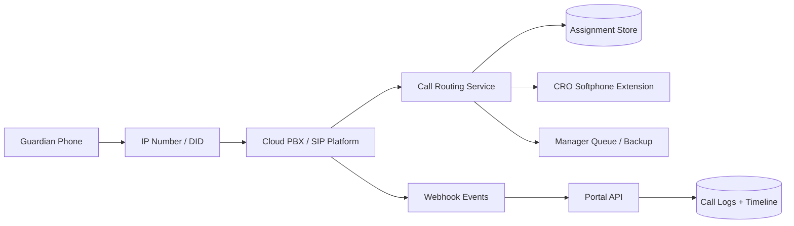
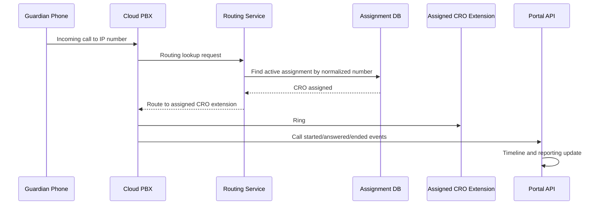

# Bright Tutor Call Mapping Implementation Proposal

## Document Control

| Field | Value |
|---|---|
| Client | Bright Tutor |
| Module | Call Mapping and Routing |
| Version | 1.0 |
| Date | March 2026 |
| Purpose | Production-ready sticky call routing so guardian calls map to assigned CRO throughout active tuition lifecycle |

## 1. Executive Summary

This document contains only the call feature implementation plan.

Bright Tutor requires that when a guardian calls the company IP number:

1. Manager can assign tuition to a specific CRO.
2. Future calls from same guardian should route to the same assigned CRO.
3. Mapping should remain active until tuition lifecycle is closed.

This is implemented using cloud PBX/SIP + a call routing service integrated with Bright Tutor admin portal.

## 2. Business Goals

1. Ensure continuity between guardian and assigned CRO.
2. Reduce re-explanation and transfer overhead.
3. Keep assignment ownership transparent and auditable.
4. Log all call activities in tuition timeline.

## 3. Scope

### In Scope

1. Inbound call routing by assignment.
2. Sticky mapping by guardian number and tuition context.
3. Escalation when assigned CRO does not answer.
4. Call event webhook ingestion to admin portal.
5. Call logs and disposition reporting.

### Out of Scope (Phase 1)

1. AI call transcription/summarization.
2. Predictive dialer campaigns.
3. Advanced omnichannel contact center features.

## 4. Call Architecture



## 5. End-to-End Call Flows

### 5.1 Inbound Call with Existing Assignment



### 5.2 No Assignment or No Answer

1. If no active mapping exists, route to manager queue/IVR.
2. Manager handles and optionally creates assignment.
3. If assigned CRO does not answer within timeout, escalate to backup.
4. Every transfer and escalation must be logged.

### 5.3 Lifecycle Closure

1. Tuition marked closed in portal.
2. Assignment status changes to inactive.
3. Sticky routing is released automatically.

## 6. Routing Rules

1. Normalize caller numbers to E.164 format.
2. Match priority:
- Active tuition assignment by guardian phone
- Latest active assignment by guardian ID
- Manager queue fallback
3. Ring assigned CRO for configured timeout (e.g., 20-30 sec).
4. If unanswered, route to manager/backup queue.
5. Preserve sticky mapping until lifecycle closure.

## 7. Data Model (Call)

### 7.1 call_assignments

- assignment_id
- guardian_phone_e164
- guardian_id
- tuition_id
- cro_id
- assigned_by
- assignment_start_at
- assignment_end_at
- status (active, closed)

### 7.2 call_events

- call_id
- direction (inbound, outbound)
- from_number
- to_number
- resolved_guardian_id
- resolved_tuition_id
- resolved_cro_id
- start_time
- answer_time
- end_time
- duration_sec
- disposition
- recording_ref (if policy allows)

### 7.3 call_route_attempts

- attempt_id
- call_id
- route_target_type (cro, queue, ivr)
- route_target_id
- result (answered, missed, timeout, failed)
- attempted_at

## 8. API Contracts (Call)

### 8.1 Create or Update Assignment

`POST /api/v1/call-routing/assignments`

```json
{
  "guardianPhone": "88017XXXXXXXX",
  "guardianId": "G-10292",
  "tuitionId": "T-901234567",
  "croId": "CRO-02",
  "assignedBy": "MANAGER-01"
}
```

### 8.2 Resolve Inbound Route

`POST /api/v1/call-routing/resolve`

```json
{
  "incomingNumber": "88017XXXXXXXX",
  "didNumber": "88096XXXXXXX",
  "timestamp": "2026-03-19T10:40:12Z"
}
```

Example response:

```json
{
  "routeType": "CRO_EXTENSION",
  "target": "EXT-202",
  "croId": "CRO-02",
  "timeoutSec": 25,
  "fallback": {
    "routeType": "MANAGER_QUEUE",
    "target": "QUEUE-01"
  }
}
```

### 8.3 PBX Webhook Events

`POST /api/v1/call-events/webhook`

Payload includes call lifecycle events (start, ring, answer, transfer, end).

## 9. Security and Compliance

1. PBX webhook signature verification.
2. IP allowlist for provider webhooks.
3. RBAC for assignment create/update permissions.
4. Audit log for assignment changes and manual overrides.
5. Data retention policy for call logs and recordings.

## 10. Operational Design

### 10.1 Daily Checks

1. PBX trunk registration and health.
2. Queue load and missed call count.
3. Extension availability by CRO shift.

### 10.2 Weekly Checks

1. First-call answer rate by CRO.
2. Escalation frequency and reason analysis.
3. Assignment quality audit.

### 10.3 Incident Handling

1. PBX outage: fail to backup DID/provider.
2. CRO extension unreachable: immediate queue fallback.
3. Webhook delay: buffer and replay from provider where available.

## 11. Implementation Plan (Call)

### Phase 0 (1 week): Discovery

1. Select PBX/vendor and confirm SIP trunk capability.
2. Confirm DID and call volume profile.
3. Approve ring and escalation policy.

### Phase 1 (1-2 weeks): Core Routing Service

1. Build assignment data model and APIs.
2. Build route resolve endpoint.
3. Build webhook ingestion and call event logging.

### Phase 2 (1-2 weeks): PBX Integration

1. Configure inbound route to resolver.
2. Configure CRO extensions and manager queue.
3. Configure timeout and fallback behavior.

### Phase 3 (1 week): Portal Integration

1. Assignment UI for manager.
2. Timeline view with call events.
3. Reports for answer/missed/escalation.

### Phase 4 (1 week): UAT + Rollout

1. Scenario testing with real calls.
2. SOP and escalation handbook.
3. Controlled go-live.

## 12. UAT Acceptance Checklist (Call)

1. Incoming calls route to assigned CRO when active assignment exists.
2. Repeated guardian calls remain sticky to same CRO.
3. Timeout fallback routes to manager queue.
4. Call timeline updates in near real time.
5. Assignment closure stops sticky routing automatically.
6. All route decisions are auditable.

## 13. Risks and Mitigations (Call)

1. Phone normalization errors -> enforce E.164 normalization consistently.
2. CRO non-availability -> queue fallback and missed-call tasks.
3. Webhook reliability -> signed retries and idempotent event processing.
4. Assignment conflicts -> single active assignment constraints.

## 14. Closing Note

This call-only architecture ensures continuity between guardians and assigned CROs, improves conversion and experience quality, and provides full operational control through measurable routing and timeline analytics.
