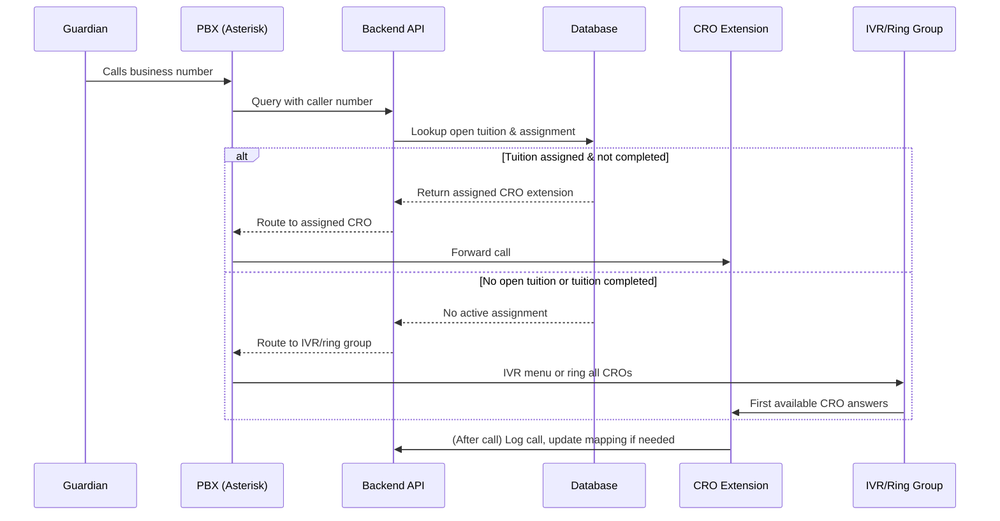
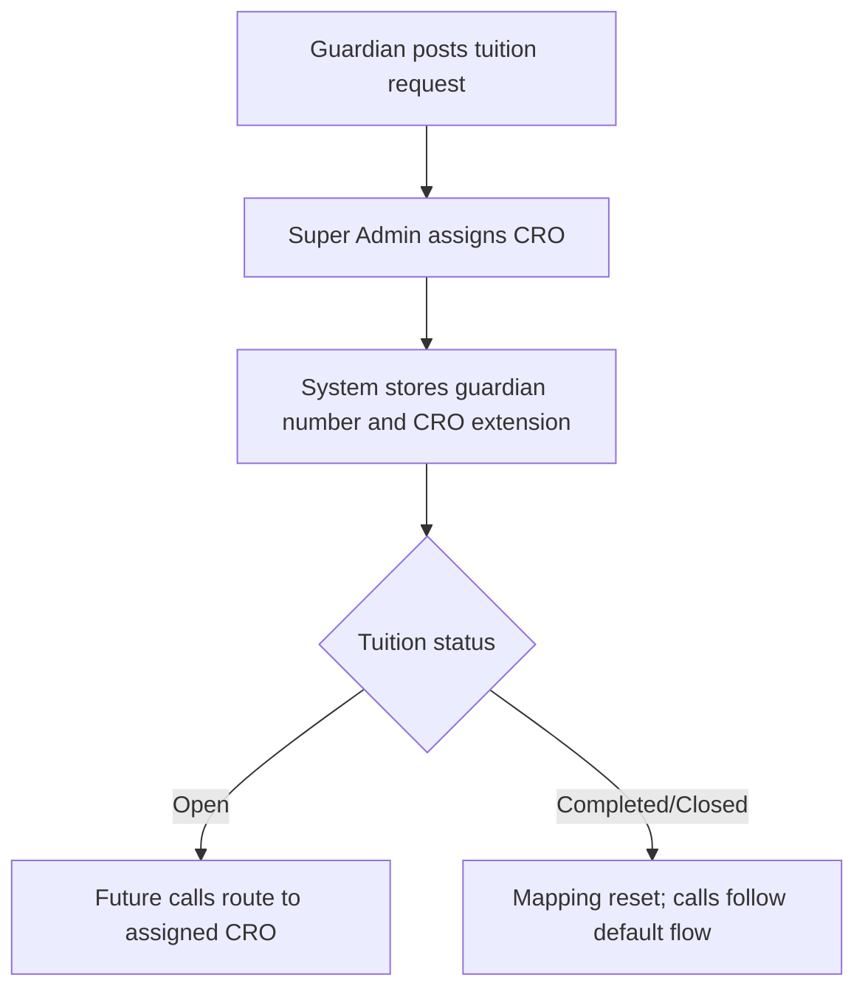
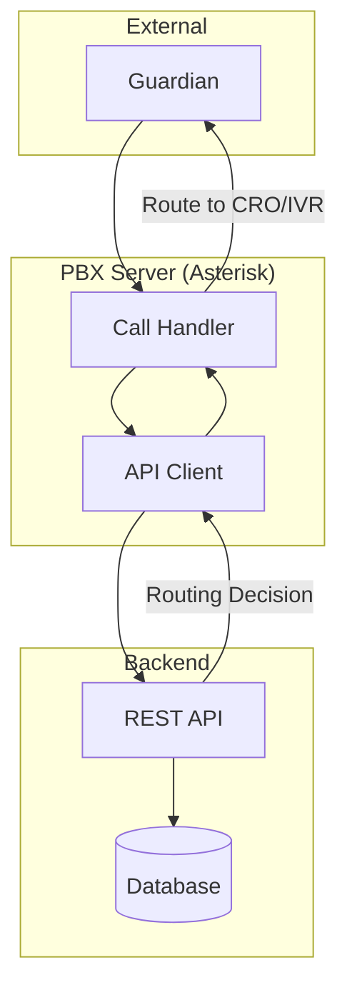

# Bright Tutor – IP Call Service Integration

**Contact:** neexg7@gmail.com  
**Website:** www.neexg.com  
**Phone:** +880 1743586381  
**Version:** 1.0  
**Date:** March 2026  
**Confidential – For IP Call Provider**

---

## Overview

Bright Tutor is an operations-first tuition lifecycle platform. This integration requires a custom IP PBX system (Asterisk or compatible) that routes inbound calls from guardians to Customer Relationship Officers (CROs) based on tuition assignment and status, with real-time backend API integration.

---

## Key Call Routing Logic

- When a guardian is assigned to a CRO for a tuition, all calls from that guardian’s number are routed to the assigned CRO **until the tuition is completed/closed**.
- Once the tuition is completed/closed, the mapping is reset. Any future calls from that guardian follow the default routing (IVR, ring group, or new assignment).
- If a guardian is not assigned to any open tuition, calls are routed via IVR and distributed among available CROs.

---

## Call Routing Flow (Sequence Diagram)

---

## Guardian Post & CRO Assignment Flow

---

## System Architecture

---

## Technical Requirements

- **PBX Platform:** Asterisk or compatible, with programmable dialplan and SIP trunking.
- **API Integration:** PBX must call backend API for every inbound call, sending caller number and receiving routing instructions.
- **Call Mapping Logic:**  
  - If guardian has an open (not completed/closed) tuition assigned to a CRO, route to that CRO.
  - If no open tuition, route via IVR/ring group.
  - When tuition is completed/closed, mapping is reset.
- **Call Logging:** All call events must be logged via API/webhook.
- **Security:** All API traffic encrypted (TLS).
- **Scalability:** Support 50+ concurrent calls.
- **Call Recording:** Optional, with access via API or S3-compatible storage.

---

## Key Challenges

- Real-time, data-driven routing (no static dialplans).
- State-aware mapping: only active while tuition is open.
- Assignment consistency and immediate reset on completion.
- API reliability and failover handling.
- Full audit trail for all call and assignment events.

---

## Contacts & Next Steps

- **Product/Delivery Lead:** neexg7@gmail.com | +880 1743586381
- **API Documentation:** Provided upon project kickoff

---

**End of README**

---

This document is ready to send to your IP Call Service provider. If you need further customization or additional sections, let us know.
