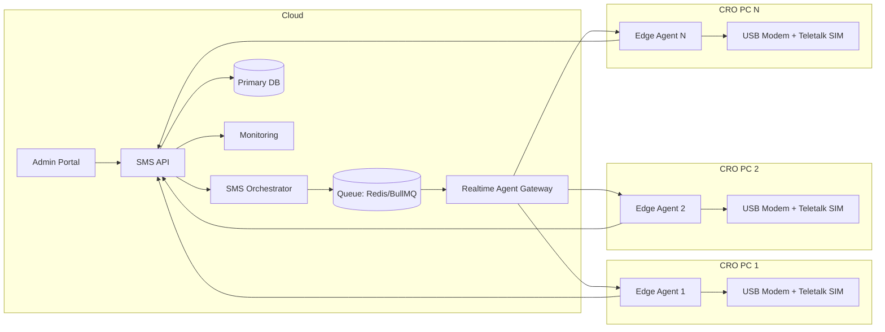
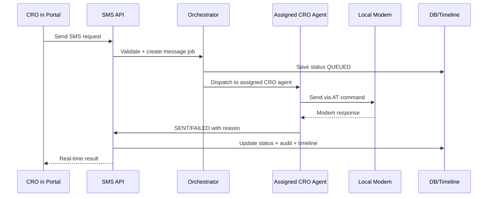

# Bright Tutor SMS Automation Implementation Proposal

## Document Control

| Field | Value |
|---|---|
| Client | Bright Tutor |
| Module | SMS Automation |
| Version | 1.1 |
| Date | March 2026 |
| Purpose | Production-ready implementation plan for CRO-wise dedicated modem/SIM SMS sending from admin portal |

## 1. Executive Summary

This document contains only the SMS implementation plan.

Bright Tutor requested this operating model:

1. Each CRO/Manager uses their own local PC.
2. Each PC has one USB modem and one dedicated Teletalk SIM.
3. SMS is triggered from the admin portal.
4. SMS must be sent from that CRO's own local modem/SIM.

Recommended architecture is a distributed edge-agent model where each CRO machine runs a secure local service that receives jobs from cloud and sends SMS through local modem COM port.

## 2. Business Goals

1. Eliminate SMSCaster/manual tool switching.
2. Keep CRO fully inside admin portal workflow.
3. Preserve existing Teletalk SIM investment.
4. Enforce CRO ownership and accountability per message.
5. Add reliable queue, retry, delivery tracking, and audit.

## 3. Scope

### In Scope

1. Manual SMS from portal.
2. Automated SMS from workflow events.
3. Template-based SMS with dynamic variables.
4. Queueing, retries, and delivery events.
5. Inbound SMS capture and keyword processing.
6. Modem/agent health monitoring.

### Out of Scope (Phase 1)

1. Marketing campaign engine.
2. Multi-operator smart routing.
3. AI optimization for templates.

## 4. Architecture (SMS Only)



## 5. End-to-End SMS Workflows

### 5.1 Manual SMS from Portal



### 5.2 Automated SMS by Trigger

1. Tuition status changes in core workflow.
2. SMS API selects template.
3. Template renders with tuition variables.
4. Idempotency key generated and queued.
5. Job routed to assigned CRO agent.
6. Delivery event updates timeline and logs.

### 5.3 Inbound SMS

1. Guardian replies to CRO SIM.
2. Agent reads inbound from modem.
3. Agent sends inbound event to backend.
4. Backend maps number to tuition context.
5. Keyword matched action executes or creates manual task.

## 6. Routing and Reliability Policy

### 6.1 Routing Rules

1. If assigned CRO agent is online, send there.
2. If offline, hold for short SLA window.
3. If SLA breached, use approved fallback pool.
4. Log all fallback sends for audit.

### 6.2 Retry Rules

1. Temporary failures: retry with exponential backoff.
2. Permanent failures: fail fast with clear reason.
3. Enforce idempotency to prevent duplicates.

## 7. Security Design

1. No public modem-port exposure.
2. Outbound-only TLS connection from agent to cloud.
3. Per-agent authentication token/certificate.
4. HMAC signing for sensitive API events.
5. IP allowlist on agent gateway endpoints.
6. Role-based permissions for send/template access.
7. Immutable audit trail for every send/retry/fail event.

## 8. Agent Design (Local PC Service)

### 8.1 Core Responsibilities

1. Auto-start at machine boot.
2. Maintain secure persistent connection.
3. Detect and lock modem COM port.
4. Execute SMS send job.
5. Report delivery and health events.
6. Store small encrypted offline queue for outages.

### 8.2 Modem Health Checks

1. `AT`
2. `AT+CSQ`
3. `AT+CPIN?`
4. `AT+CREG?`

### 8.3 Message Encoding

1. GSM 7-bit for standard text.
2. UCS2 for Bangla/non-GSM content.
3. Multipart handling for long SMS.

## 9. Data Model (SMS)

### 9.1 agents

- agent_id
- cro_id
- status
- last_heartbeat_at
- modem_port
- signal_strength
- sim_number
- app_version

### 9.2 sms_messages

- message_id
- tuition_id
- guardian_id
- target_phone
- template_code
- rendered_body
- intended_cro_id
- assigned_agent_id
- status
- retry_count
- idempotency_key
- created_at
- updated_at

### 9.3 sms_attempts

- attempt_id
- message_id
- agent_id
- modem_response_code
- attempt_status
- latency_ms
- attempted_at

### 9.4 inbound_sms

- inbound_id
- sim_number
- from_phone
- message_body
- received_at
- matched_tuition_id
- action_taken

## 10. API Contracts (SMS)

### 10.1 Send SMS

`POST /api/v1/sms/send`

```json
{
  "tuitionId": "T-901234567",
  "guardianId": "G-10292",
  "phone": "88017XXXXXXXX",
  "templateCode": "TUTOR_ASSIGNED",
  "variables": {
    "guardianName": "Mr Rahman",
    "tutorName": "Rahim",
    "croName": "Tanha"
  },
  "idempotencyKey": "2ec8f46d-6e0f-4b4f-a083-4f86d4e3fbf8"
}
```

### 10.2 Message Status

`GET /api/v1/sms/{messageId}`

```json
{
  "messageId": "SMS-100145",
  "status": "SENT",
  "agentId": "AGENT-CRO-02",
  "simNumber": "8801XXXXXXXX",
  "sentAt": "2026-03-17T10:24:52Z",
  "lastProviderCode": "OK"
}
```

## 11. Capacity Planning

Assumptions:

1. One modem throughput: about 6 to 10 SMS/min.
2. 20 CRO modems: about 120 to 200 SMS/min theoretical.

Sizing formula:

$$
\text{Required Modems} = \frac{\text{Peak SMS per minute}}{\text{Average SMS per modem per minute}}
$$

## 12. Step-by-Step Implementation Plan (SMS)

### Phase 0 (1-2 weeks): Discovery

1. Confirm volume and SLA.
2. Confirm modem models and drivers.
3. Finalize fallback policy.

### Phase 1 (2 weeks): Backend Foundation

1. SMS schema and audit model.
2. Queue and idempotency.
3. Agent registry and authentication.

### Phase 2 (2-3 weeks): Edge Agent MVP

1. Windows service with auto-start.
2. COM modem detection.
3. Send + callback path.
4. Heartbeat and telemetry.

### Phase 3 (2 weeks): Production Hardening

1. Retry, DLQ, fallback routing.
2. Inbound SMS flow.
3. Monitoring and alerts.
4. UAT with pilot CRO group.

### Phase 4 (1-2 weeks): Rollout

1. SOP/runbook training.
2. Gradual expansion to all CRO/manager machines.
3. Daily stabilization tracking.

## 13. UAT Acceptance Checklist (SMS)

1. Portal-triggered SMS is sent from assigned CRO SIM.
2. Offline assigned CRO handled by hold/fallback policy.
3. Duplicate send blocked by idempotency key.
4. Delivery status visible in tuition timeline.
5. Failure reason visible for operations.
6. Inbound replies mapped correctly to context.

## 14. Operational Runbook (SMS)

### Daily

1. Agent online/offline dashboard check.
2. Queue pending/failed count check.
3. SIM balance and signal check.

### Weekly

1. Failure trend by modem and CRO.
2. Replace unstable hardware.
3. Validate fallback path.

### Incident Handling

1. Agent gateway down: queue only, do not drop.
2. Modem offline: mark unavailable and reroute by policy.
3. Failure spike: pause non-critical templates and alert.

## 15. Risks and Mitigations (SMS)

1. CRO PC turned off -> heartbeat alert + fallback SLA.
2. USB modem instability -> certified hardware + powered hub + spare units.
3. Bangla encoding issues -> UCS2 tests by modem firmware.
4. Duplicate sends on retries -> strict idempotency and de-dup logic.

## 16. Closing Note

This SMS-only architecture gives Bright Tutor a secure, auditable, and scalable replacement for SMSCaster while preserving dedicated Teletalk SIM ownership per CRO.
